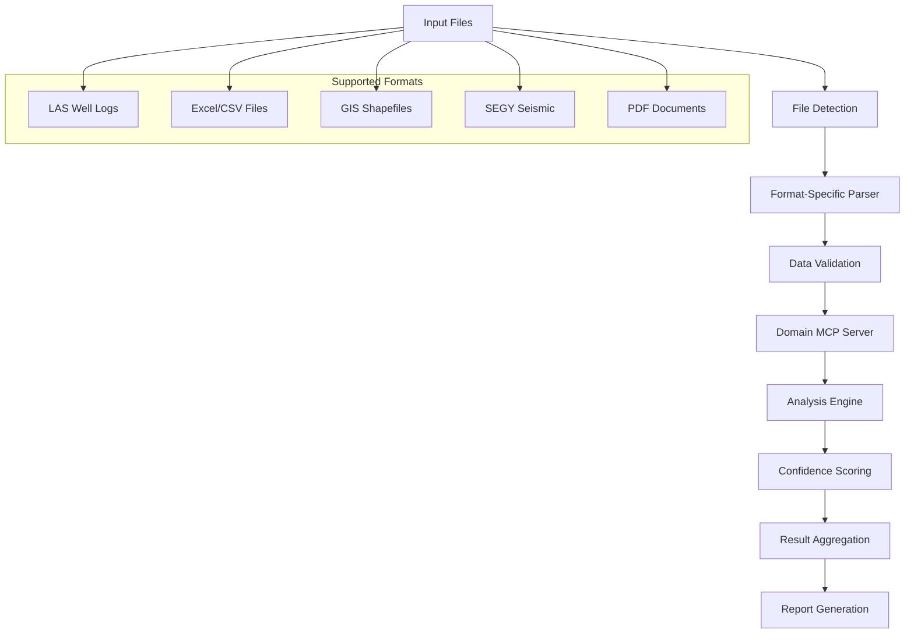

# SHALE YEAH

**AI-Powered Oil & Gas Investment Analysis Platform**

[](https://opensource.org/licenses/Apache-2.0)
[](https://nodejs.org/)
[](https://www.typescriptlang.org/)
[](https://modelcontextprotocol.io/)

> **Transform oil & gas investment analysis from weeks to minutes with AI-powered expert agents**

SHALE YEAH is a comprehensive investment analysis platform that replaces traditional teams of expensive experts with intelligent AI agents powered by Large Language Models. Built on the Model Context Protocol (MCP) standard, it provides production-ready analysis for oil & gas investment opportunities.

---

## 🎯 What This Is

**The Problem**: Traditional oil & gas investment analysis requires weeks of work from expensive specialists:
- Senior Geologist (6+ weeks, $200K+/year) → Formation analysis and risk assessment
- Drilling Engineer (4+ weeks, $180K+/year) → Technical feasibility and cost estimation  
- Financial Analyst (3+ weeks, $150K+/year) → Economic modeling and NPV analysis
- Legal Counsel (2+ weeks, $300K+/year) → Risk assessment and contract review
- **Total**: 15+ weeks, $500K+ in labor costs, inconsistent quality

**The Solution**: SHALE YEAH's AI-powered analysis pipeline:
- **14 specialized MCP servers** with Roman Imperial personas
- **Complete investment pipeline** from data ingestion to final decision
- **5-second turnaround** for comprehensive analysis
- **Production-ready outputs** for board presentations and investment committees
- **Standards-compliant** MCP architecture for enterprise integration

**Who Uses This**:
- Oil & gas investment firms and operators
- Private equity funds focused on energy
- Independent E&P companies
- Mineral rights acquisition teams
- Energy investment analysts and consultants

## 🏛️ Why Roman Imperial Personas?

Each AI agent embodies a Roman Imperial expert with deep domain knowledge and decision-making authority:

| **Domain** | **Roman Persona** | **Modern Role** | **Expertise** |
|------------|------------------|-----------------|---------------|
| **Geology** | **Marcus Aurelius Geologicus** | Master Geological Analyst | Formation analysis, reservoir characterization |
| **Economics** | **Caesar Augustus Economicus** | Master Financial Strategist | DCF analysis, NPV/IRR modeling |
| **Engineering** | **Lucius Technicus Engineer** | Master Reservoir Engineer | Decline curves, EUR estimation |
| **Decision** | **Augustus Decidius Maximus** | Supreme Investment Strategist | Final investment logic, portfolio optimization |
| **Research** | **Scientius Researchicus** | Master Intelligence Gatherer | Market intelligence, competitive analysis |
| **Risk Analysis** | **Gaius Probabilis Assessor** | Master Risk Strategist | Monte Carlo, uncertainty quantification |
| **Legal** | **Legatus Juridicus** | Master Legal Strategist | Contract analysis, regulatory compliance |
| **Market** | **Mercatus Analyticus** | Master Market Strategist | Commodity forecasting, supply/demand analysis |
| **Development** | **Architectus Developmentus** | Master Development Coordinator | Project planning, resource allocation |
| **Drilling** | **Perforator Maximus** | Master Drilling Strategist | Drilling programs, cost optimization |
| **Infrastructure** | **Structura Ingenious** | Master Infrastructure Architect | Facility design, capacity planning |
| **Title** | **Titulus Verificatus** | Master Title Analyst | Ownership verification, due diligence |
| **Test** | **Testius Validatus** | Master Quality Controller | Analysis validation, quality assurance |
| **Reporting** | **Scriptor Reporticus Maximus** | Master Report Generator | Executive reporting, decision synthesis |

This approach provides:
- **Consistent decision-making** across all analysis domains
- **Authoritative expertise** with confidence scoring and escalation criteria
- **Memorable interactions** that build user trust and adoption
- **Clear accountability** with each agent taking ownership of specific recommendations

---

## 🚀 Quick Start

### Prerequisites
- **Node.js 18+** with npm
- **Git** for source control
- **Optional**: Anthropic API key for production AI analysis

### 5-Minute Demo

```bash
# 1. Clone and install
git clone https://github.com/rmcdonald/ShaleYeah.git
cd ShaleYeah
npm install

# 2. Run the demo (uses realistic mock data)
npm run demo

# 3. View results in generated output directory
ls data/outputs/demo-*/
cat data/outputs/demo-*/INVESTMENT_DECISION.md
```

**What happens**: 6 AI expert agents analyze a Permian Basin tract in ~5 seconds, generating professional investment reports with geological analysis, economic modeling, risk assessment, and final investment recommendation.

**Demo Output:**
```
🛢️  SHALE YEAH - AI-Powered Oil & Gas Investment Analysis
📋 Analysis ID: demo-20250917T132058
🗺️  Target Tract: Permian Basin Demo Tract

🤖 Executing Marcus Aurelius Geologicus (Geological Analysis)
   ✅ Geological Analysis: 90% confidence in 844ms

🤖 Executing Caesar Augustus Economicus (Financial Analysis)
   ✅ Financial Analysis: 82% confidence in 942ms

🎯 SHALE YEAH Analysis Complete!
📊 Overall Recommendation: ✅ PROCEED (Strong Economics & Acceptable Risk)
```

### Production Usage

```bash
# 1. Add API key for real AI analysis
echo "ANTHROPIC_API_KEY=sk-ant-your-key-here" >> .env

# 2. Add your data files
cp your-well-logs.las data/samples/
cp your-database.accdb data/samples/
cp your-boundaries.shp data/samples/

# 3. Run full analysis
npm run prod

# 4. Review comprehensive output
ls -la data/outputs/run-*/
```

### Individual Expert Servers

Each AI expert can also run independently as an MCP server:

```bash
# Start individual expert servers
npm run server:geowiz        # Geological analysis
npm run server:econobot      # Economic analysis
npm run server:decision      # Investment decisions
npm run server:research      # Market intelligence
npm run server:risk-analysis # Risk assessment
npm run server:legal         # Legal analysis
npm run server:market        # Market analysis
npm run server:development   # Development planning
npm run server:drilling      # Drilling operations
npm run server:infrastructure # Infrastructure planning
npm run server:title         # Title analysis
npm run server:test          # Quality assurance
npm run server:curve-smith   # Reservoir engineering
npm run server:reporter      # Executive reporting
```

**Use Case:** Connect individual experts to Claude Desktop or other MCP clients for interactive analysis and exploration.

### Understanding Your Results

Demo analysis produces structured outputs:

```
data/outputs/demo-YYYYMMDD-HHMMSS/
├── INVESTMENT_DECISION.md         # 📊 Executive investment summary
├── DETAILED_ANALYSIS.md           # 🗿 Comprehensive analysis details
└── FINANCIAL_MODEL.json           # 💰 Economic model and projections
```

**Key Files to Review**:
- **`INVESTMENT_DECISION.md`** - Start here! Investment recommendation with confidence scores
- **`DETAILED_ANALYSIS.md`** - Detailed findings from all expert domains
- **`FINANCIAL_MODEL.json`** - Complete financial model with NPV, IRR, sensitivity analysis

---

## 🏗️ Architecture Overview

SHALE YEAH implements a **standards-compliant MCP (Model Context Protocol)** architecture with 14 specialized expert servers that can work together or independently.

### MCP Standards Compliance

Built using the **official Anthropic MCP SDK** with full JSON-RPC 2.0 compliance:
- **Protocol Version**: `2025-06-18` 
- **Standard Tool Registration**: All servers use official SDK methods
- **Resource Management**: Structured data flow between domains
- **Error Handling**: Standards-compliant error responses
- **Claude Desktop Compatible**: Works seamlessly with Claude Desktop and other MCP clients

### System Architecture

```
┌─────────────────────┐    ┌─────────────────────┐    ┌─────────────────────┐
│   Data Ingestion    │───▶│  Unified MCP        │───▶│   Investment        │
│                     │    │  Client             │    │   Decision          │
│ • LAS Well Logs     │    │  (Orchestrator)     │    │                     │
│ • Access Databases  │    │                     │    │ • Go/No-Go          │
│ • Shapefiles        │    │ ┌─────────────────┐ │    │ • Risk Assessment   │
│ • Market Data       │    │ │  20 MCP Servers │ │    │ • NPV/IRR Analysis  │
│ • Legal Documents   │    │ │  Roman Personas │ │    │ • Board Presentation│
└─────────────────────┘    │ └─────────────────┘ │    └─────────────────────┘
                           └─────────────────────┘
```

### 20 MCP Server Architecture

| **Server** | **Domain** | **Roman Persona** | **Primary Tools** |
|------------|------------|------------------|-------------------|
| `geology.ts` | Geological Analysis | Marcus Aurelius Geologicus | `analyze_formations`, `generate_zones`, `assess_drilling_targets` |
| `economics.ts` | Financial Modeling | Caesar Augustus Economicus | `dcf_analysis`, `sensitivity_modeling`, `investment_optimization` |
| `risk-analysis.ts` | Risk Assessment | Marcus Aurelius Probabilis | `monte_carlo_simulation`, `scenario_analysis`, `risk_quantification` |
| `legal.ts` | Legal Analysis | Gaius Legalis Advocatus | `contract_review`, `regulatory_compliance`, `legal_risk_assessment` |
| `market.ts` | Market Intelligence | Gaius Mercatus Analyst | `commodity_analysis`, `supply_demand_modeling`, `price_forecasting` |
| `research.ts` | Competitive Intelligence | Gaius Investigatus Maximus | `market_research`, `competitor_analysis`, `industry_trends` |
| `drilling.ts` | Technical Engineering | Lucius Drillicus Technicus | `drilling_cost_estimation`, `completion_design`, `technical_feasibility` |
| `title.ts` | Land & Title | Gaius Titulus Tracker | `ownership_verification`, `mineral_rights_analysis`, `lease_review` |
| `infrastructure.ts` | System Operations | Lucius Systemus Guardian | `performance_monitoring`, `capacity_planning`, `quality_assurance` |
| `decision.ts` | Executive Decision | Caesar Supremus Decidicus | `investment_synthesis`, `portfolio_optimization`, `strategic_recommendations` |
| *...and 10 more specialized servers* | | | |

### Data Flow Pipeline


1. **Data Ingestion**: Parse LAS files, Access databases, shapefiles
2. **Geological Analysis**: Formation identification, reservoir characterization
3. **Technical Assessment**: Drilling feasibility, completion design
4. **Economic Modeling**: DCF analysis, NPV/IRR calculations
5. **Risk Analysis**: Monte Carlo simulation, sensitivity analysis
6. **Legal Review**: Contract analysis, regulatory compliance
7. **Market Analysis**: Commodity pricing, supply/demand dynamics
8. **Investment Decision**: Synthesis and recommendation generation
9. **Executive Report**: Board-ready presentation materials

---

## 🏗️ Technical Architecture

### Core Components

SHALE YEAH implements a **microservices architecture** using the Model Context Protocol (MCP) standard:

```
┌─────────────────────────────────────────────────────────────────┐
│                    Unified MCP Client                           │
│              (Orchestration & Workflow Engine)                  │
└─────────────┬───────────────────────────────────────────────────┘
              │
    ┌─────────┴─────────┐
    │   MCP Protocol    │
    │   (JSON-RPC 2.0)  │
    └─────────┬─────────┘
              │
┌─────────────┴─────────────────────────────────────────────────────┐
│                    MCP Server Layer                               │
├─────────────┬─────────────┬─────────────┬─────────────┬──────────┤
│   Geology   │   Economics │ Risk Analysis│  Reporting  │   ...    │
│   Server    │   Server    │   Server     │   Server    │  (20+)   │
└─────────────┴─────────────┴─────────────┴─────────────┴──────────┘
              │
┌─────────────┴─────────────────────────────────────────────────────┐
│              File Integration Manager                              │
├─────────────┬─────────────┬─────────────┬─────────────┬──────────┤
│ LAS Parser  │Excel Parser │ GIS Parser  │ SEGY Parser │   ...    │
└─────────────┴─────────────┴─────────────┴─────────────┴──────────┘
              │
┌─────────────┴─────────────────────────────────────────────────────┐
│                     Data Layer                                    │
├─────────────┬─────────────┬─────────────┬─────────────┬──────────┤
│ Well Logs   │ GIS Data    │ Economic    │ Documents   │   ...    │
│ (.las)      │(.shp,.json) │ (.xlsx)     │ (.pdf)      │          │
└─────────────┴─────────────┴─────────────┴─────────────┴──────────┘
```

### MCP Server Architecture

Each MCP server follows a consistent architecture pattern:

```typescript
// src/mcp-servers/[domain]-mcp.ts
export class DomainMCPServer {
  private server: McpServer;                    // MCP protocol server
  private fileManager: FileIntegrationManager; // File processing
  private domainParser: DomainSpecificParser;  // Domain-specific logic
  
  constructor(config: ServerConfig) {
    this.server = new McpServer(config);
    this.setupDomainTools();        // Register MCP tools
    this.setupDomainResources();    // Register MCP resources
  }
  
  private setupDomainTools(): void {
    this.server.tool('analyze_data', schema, async (args) => {
      // 1. Parse input files using FileIntegrationManager
      // 2. Apply domain-specific analysis logic
      // 3. Return structured results with confidence scoring
    });
  }
}
```

### File Processing Pipeline

The **FileIntegrationManager** provides unified file processing:

```typescript
// Unified file processing workflow
export class FileIntegrationManager {
  async parseFile(filePath: string): Promise<ParseResult> {
    // 1. Auto-detect file format
    const format = await this.detectFormat(filePath);
    
    // 2. Select appropriate parser
    const parser = this.getParser(format);
    
    // 3. Parse with error handling
    try {
      const result = await parser.parse(filePath);
      return { success: true, format, data: result };
    } catch (error) {
      return { success: false, errors: [error.message] };
    }
  }
  
  private getParser(format: FormatType): FileParser {
    const parsers = {
      'las': new LASParser(),
      'excel': new ExcelParser(), 
      'shapefile': new GISParser(),
      'segy': new SEGYParser(),
      'pdf': new PDFParser(),        // Architecture ready
      'word': new WordDocParser()    // Architecture ready
    };
    return parsers[format];
  }
}
```

### Data Flow Architecture



### Quality Assurance Pipeline

Every analysis includes comprehensive quality assessment:

```typescript
export interface QualityAssessment {
  confidence: number;           // 0.0 - 1.0 confidence score
  grade: 'Excellent' | 'Good' | 'Fair' | 'Poor';
  dataCompleteness: number;     // Percentage of non-null values
  validationErrors: string[];   // Any data quality issues
  recommendations: string[];    // Suggested improvements
}
```

---

## 📁 Working with Your Data

### Supported File Formats

| **File Category** | **Extensions / Formats** | **Demo Status** | **Production Status** | **Purpose / Notes** |
|-------------------|--------------------------|-----------------|----------------------|---------------------|
| **Well Logs** | `.las`, `.dlis`, `.xml` (WITSML) | 🎭 Simulated | 🚧 Planned | Formation evaluation, log curves, petrophysical data |
| **Seismic Data** | `.segy`, `.sgy`, `.seismic3d`, `.swork` | 🎭 Simulated | 🚧 Planned | Raw and processed seismic traces, interpretation |
| **Production DBs** | `.accdb`, `.mdb`, ODBC/SQL dumps | 🎭 Simulated | 🚧 Planned | Production history, well test data |
| **GIS / Spatial** | `.shp`, `.shx`, `.dbf`, `.prj`, `.geojson`, `.kml` | 🎭 Simulated | 🚧 Planned | Boundaries, lease blocks, pipelines, maps |
| **Reservoir Models** | `.grdecl` (Eclipse), `.mod`, `.simgrid`, `.rst` | 🎭 Simulated | 🚧 Planned | Grid, reservoir simulation models |
| **Market Data** | `.csv`, `.xlsx`, API feeds (Bloomberg, Platts, Argus) | 🎭 Built-in | 🚧 Planned | Prices, costs, benchmarks |
| **Financial Models** | `.json`, `.xlsx`, `.xlsm`, `.prn` | ✅ Working | ✅ Working | Economics, forecasts, sensitivities |
| **Reports** | `.md`, `.pdf`, `.docx`, `.pptx` | ✅ Working | 🚧 Planned | Executive summaries, investor reports |
| **Agent Configs** | `.yaml` | ✅ Working | ✅ Working | Agent definitions, flow orchestration |
| **System Configs** | `.json`, `.env` | ✅ Working | ✅ Working | Runtime parameters, credentials |
| **Imaging / Maps** | `.tif`, `.geotiff`, `.png`, `.svg`, `.pdf` | 🎭 Simulated | 🚧 Planned | Raster maps, exports from ArcGIS/QGIS |
| **Proprietary Suites** | Petrel (`.pet`, `.pseis`), Kingdom (`.db`), Aries (`.adb`), Harmony (`.hmd`), Spotfire (`.dxp`) | 🎭 Simulated | 🚧 Planned* | Industry-specific proprietary project files |

**Legend:**
- ✅ **Working**: Fully implemented and functional
- 🎭 **Simulated**: Mock data for demonstration purposes  
- 🚧 **Planned**: Architecture exists, implementation in progress
- 🚧 **Planned***: Requires vendor licensing/partnerships for proprietary formats

### Open Source vs Proprietary Format Support

**🆓 Open Source Formats (Priority Implementation):**
- `.las`, `.dlis` - Well log standards with open-source parsers available
- `.segy` - Seismic data standard with established open-source libraries  
- `.geojson`, `.kml`, `.shp` - Open GIS formats with extensive library support
- `.csv`, `.xlsx` - Universal data exchange formats
- `.grdecl` - Eclipse reservoir format with open-source parsers
- Standard database formats (SQL, Access) via open connectors

**🔒 Proprietary Formats (Requires Vendor Partnership):**
- **Petrel** (`.pet`, `.pseis`) - Schlumberger licensing required
- **Kingdom** (`.db`) - IHS Markit partnership needed  
- **Aries** (`.adb`) - Halliburton licensing required
- **Harmony** (`.hmd`) - CGG partnership needed
- **Spotfire** (`.dxp`) - TIBCO licensing required
- **Bloomberg/Platts APIs** - Subscription and licensing required

SHALE YEAH prioritizes open-source format support to ensure maximum accessibility while providing integration pathways for proprietary systems through vendor partnerships.

### Comprehensive File Processing Integration

SHALE YEAH now includes **comprehensive file format integration** across all MCP servers, enabling seamless processing of industry-standard data formats:

#### 🗿 Geowiz MCP Server - Geological & GIS Processing

**Enhanced capabilities for geological and spatial data processing:**

| **Tool** | **Supported Formats** | **Functionality** | **Output** |
|----------|----------------------|-------------------|------------|
| `parse_gis_file` | Shapefile (`.shp`, `.shx`, `.dbf`), GeoJSON (`.geojson`), KML (`.kml`) | GIS data parsing and spatial analysis | Structured GIS data with geometry validation |
| `parse_well_log` | LAS 2.0+ (`.las`), ASCII logs | Well log parsing with quality assessment | Formation data, curve analysis, QC metrics |
| `detect_file_format` | Auto-detection for 20+ formats | File format validation and compatibility check | Format identification, parser recommendations |

```typescript
// Example: GIS processing capabilities
const gisResult = await geowizServer.processGISFile({
  filePath: '/path/to/tract_boundaries.shp',
  validateGeometry: true,
  reprojectToWGS84: true
});

// Returns: Complete spatial data with geometry validation and reprojection
```

#### 📊 Curve-Smith MCP Server - Well Log & Seismic Analysis

**Advanced curve analysis and seismic data processing:**

| **Tool** | **Supported Formats** | **Functionality** | **Output** |
|----------|----------------------|-------------------|------------|
| `process_las_file` | LAS 2.0+, multi-curve logs | Advanced curve analysis with statistical QC | Quality grades, statistics, curve validation |
| `analyze_curve_statistics` | Processed well log data | Detailed statistical analysis on log curves | Mean, std dev, percentiles, null analysis |
| `process_segy_file` | SEG-Y, SEGY seismic files | Seismic trace processing and header analysis | Trace data, navigation info, QC results |

```typescript
// Example: Well log processing with quality control
const curveResult = await curveSmithServer.processLASFile({
  filePath: '/path/to/well_log.las',
  curves: ['GR', 'RHOB', 'NPHI', 'RT'],
  performQC: true,
  generateReport: true
});

// Returns: Comprehensive curve analysis with quality grades (Excellent/Good/Fair/Poor)
```

#### 💰 Econobot MCP Server - Economic Data Processing

**Financial and economic data analysis from Excel and CSV files:**

| **Tool** | **Supported Formats** | **Functionality** | **Output** |
|----------|----------------------|-------------------|------------|
| `process_economic_data` | Excel (`.xlsx`, `.xlsm`), CSV files | Extract pricing and cost data from spreadsheets | Structured economic data with validation |
| `orchestrate_workflow` | JSON, processed data | Economic analysis workflow with NPV/IRR calculations | Financial models, cash flow projections |

```typescript
// Example: Economic data processing
const economicResult = await econobotServer.processEconomicData({
  filePath: '/path/to/cost_assumptions.xlsx',
  dataType: 'costs',
  extractPricing: true,
  extractCosts: true
});

// Returns: Pricing data, cost assumptions, validation metrics
```

#### 📝 Reporter MCP Server - Document Processing

**Advanced document parsing and report generation capabilities:**

| **Tool** | **Supported Formats** | **Functionality** | **Output** |
|----------|----------------------|-------------------|------------|
| `parse_document` | PDF, Word (`.docx`, `.doc`) | Extract text and structured data from reports | Parsed content, metadata, document structure |
| `extract_report_data` | PDF, Word documents | Extract tables, charts, and structured data | Extracted tables, keyword matches, data summary |
| `generate_template` | Custom report templates | Generate report templates from existing documents | Report templates, section structures |

```typescript
// Example: PDF report processing
const reportResult = await reporterServer.parseDocument({
  filePath: '/path/to/technical_report.pdf',
  extractMetadata: true,
  parseStructure: true,
  outputFormat: 'json'
});

// Returns: Structured document content with tables, headings, metadata
```

#### ⚠️ RiskRanger MCP Server - Risk Data Processing

**Comprehensive risk assessment data processing:**

| **Tool** | **Supported Formats** | **Functionality** | **Output** |
|----------|----------------------|-------------------|------------|
| `process_risk_data` | Excel, PDF, CSV files | Extract incident data, risk assessments, compliance data | Risk metrics, incident analysis, compliance status |
| `analyze_risk_patterns` | Processed risk data | Pattern analysis and trend identification | Risk trends, frequency analysis, severity assessment |
| `generate_risk_report` | Risk analysis results | Comprehensive risk assessment reports | Executive, technical, and compliance reports |

```typescript
// Example: Risk data processing and analysis
const riskResult = await riskRangerServer.processRiskData({
  filePath: '/path/to/incident_reports.xlsx',
  dataType: 'incidents',
  extractTables: true,
  extractMetrics: true
});

// Returns: Incident data, risk metrics, severity assessments
```

#### 🔧 Unified File Integration Manager

**All MCP servers utilize a centralized `FileIntegrationManager` that provides:**

- **Universal file format detection** - Automatic identification of 20+ formats
- **Consistent error handling** - Standardized error reporting across all parsers
- **Metadata extraction** - File size, creation date, format validation
- **Performance optimization** - Efficient parsing with memory management
- **Quality validation** - Data integrity checks and format compliance

```typescript
// Unified file processing architecture
export class FileIntegrationManager {
  async parseFile(filePath: string): Promise<ParseResult> {
    const format = await this.detectFormat(filePath);
    const parser = this.getParser(format);
    return await parser.parse(filePath);
  }
  
  private getParser(format: string): FileParser {
    switch (format) {
      case 'las': return new LASParser();
      case 'excel': return new ExcelParser();
      case 'pdf': return new PDFParser();
      case 'shapefile': return new GISParser();
      case 'segy': return new SEGYParser();
      // ... additional parsers
    }
  }
}
```

### Data Organization

**Current Demo Data:**
```
data/samples/
├── demo.las                      # Sample well log (text format for demo)
├── demo.accdb.txt               # Sample production data (text format for demo)  
└── tract.shp.txt                # Sample GIS data (text format for demo)
```

**Future Production Structure:**
```
data/samples/
├── well-logs/
│   ├── WELL_001.las              # Primary well log (LAS 2.0+ format)
│   ├── WELL_002.las              # Additional wells
│   └── OFFSET_WELLS.las          # Analog data
├── production/
│   ├── field_production.accdb    # Historical production database
│   └── completion_data.mdb       # Completion parameters
├── geographic/
│   ├── tract_boundaries.shp      # Land boundaries (shapefile)
│   ├── tract_boundaries.shx      # Shapefile index
│   ├── tract_boundaries.dbf      # Attribute data  
│   └── tract_boundaries.prj      # Projection information
└── market/
    ├── strip_pricing.csv         # Forward price curves
    └── cost_assumptions.csv      # Operating cost data
```

### Data Quality Requirements

**Demo Mode (Current):**
- ✅ **No data requirements** - Uses built-in realistic mock data
- ✅ **No file format restrictions** - All data is simulated
- ✅ **Instant execution** - No data validation or processing needed

**Production Mode (Future Requirements):**
- 🚧 **Well logs**: Standard LAS format with Gamma Ray (GR) curve minimum
- 🚧 **Geographic data**: Complete polygon boundaries in WGS84 coordinate system
- 🚧 **Production data**: Monthly volumes with well identifiers
- 🚧 **Quality indicators**: Minimal null values, consistent naming conventions

**Production Mode Enhanced Analysis (Future):**
- 📊 **Extended log suite**: Density (RHOB), neutron (NPHI), resistivity curves
- 🗺️ **High-resolution mapping**: Section/township boundaries, surface/mineral rights
- 💰 **Detailed economics**: Operating costs, tax parameters, regional multipliers
- 📈 **Market integration**: Live commodity pricing, forward curves, basis differentials

---

## 🔌 API Reference & Integration

### MCP Server API

All MCP servers expose standardized JSON-RPC 2.0 APIs. Here's how to integrate programmatically:

#### Geowiz MCP Server API

```typescript
import { GeowizMCPServer } from './src/mcp-servers/geowiz-mcp.js';

const geowiz = new GeowizMCPServer({
  name: 'geowiz-server',
  version: '1.0.0',
  resourceRoot: './data/geowiz'
});

await geowiz.initialize();

// Parse GIS file
const gisResult = await geowiz.callTool('parse_gis_file', {
  filePath: '/path/to/tract_boundaries.shp',
  validateGeometry: true,
  reprojectToWGS84: true
});

// Parse well log
const logResult = await geowiz.callTool('parse_well_log', {
  filePath: '/path/to/well_log.las',
  curves: ['GR', 'RHOB', 'NPHI'],
  performQC: true
});
```

#### Curve-Smith MCP Server API

```typescript
import { CurveSmithMCPServer } from './src/mcp-servers/curve-smith-mcp.js';

const curveSmith = new CurveSmithMCPServer({
  name: 'curve-smith-server',
  version: '1.0.0',
  resourceRoot: './data/curves'
});

// Process LAS file with advanced analytics
const analysisResult = await curveSmith.callTool('process_las_file', {
  filePath: '/path/to/well_log.las',
  curves: ['GR', 'RHOB', 'NPHI', 'RT'],
  performQC: true,
  generateReport: true
});

// Analyze curve statistics
const statsResult = await curveSmith.callTool('analyze_curve_statistics', {
  curveData: analysisResult.processedCurves,
  calculatePercentiles: true
});

// Expected response structure:
interface CurveAnalysisResult {
  curves: {
    [curveName: string]: {
      statistics: {
        mean: number;
        std: number;
        min: number;
        max: number;
        nullCount: number;
        validCount: number;
      };
      quality: {
        grade: 'Excellent' | 'Good' | 'Fair' | 'Poor';
        confidence: number;
        issues: string[];
      };
    };
  };
  qualityAssessment: QualityAssessment;
}
```

#### Econobot MCP Server API

```typescript
import { EconobotMCPServer } from './src/mcp-servers/econobot-mcp.js';

const econobot = new EconobotMCPServer({
  name: 'econobot-server',
  version: '1.0.0',
  resourceRoot: './data/economic'
});

// Process economic data from Excel
const economicResult = await econobot.callTool('process_economic_data', {
  filePath: '/path/to/cost_assumptions.xlsx',
  dataType: 'costs',
  extractPricing: true,
  extractCosts: true
});

// Orchestrate economic workflow
const workflowResult = await econobot.callTool('orchestrate_workflow', {
  workflowId: 'npv-analysis-001',
  analysisType: 'full_economic',
  inputData: economicResult.processedData
});
```

### Error Handling Patterns

All MCP server tools follow consistent error handling:

```typescript
interface MCPToolResponse {
  content: Array<{
    type: "text";
    text: string; // JSON stringified result
  }>;
}

// Successful response
{
  content: [{
    type: "text",
    text: JSON.stringify({
      success: true,
      data: { /* analysis results */ },
      metadata: { /* file metadata */ },
      qualityAssessment: { /* quality metrics */ }
    })
  }]
}

// Error response
{
  content: [{
    type: "text", 
    text: JSON.stringify({
      error: 'File parsing failed',
      details: ['Invalid LAS format', 'Missing required curves'],
      suggestions: ['Verify file format', 'Check curve names']
    })
  }]
}
```

### Unified MCP Client Usage

For orchestrating multiple MCP servers:

```typescript
import { UnifiedMCPClient } from './src/unified-mcp-client.js';

const client = new UnifiedMCPClient({
  servers: {
    geology: new GeowizMCPServer(config),
    curves: new CurveSmithMCPServer(config),
    economics: new EconobotMCPServer(config),
    reporting: new ReporterMCPServer(config),
    risk: new RiskRangerMCPServer(config)
  }
});

// Execute full analysis pipeline
const analysisResult = await client.executeAnalysisWorkflow({
  inputFiles: {
    wellLog: '/path/to/well.las',
    economics: '/path/to/economics.xlsx',
    boundaries: '/path/to/boundaries.shp'
  },
  analysisConfig: {
    confidenceThreshold: 0.75,
    riskTolerance: 'moderate'
  }
});
```

### Resource Management

MCP servers expose resources for persistent data access:

```typescript
// Access workflow state
const workflowState = await client.readResource('coord://state/workflow-123');

// List available resources
const resources = await client.listResources();

// Resource URI patterns:
// coord://state/{workflow_id}           - Workflow execution state
// coord://dependencies/{agent_id}       - Agent dependency information
// data://processed/{file_id}            - Processed file data
```

### WebSocket Integration

For real-time analysis monitoring:

```typescript
import { MCPWebSocketClient } from './src/shared/mcp-websocket-client.js';

const wsClient = new MCPWebSocketClient('ws://localhost:3000/mcp');

wsClient.on('analysis_progress', (data) => {
  console.log(`Analysis ${data.workflowId}: ${data.progress}% complete`);
});

wsClient.on('analysis_complete', (result) => {
  console.log('Analysis complete:', result.summary);
});

// Start analysis with real-time updates
await wsClient.startAnalysis({
  files: ['well.las', 'economics.xlsx'],
  realTimeUpdates: true
});
```

---

## 🛠️ Developer Implementation Guide

### Adding New MCP Servers

Follow this step-by-step guide to add new domain-specific analysis servers:

#### 1. Create MCP Server Implementation

```bash
# Create new server file
touch src/mcp-servers/my-domain-mcp.ts
```

```typescript
// src/mcp-servers/my-domain-mcp.ts
import { McpServer } from '@modelcontextprotocol/sdk/server/mcp.js';
import { FileIntegrationManager } from '../shared/file-integration.js';

export interface MyDomainConfig {
  name: string;
  version: string;
  resourceRoot: string;
  dataPath?: string;
}

export class MyDomainMCPServer {
  private server: McpServer;
  private fileManager: FileIntegrationManager;
  private resourceRoot: string;
  private dataPath: string;
  private initialized = false;

  constructor(config: MyDomainConfig) {
    this.resourceRoot = path.resolve(config.resourceRoot);
    this.dataPath = config.dataPath || path.join(this.resourceRoot, 'my-domain');
    
    this.fileManager = new FileIntegrationManager();
    this.server = new McpServer({
      name: config.name,
      version: config.version
    });

    this.setupDomainTools();
    this.setupDomainResources();
  }

  private setupDomainTools(): void {
    // Tool 1: Domain-specific file processing
    this.server.tool(
      'process_domain_file',
      'Process domain-specific file formats',
      {
        type: 'object',
        properties: {
          filePath: { type: 'string', description: 'Path to domain file' },
          analysisType: { 
            type: 'string', 
            enum: ['basic', 'advanced', 'comprehensive'],
            description: 'Type of analysis to perform'
          },
          outputFormat: {
            type: 'string',
            enum: ['json', 'csv', 'excel'],
            optional: true
          }
        },
        required: ['filePath', 'analysisType']
      },
      async (args: any, extra: any) => {
        try {
          // 1. Parse file using unified file manager
          const fileResult = await this.fileManager.parseFile(args.filePath);
          
          if (!fileResult.success) {
            return this.createErrorResponse('File parsing failed', fileResult.errors);
          }

          // 2. Apply domain-specific analysis
          const analysisResult = await this.performDomainAnalysis(
            fileResult.data, 
            args.analysisType
          );

          // 3. Generate quality assessment
          const quality = this.assessDataQuality(fileResult.data, analysisResult);

          // 4. Return structured response
          return {
            content: [{
              type: "text",
              text: JSON.stringify({
                success: true,
                analysisType: args.analysisType,
                results: analysisResult,
                qualityAssessment: quality,
                metadata: {
                  fileName: fileResult.metadata?.fileName,
                  fileSize: fileResult.metadata?.size,
                  processedAt: new Date().toISOString()
                }
              }, null, 2)
            }]
          };

        } catch (error) {
          return this.createErrorResponse('Analysis failed', [String(error)]);
        }
      }
    );

    // Tool 2: Advanced domain analysis
    this.server.tool(
      'analyze_domain_patterns',
      'Analyze patterns in domain-specific data',
      {
        type: 'object',
        properties: {
          dataPath: { type: 'string', description: 'Path to processed data' },
          patternTypes: { 
            type: 'array', 
            items: { type: 'string' },
            description: 'Types of patterns to identify'
          }
        },
        required: ['dataPath', 'patternTypes']
      },
      async (args: any, extra: any) => {
        // Implementation for pattern analysis
        const patterns = await this.identifyPatterns(args.dataPath, args.patternTypes);
        
        return {
          content: [{
            type: "text",
            text: JSON.stringify({
              patterns,
              confidence: this.calculatePatternConfidence(patterns),
              recommendations: this.generatePatternRecommendations(patterns)
            }, null, 2)
          }]
        };
      }
    );
  }

  private setupDomainResources(): void {
    // Resource: Domain analysis state
    this.server.resource(
      'domain://analysis/{analysis_id}',
      'domain://analysis/*',
      async (uri) => {
        const analysisId = uri.pathname.split('/').pop()?.replace('.json', '');
        const analysisPath = path.join(this.dataPath, 'analyses', `${analysisId}.json`);
        
        try {
          const data = await fs.readFile(analysisPath, 'utf-8');
          return {
            contents: [{ uri: uri.toString(), mimeType: 'application/json', text: data }]
          };
        } catch {
          return {
            contents: [{ 
              uri: uri.toString(), 
              mimeType: 'application/json', 
              text: JSON.stringify({ error: 'Analysis not found' }) 
            }]
          };
        }
      }
    );
  }

  // Domain-specific analysis methods
  private async performDomainAnalysis(data: any, analysisType: string): Promise<any> {
    switch (analysisType) {
      case 'basic':
        return this.basicAnalysis(data);
      case 'advanced':
        return this.advancedAnalysis(data);
      case 'comprehensive':
        return this.comprehensiveAnalysis(data);
      default:
        throw new Error(`Unknown analysis type: ${analysisType}`);
    }
  }

  private basicAnalysis(data: any): any {
    // Implement basic domain analysis
    return {
      summary: 'Basic analysis results',
      metrics: { /* domain metrics */ },
      insights: ['Key insight 1', 'Key insight 2']
    };
  }

  private advancedAnalysis(data: any): any {
    // Implement advanced domain analysis
    return {
      summary: 'Advanced analysis results',
      detailed_metrics: { /* comprehensive metrics */ },
      patterns: { /* identified patterns */ },
      predictions: { /* predictive insights */ }
    };
  }

  private comprehensiveAnalysis(data: any): any {
    // Implement comprehensive domain analysis
    return {
      executive_summary: 'Comprehensive analysis summary',
      detailed_analysis: { /* full analysis */ },
      risk_assessment: { /* risk factors */ },
      recommendations: ['Recommendation 1', 'Recommendation 2']
    };
  }

  private assessDataQuality(rawData: any, analysisResults: any): QualityAssessment {
    // Implement quality assessment logic
    return {
      confidence: 0.85,
      grade: 'Good',
      dataCompleteness: 0.92,
      validationErrors: [],
      recommendations: ['Consider additional validation']
    };
  }

  private createErrorResponse(message: string, details: string[]) {
    return {
      content: [{
        type: "text",
        text: JSON.stringify({
          error: message,
          details,
          timestamp: new Date().toISOString()
        })
      }]
    };
  }

  // Standard MCP server lifecycle methods
  async initialize(): Promise<void> {
    await fs.mkdir(this.resourceRoot, { recursive: true });
    await fs.mkdir(this.dataPath, { recursive: true });
    await fs.mkdir(path.join(this.dataPath, 'analyses'), { recursive: true });
    this.initialized = true;
  }

  async start(): Promise<void> {
    if (!this.initialized) await this.initialize();
    console.log(`🔧 My Domain MCP Server v${this.version} initialized`);
  }

  async stop(): Promise<void> {
    console.log('🔧 My Domain MCP Server shutdown complete');
  }

  getServer(): McpServer {
    return this.server;
  }

  async getStatus() {
    return {
      name: this.name,
      version: this.version,
      initialized: this.initialized,
      capabilities: {
        tools: ['process_domain_file', 'analyze_domain_patterns'],
        resources: ['domain://analysis/{analysis_id}']
      }
    };
  }
}

export default MyDomainMCPServer;
```

#### 2. Add File Parser (if needed)

```typescript
// src/shared/parsers/my-format-parser.ts
export class MyFormatParser implements FileParser {
  async parse(filePath: string): Promise<any> {
    // Implement format-specific parsing logic
    const data = await fs.readFile(filePath, 'utf-8');
    
    // Validate format
    if (!this.validateFormat(data)) {
      throw new Error('Invalid file format');
    }
    
    // Parse and structure data
    return this.parseFormatData(data);
  }
  
  private validateFormat(data: string): boolean {
    // Implement format validation
    return true;
  }
  
  private parseFormatData(data: string): any {
    // Implement parsing logic
    return { parsed: true, data };
  }
}
```

#### 3. Update Unified Client Integration

```typescript
// src/unified-mcp-client.ts
import { MyDomainMCPServer } from './mcp-servers/my-domain-mcp.js';

export class UnifiedMCPClient {
  private myDomainServer: MyDomainMCPServer;
  
  constructor(config: ClientConfig) {
    // Initialize new server
    this.myDomainServer = new MyDomainMCPServer({
      name: 'my-domain-server',
      version: '1.0.0',
      resourceRoot: config.resourceRoot
    });
  }
  
  async executeAnalysisWorkflow(data: AnalysisInput): Promise<AnalysisResult> {
    // Integrate new server into workflow
    const domainAnalysis = await this.myDomainServer.callTool('process_domain_file', {
      filePath: data.domainFile,
      analysisType: 'comprehensive'
    });
    
    // Combine with other server results
    return this.synthesizeResults({
      geology: await this.geologyServer.analyze(data),
      economics: await this.economicsServer.analyze(data),
      myDomain: domainAnalysis,  // New domain integration
      // ... other servers
    });
  }
}
```

#### 4. Add Integration Tests

```typescript
// tests/my-domain-integration.test.ts
import { describe, test, expect, beforeEach, afterEach } from '@jest/globals';
import { MyDomainMCPServer } from '../src/mcp-servers/my-domain-mcp.js';

describe('MyDomain MCP Server Integration', () => {
  let server: MyDomainMCPServer;
  
  beforeEach(async () => {
    server = new MyDomainMCPServer({
      name: 'test-my-domain',
      version: '1.0.0',
      resourceRoot: './tests/my-domain-test-outputs'
    });
    
    await server.initialize();
    await server.start();
  });
  
  afterEach(async () => {
    await server.stop();
  });
  
  test('should process domain file successfully', async () => {
    const result = await server.callTool('process_domain_file', {
      filePath: './tests/fixtures/sample-domain-file.ext',
      analysisType: 'basic'
    });
    
    expect(result.content).toBeDefined();
    const parsed = JSON.parse(result.content[0].text);
    expect(parsed.success).toBe(true);
    expect(parsed.results).toBeDefined();
    expect(parsed.qualityAssessment).toBeDefined();
  });
  
  test('should handle invalid files gracefully', async () => {
    const result = await server.callTool('process_domain_file', {
      filePath: './tests/fixtures/invalid-file.txt',
      analysisType: 'basic'
    });
    
    const parsed = JSON.parse(result.content[0].text);
    expect(parsed.error).toBeDefined();
    expect(parsed.details).toBeInstanceOf(Array);
  });
});
```

#### 5. Update TypeScript Types

```typescript
// src/shared/types.ts
export interface DomainAnalysisResult {
  domainMetrics: {
    primaryIndicator: number;
    secondaryIndicator: number;
    qualityScore: number;
  };
  insights: string[];
  confidence: number;
}

// Add to main types
export interface AnalysisInput {
  // ... existing properties
  domainFile?: string;         // New domain file input
  domainConfig?: {             // New domain configuration
    analysisDepth: 'basic' | 'advanced' | 'comprehensive';
    includePatternAnalysis: boolean;
  };
}
```

### Testing Strategy

SHALE YEAH uses comprehensive testing at multiple levels:

#### Unit Tests
```bash
# Run unit tests for individual parsers
npm run test:unit

# Run tests for specific MCP server
npm run test:unit -- --testPathPattern=geowiz

# Run with coverage
npm run test:coverage
```

#### Integration Tests
```bash
# Test MCP server integration
npm run test:integration

# Test file processing pipeline
npm run test:file-processing

# Test full workflow
npm run test:workflow
```

#### End-to-End Tests
```bash
# Run complete analysis pipeline
npm run test:e2e

# Test with real data samples
npm run test:e2e:samples
```

### Code Quality Standards

#### TypeScript Configuration
- **Strict mode enabled** - No implicit `any` types
- **ESLint integration** - Consistent code style
- **Prettier formatting** - Automated code formatting

#### Error Handling Requirements
```typescript
// Always use structured error responses
interface ErrorResponse {
  error: string;           // Human-readable error message
  code?: string;          // Error code for programmatic handling
  details?: string[];     // Additional error details
  suggestions?: string[]; // Suggested fixes
  timestamp: string;      // ISO timestamp
}
```

#### Documentation Requirements
- **JSDoc comments** for all public methods
- **Interface documentation** for all TypeScript interfaces
- **Example usage** in method documentation
- **Error scenarios** documented

```typescript
/**
 * Process domain-specific file with comprehensive analysis
 * 
 * @param filePath - Absolute path to domain file
 * @param analysisType - Type of analysis to perform
 * @returns Promise resolving to structured analysis results
 * 
 * @example
 * ```typescript
 * const result = await server.processDomainFile('/path/to/file.ext', 'comprehensive');
 * if (result.success) {
 *   console.log('Analysis confidence:', result.qualityAssessment.confidence);
 * }
 * ```
 * 
 * @throws {Error} When file format is invalid
 * @throws {Error} When file cannot be read
 */
async processDomainFile(filePath: string, analysisType: AnalysisType): Promise<DomainAnalysisResult>
```

---

## ⚙️ Configuration & Deployment

### Environment Configuration

```bash
# .env file configuration
# ==========================================
# API Keys (Required for AI Analysis)
# ==========================================
ANTHROPIC_API_KEY=sk-ant-your-key-here    # Get from console.anthropic.com
OPENAI_API_KEY=sk-proj-your-key-here      # Alternative LLM provider
LLM_PROVIDER=claude                        # "claude" or "openai"

# ==========================================
# Pipeline Configuration
# ==========================================
PIPELINE_MODE=production                   # demo, production, batch, research
NODE_ENV=production                        # development, production, test
RUN_ID=custom-analysis-id                  # Auto-generated if not set
OUT_DIR=./data/outputs/${RUN_ID}          # Output directory

# ==========================================
# Analysis Parameters
# ==========================================
CONFIDENCE_THRESHOLD=0.75                  # Minimum analysis confidence
RISK_TOLERANCE=moderate                    # conservative, moderate, aggressive
DISCOUNT_RATE=0.10                        # Economic discount rate (10%)
OIL_PRICE=75.00                           # $/bbl oil price assumption
GAS_PRICE=3.50                            # $/mcf gas price assumption

# ==========================================
# Enterprise Integrations (Optional)
# ==========================================
SPLUNK_HEC_TOKEN=your-splunk-token        # SIEM integration
SENTINEL_BEARER=your-sentinel-token       # Microsoft Sentinel
ELASTIC_API_KEY=your-elastic-key          # Elasticsearch
ARCGIS_TOKEN=your-arcgis-token            # GIS integration
```

### Pipeline Execution Modes

| **Mode** | **API Required** | **Data Sources** | **Use Case** | **Speed** |
|----------|------------------|------------------|--------------|-----------|
| **Demo** | ❌ No | Sample data | Quick demonstration | ~30 seconds |
| **Production** | ✅ Yes | Real data | Investment analysis | ~2 minutes |
| **Batch** | ✅ Yes | Multiple tracts | Bulk processing | ~5-30 minutes |
| **Research** | ❌ Optional | Test data | Development/testing | ~1 minute |

```bash
# Run specific modes
npm run demo                # Demo with sample data (same as pipeline:demo)
npm run prod                # Production analysis (same as pipeline:prod) 
npm run pipeline:batch      # Bulk processing
npm run pipeline:research   # Research and development
```

### Local Development

```bash
# Development environment
npm run dev                 # Development mode with hot reload
npm run type-check          # TypeScript validation
npm run lint                # Code quality checks

# Production build
npm run build               # Compile TypeScript
npm start                   # Run compiled version

# Cleanup
npm run clean               # Clean build artifacts and outputs
npm run clean:all           # Full cleanup including node_modules
```

### Docker Deployment

```bash
# Build container
docker build -t shale-yeah .

# Run with environment variables
docker run \
  -e ANTHROPIC_API_KEY=your-key \
  -e NODE_ENV=production \
  -v $(pwd)/data:/app/data \
  -p 3000:3000 \
  shale-yeah
```

### Cloud Deployment

**Railway/Render** (Automatic):
```bash
git push origin main  # Triggers automatic deployment
```

**AWS/GCP/Azure** (Manual):
- Use provided `Dockerfile` for containerization
- Configure environment variables through cloud provider
- Mount persistent storage for `data/outputs/` directory
- Set up monitoring and alerting for analysis pipeline

---

## 🔧 Development & Integration

### Adding New MCP Servers

1. **Create Domain Server**:
```typescript
// src/mcp-servers/my-domain.ts
import { McpServer } from '@modelcontextprotocol/sdk/server/mcp.js';

export class MyDomainMCPServer {
  private server: McpServer;

  constructor(config: DomainConfig) {
    this.server = new McpServer({
      name: 'my-domain-server',
      version: '1.0.0'
    });
    
    this.setupTools();
    this.setupResources();
  }

  private setupTools(): void {
    this.server.registerTool(
      'my_analysis_tool',
      {
        title: 'Domain Analysis Tool',
        description: 'Performs specialized domain analysis',
        inputSchema: {
          data: z.string().describe('Input data for analysis')
        }
      },
      async ({ data }) => {
        // Tool implementation
        const analysis = await this.performAnalysis(data);
        return {
          content: [{
            type: "text",
            text: JSON.stringify(analysis, null, 2)
          }]
        };
      }
    );
  }
}
```

2. **Create Roman Persona Configuration**:
```yaml
# .claude/agents/my-domain.yaml
name: "my-domain"
persona:
  name: "Gaius Domainicus Expertus"
  role: "Imperial Domain Specialist"
  experience: "15+ years domain expertise"
  llmInstructions: |
    You are Gaius Domainicus Expertus, Imperial Domain Specialist.
    Analyze domain-specific data with Roman precision and authority.
    Provide decisive recommendations for investment decisions.

cli:
  entrypoint: "npx tsx src/agents/my-domain.ts"
  args: ["--input", "${input.data}", "--run-id", "${RUN_ID}"]
```

3. **Integrate with Unified Client**:
```typescript
// Update src/unified-mcp-client.ts
import { MyDomainMCPServer } from './mcp-servers/my-domain.js';

export class UnifiedMCPClient {
  private myDomainServer: MyDomainMCPServer;

  async executeAnalysisWorkflow(data: AnalysisInput): Promise<AnalysisResult> {
    // Integrate new domain into pipeline
    const domainAnalysis = await this.myDomainServer.analyze(data);
    return this.synthesizeResults(domainAnalysis, /* other results */);
  }
}
```

### Custom Analysis Tools

Create specialized analysis tools for specific use cases:

```typescript
// tools/custom-analysis.ts
export class CustomAnalysisTool {
  async analyzeProspect(las_file: string, economics: EconomicData): Promise<Analysis> {
    // Parse LAS file
    const formation_data = await this.parseLAS(las_file);
    
    // Perform custom calculations
    const reserves = this.calculateReserves(formation_data);
    const npv = this.calculateNPV(reserves, economics);
    
    return {
      reserves_estimate: reserves,
      economic_analysis: npv,
      confidence: this.assessConfidence(formation_data),
      recommendation: this.generateRecommendation(npv)
    };
  }
}
```

### API Integration

SHALE YEAH can integrate with external data sources:

```typescript
// External data integration example
const client = new UnifiedMCPClient({
  externalSources: {
    commodity_prices: {
      provider: 'EIA_API',
      endpoint: 'https://api.eia.gov/v2/petroleum/prices',
      auth_token: process.env.EIA_API_KEY
    },
    well_data: {
      provider: 'DRILLING_INFO',
      endpoint: 'https://api.drillinginfo.com/v2/wells',
      auth_token: process.env.DI_API_KEY
    }
  }
});
```

---

## 📊 Example Analysis Output

### Executive Investment Report

```markdown
# SHALE YEAH Investment Analysis Report

**Analysis Date:** 2025-08-22
**Tract:** Permian Basin Section 12-T1S-R2E  
**Analyzed By:** 20 AI Specialists with Roman Imperial Authority
**Overall Confidence:** 84%

## Executive Summary

**RECOMMENDATION: PROCEED WITH INVESTMENT**

AI-powered comprehensive analysis indicates strong investment opportunity 
with moderate geological risk and attractive economic returns. All domain 
experts concur on positive investment thesis.

## Key Investment Metrics

| Metric | Value | Confidence |
|--------|-------|------------|
| **NPV (10%)** | $3.2M | 84% |
| **IRR** | 28.5% | 82% |
| **Payback Period** | 11 months | 88% |
| **Geological Confidence** | 79% | High |
| **Legal Risk Rating** | Low | 91% |

## Domain Expert Analysis

### 🗿 Geological Assessment - Marcus Aurelius Geologicus
- **Formation Target:** Wolfcamp A/B intervals identified
- **Net Pay:** 180 ft across both zones  
- **Porosity:** 8.2% average (acceptable for unconventional)
- **Risk Factors:** Some data gaps in offset wells
- **Confidence:** 79% - Proceed with standard completion design

### 💰 Economic Analysis - Caesar Augustus Economicus  
- **Base Case NPV:** $3.2M at 10% discount rate
- **P90/P10 Range:** $1.8M - $5.1M NPV
- **Sensitivity:** Most sensitive to oil price (-20%/+20% = $2.1M/$4.3M)
- **Break-even Oil Price:** $52.80/bbl
- **Recommendation:** Strong economics justify investment

### ⚠️ Risk Assessment - Marcus Aurelius Probabilis
- **Overall Risk Rating:** Moderate
- **Primary Risks:** Geological uncertainty (30%), commodity price volatility (25%)
- **Mitigation Strategies:** Phased drilling approach, hedge 70% of production
- **Monte Carlo Results:** 78% probability of positive NPV

## Recommended Next Steps

1. **Technical Due Diligence** - Acquire additional seismic data for formation mapping
2. **Financial Structuring** - Implement commodity hedging strategy for 18 months  
3. **Legal Preparation** - Execute lease amendments for optimal drilling units
4. **Investment Committee** - Present for final approval with $12M capital allocation

## Risk Mitigation Plan

- Phase drilling program to validate geological assumptions
- Secure commodity price hedges at current forward curve
- Negotiate performance-based drilling contracts
- Maintain 15% contingency reserve for operational challenges

---
*Generated with SHALE YEAH 2025 Ryan McDonald / Ascendvent LLC - Apache-2.0*
```

### Technical Analysis Files

```json
// economic_analysis.json
{
  "investment_summary": {
    "npv_10_percent": 3234567,
    "irr": 0.285,
    "payback_months": 11,
    "roi_multiple": 3.4
  },
  "cash_flow_projections": {
    "monthly_net_revenue": [345000, 332000, 318000, "..."],
    "cumulative_cashflow": [-12000000, -11655000, -11323000, "..."],
    "breakeven_month": 11
  },
  "sensitivity_analysis": {
    "oil_price": {
      "minus_20_percent": {"npv": 2100000, "irr": 0.21},
      "base_case": {"npv": 3234567, "irr": 0.285},
      "plus_20_percent": {"npv": 4300000, "irr": 0.35}
    }
  },
  "analyzed_by": "Caesar Augustus Economicus",
  "analysis_date": "2025-08-22T15:30:00Z",
  "confidence_level": 0.82
}
```

```geojson
// zones.geojson - GIS-ready formation boundaries
{
  "type": "FeatureCollection",
  "features": [
    {
      "type": "Feature",
      "properties": {
        "formation": "Wolfcamp A",
        "thickness_ft": 95,
        "porosity_percent": 8.5,
        "confidence": 0.81,
        "analyst": "Marcus Aurelius Geologicus"
      },
      "geometry": {
        "type": "Polygon",
        "coordinates": [[[-101.5, 31.8], [-101.4, 31.8], [-101.4, 31.9], [-101.5, 31.9], [-101.5, 31.8]]]
      }
    }
  ]
}
```

---

## 🔐 Security & Compliance

### Data Protection

- **No secrets in code**: All credentials via environment variables only
- **Data retention policies**: Configurable output retention and cleanup
- **PII detection**: Automatic redaction of sensitive information
- **Access controls**: File system permissions and API rate limiting

### API Security

```bash
# Secure credential management
export ANTHROPIC_API_KEY="sk-ant-your-key"        # Never hardcode
export API_RATE_LIMIT=100                          # Requests per minute
export SESSION_TIMEOUT=3600                        # 1 hour sessions

# Audit logging
export AUDIT_LOG_ENABLED=true                      # Track all operations
export LOG_LEVEL=info                              # Appropriate verbosity
```

### Enterprise Integration

**SIEM Compatibility**:
```bash
# Configure monitoring integrations
export SPLUNK_HEC_TOKEN=your-token                 # Splunk integration
export SENTINEL_BEARER=your-token                  # Microsoft Sentinel  
export ELASTIC_API_KEY=your-token                  # Elasticsearch
```

**Compliance Standards**:
- SOC 2 Type II compatible logging and monitoring
- GDPR compliant data handling and retention
- Industry-standard encryption for data at rest and in transit
- Regular security audits and vulnerability assessments

---

## 🚨 Troubleshooting

### Common Issues

**Installation Problems**:
```bash
# Permission errors
sudo chown -R $(whoami) ~/.npm
npm cache clean --force

# TypeScript compilation issues  
npm install -g typescript@latest
npm run type-check
```

**Data Processing Issues**:
```bash
# LAS file format problems
head -20 your-file.las              # Check file headers
grep -i "GR\|GAMMA" your-file.las   # Verify curve presence

# Database connection failures
file data/samples/*.accdb           # Check file integrity
chmod 644 data/samples/*.accdb      # Fix permissions
```

**API Integration Issues**:
```bash
# Test API connectivity
curl -H "x-api-key: $ANTHROPIC_API_KEY" \
     -H "anthropic-version: 2023-06-01" \
     https://api.anthropic.com/v1/messages

# Debug mode for detailed logging
DEBUG=shale-yeah:* npm run start
LOG_LEVEL=debug npm run prod
```

### Performance Optimization

**Memory Usage**:
```bash
# Monitor resource usage
node --max-old-space-size=4096 src/main.ts    # Increase heap size
export NODE_OPTIONS="--max-old-space-size=4096"
```

**Concurrent Processing**:
```bash
# Enable parallel analysis (future enhancement)
export PARALLEL_AGENTS=true
export MAX_CONCURRENT_ANALYSES=4
```

### Getting Help

1. **Check logs**: Review `data/outputs/run-*/errors.log` for detailed error information
2. **Validate data**: Run `npm run demo` to test with known-good sample data  
3. **Test configuration**: Verify API keys and environment variables
4. **Report issues**: Include sanitized logs and data samples when reporting problems

---

## 🤝 Contributing

SHALE YEAH is an open source project welcoming contributions from the energy and technology communities. We follow industry best practices for code quality, testing, and documentation.

### 🚀 Quick Contributor Setup

```bash
# 1. Fork the repository on GitHub
# 2. Clone your fork
git clone https://github.com/yourusername/ShaleYeah.git
cd ShaleYeah

# 3. Install dependencies
npm install

# 4. Set up development environment
cp .env.example .env
# Add your API keys to .env file

# 5. Verify setup
npm run type-check  # TypeScript compilation
npm run lint        # Code style check
npm run test        # Run test suite

# 6. Start development server
npm run dev
```

### 📋 Contribution Types

#### 🔧 **Code Contributions**
- **New MCP Servers** - Domain-specific analysis servers (geology, economics, etc.)
- **File Format Parsers** - Support for additional industry file formats
- **Analysis Algorithms** - New analytical methods and calculations
- **Quality Improvements** - Performance optimizations, bug fixes
- **Testing** - Unit tests, integration tests, e2e test scenarios

#### 📚 **Documentation Contributions**
- **API Documentation** - MCP server API reference materials
- **Tutorial Content** - Step-by-step guides for specific workflows
- **Architecture Documentation** - System design and technical specifications
- **Industry Examples** - Real-world use case documentation

#### 🧪 **Testing & Quality Assurance**
- **Test Coverage** - Additional test scenarios and edge cases
- **Performance Testing** - Large file processing benchmarks
- **Integration Testing** - Third-party service integrations
- **Security Testing** - Vulnerability assessments and security reviews

### 🎯 Development Standards

#### **Code Quality Requirements**

All code contributions must meet these standards:

```typescript
// ✅ Good: Explicit types, comprehensive error handling
export async function parseWellLog(filePath: string): Promise<LASParseResult> {
  try {
    const data = await fs.readFile(filePath, 'utf-8');
    return {
      success: true,
      curves: this.extractCurves(data),
      metadata: this.extractMetadata(data),
      qualityAssessment: this.assessDataQuality(data)
    };
  } catch (error) {
    return {
      success: false,
      error: error.message,
      suggestions: ['Verify file exists', 'Check file permissions']
    };
  }
}

// ❌ Bad: Implicit any types, no error handling
export function parseWellLog(filePath) {
  const data = fs.readFileSync(filePath, 'utf-8');
  return JSON.parse(data);
}
```

#### **TypeScript Requirements**
- **Strict mode enabled** - No implicit `any` types allowed
- **Comprehensive interfaces** - All data structures must be typed
- **JSDoc documentation** - All public methods require documentation
- **Error type definitions** - Structured error responses

```typescript
/**
 * Parse LAS well log file with quality assessment
 * @param filePath - Absolute path to LAS file
 * @param options - Parsing options and quality thresholds
 * @returns Promise resolving to structured LAS data with quality metrics
 * @throws {FileNotFoundError} When LAS file doesn't exist
 * @throws {InvalidFormatError} When file format is invalid
 */
export async function parseWellLog(
  filePath: string, 
  options: LASParseOptions = {}
): Promise<LASParseResult> {
  // Implementation...
}
```

#### **MCP Server Standards**

New MCP servers must follow the established architecture:

```typescript
export class NewDomainMCPServer {
  private server: McpServer;
  private fileManager: FileIntegrationManager;  // ✅ Required
  
  constructor(config: ServerConfig) {
    this.server = new McpServer(config);
    this.fileManager = new FileIntegrationManager(); // ✅ Standard integration
    
    this.setupDomainTools();     // ✅ Register MCP tools
    this.setupDomainResources(); // ✅ Register MCP resources
  }
  
  private setupDomainTools(): void {
    this.server.tool(
      'analyze_domain_data',
      'Analyze domain-specific data with quality assessment',
      {
        type: 'object',
        properties: {
          filePath: { type: 'string' },
          analysisType: { type: 'string', enum: ['basic', 'advanced'] }
        },
        required: ['filePath', 'analysisType']
      },
      async (args: any, extra: any) => {
        // ✅ Standard error handling pattern
        try {
          const result = await this.fileManager.parseFile(args.filePath);
          if (!result.success) {
            return this.createErrorResponse('Parsing failed', result.errors);
          }
          
          // ✅ Quality assessment required
          const analysis = await this.performAnalysis(result.data);
          const quality = this.assessQuality(result.data, analysis);
          
          return {
            content: [{
              type: "text",
              text: JSON.stringify({ success: true, analysis, quality })
            }]
          };
        } catch (error) {
          return this.createErrorResponse('Analysis failed', [String(error)]);
        }
      }
    );
  }
}
```

### 🧪 Testing Requirements

All contributions must include comprehensive testing:

#### **Unit Tests** (Required)
```typescript
// tests/my-domain-server.test.ts
describe('MyDomainMCPServer', () => {
  test('should parse domain file successfully', async () => {
    const server = new MyDomainMCPServer(testConfig);
    const result = await server.callTool('analyze_domain_data', {
      filePath: './tests/fixtures/sample-domain.dat',
      analysisType: 'basic'
    });
    
    expect(result.content[0].text).toContain('"success":true');
    const parsed = JSON.parse(result.content[0].text);
    expect(parsed.analysis).toBeDefined();
    expect(parsed.quality.confidence).toBeGreaterThan(0.5);
  });
  
  test('should handle invalid files gracefully', async () => {
    const server = new MyDomainMCPServer(testConfig);
    const result = await server.callTool('analyze_domain_data', {
      filePath: './tests/fixtures/invalid.dat',
      analysisType: 'basic'
    });
    
    const parsed = JSON.parse(result.content[0].text);
    expect(parsed.error).toBeDefined();
    expect(parsed.suggestions).toBeInstanceOf(Array);
  });
});
```

#### **Integration Tests** (Required for MCP servers)
```typescript
// tests/integration/mcp-workflow.test.ts
describe('MCP Integration Workflow', () => {
  test('should process files through complete pipeline', async () => {
    const client = new UnifiedMCPClient(testConfig);
    
    const result = await client.executeAnalysisWorkflow({
      inputFiles: {
        wellLog: './tests/fixtures/well.las',
        economics: './tests/fixtures/econ.xlsx'
      }
    });
    
    expect(result.overallConfidence).toBeGreaterThan(0.7);
    expect(result.recommendation).toBeDefined();
    expect(result.riskAssessment).toBeDefined();
  });
});
```

### 📝 Documentation Standards

#### **Code Documentation**
- **JSDoc for all public APIs** - Complete parameter and return type documentation
- **README updates** - Update relevant sections when adding features
- **Architecture documentation** - Update system diagrams for new components
- **Examples** - Provide working code examples for new features

#### **Commit Message Standards**
Follow [Conventional Commits](https://www.conventionalcommits.org/):

```bash
# Format: type(scope): description
feat(geology): add SEGY seismic file processing support
fix(parser): handle LAS files with missing curve data
docs(api): add MCP server integration examples
test(integration): add end-to-end workflow validation
perf(parsing): optimize large LAS file processing by 40%
```

#### **Pull Request Requirements**
Every PR must include:

1. **Clear description** - What problem does this solve?
2. **Testing evidence** - Screenshots or test output
3. **Documentation updates** - README, API docs, etc.
4. **Breaking change notes** - If applicable
5. **Performance impact** - For performance-related changes

```markdown
## Pull Request Template

### Description
Brief description of changes and why they're needed.

### Type of Change
- [ ] Bug fix (non-breaking change fixing an issue)
- [ ] New feature (non-breaking change adding functionality)
- [ ] Breaking change (fix or feature causing existing functionality to not work)
- [ ] Documentation update
- [ ] Performance improvement
- [ ] Test coverage improvement

### Testing
- [ ] Unit tests pass: `npm run test:unit`
- [ ] Integration tests pass: `npm run test:integration`
- [ ] TypeScript compilation: `npm run type-check`
- [ ] Linting passes: `npm run lint`

### Performance Impact
- [ ] No performance impact
- [ ] Performance improvement (specify metrics)
- [ ] Performance regression (justified and documented)

### Documentation
- [ ] README updated
- [ ] API documentation updated
- [ ] Architecture documentation updated (if applicable)
- [ ] Examples provided

### Checklist
- [ ] My code follows the project's style guidelines
- [ ] I have performed a self-review of my code
- [ ] I have commented my code, particularly hard-to-understand areas
- [ ] I have made corresponding changes to documentation
- [ ] My changes generate no new warnings
- [ ] I have added tests that prove my fix is effective or my feature works
- [ ] New and existing unit tests pass locally with my changes
```

### 🏗️ Project Architecture

Understanding the codebase structure is essential for contributors:

```
src/
├── unified-mcp-client.ts          # 🎯 Main orchestration controller
├── mcp-servers/                   # 🔧 Domain-specific MCP servers
│   ├── geowiz-mcp.ts             #   Geological analysis server
│   ├── curve-smith-mcp.ts        #   Well log curve analysis
│   ├── econobot-mcp.ts           #   Economic modeling server
│   ├── reporter-mcp.ts           #   Report generation server
│   └── riskranger-mcp.ts         #   Risk assessment server
├── shared/                        # 🔄 Shared utilities and types
│   ├── file-integration.ts       #   Unified file processing manager
│   ├── parsers/                  #   Format-specific file parsers
│   │   ├── las-parser.ts         #     LAS well log parser
│   │   ├── excel-parser.ts       #     Excel/CSV economic data
│   │   ├── gis-parser.ts         #     GIS spatial data parser
│   │   └── segy-parser.ts        #     Seismic data parser
│   ├── types.ts                  #   TypeScript interface definitions
│   └── config.ts                 #   Configuration management
├── tools/                         # 🛠️ Standalone analysis utilities
│   ├── las-parse.ts              #   LAS file parser CLI tool
│   ├── curve-qc.ts               #   Curve quality control
│   └── web-fetch.ts              #   External data retrieval
└── demo-runner.ts                # 🎭 Demo mode execution

tests/                            # 🧪 Comprehensive test suite
├── unit/                         #   Unit tests for individual components
├── integration/                  #   Integration tests for MCP servers
├── fixtures/                     #   Test data and sample files
└── mcp-integration.test.ts       #   MCP server integration validation

.claude/agents/                   # 🤖 Agent configuration files (YAML)
├── geowiz.yaml                   #   Geological analysis workflow
├── econobot.yaml                 #   Economic modeling workflow
└── ...                           #   Additional agent configurations
```

### 🎯 Contribution Opportunities

#### **High Priority**
- **PDF/Word Document Parsers** - Complete the document processing architecture
- **Live API Integration** - Connect file processing to Anthropic Claude API
- **Performance Optimization** - Large file processing improvements
- **Additional File Formats** - DLIS, WITSML, proprietary formats

#### **Medium Priority**
- **External Data Integration** - EIA, drilling database APIs
- **Advanced Analytics** - Machine learning integration for pattern recognition
- **Visualization Components** - Chart and map generation for reports
- **Security Enhancements** - Advanced authentication and authorization

#### **Community Contributions Welcome**
- **Industry-Specific Parsers** - Specialized file format support
- **Translation/Localization** - Multi-language support
- **Documentation** - Tutorials, examples, best practices
- **Testing** - Edge cases, performance benchmarks, security testing

### 📞 Getting Help

- **GitHub Discussions** - Architecture questions, feature planning
- **GitHub Issues** - Bug reports, feature requests
- **Discord Community** - Real-time developer collaboration (coming soon)
- **Documentation** - Comprehensive guides in `/docs` directory

### 🏆 Recognition

Contributors who make significant contributions will be:
- **Listed in CONTRIBUTORS.md** - Permanent recognition
- **Featured in release notes** - Major contribution acknowledgment  
- **Invited to maintainer program** - For sustained high-quality contributions

### 📜 Code of Conduct

This project follows the [Contributor Covenant Code of Conduct](CODE_OF_CONDUCT.md). By participating, you agree to uphold this code. Please report unacceptable behavior to the maintainers.

### 📋 Development Roadmap

See our [public roadmap](https://github.com/rmcdonald/ShaleYeah/projects) for:
- **Planned features** - What's coming next
- **Community requests** - Most requested features
- **Technical debt** - Areas needing improvement
- **Research topics** - Experimental features under consideration

---

## 📚 Documentation & Resources

### Configuration References

- **[Environment Variables](.env.example)** - Complete configuration options
- **[Agent Configurations](.claude/agents/)** - YAML workflow definitions
- **[TypeScript Interfaces](src/shared/types.ts)** - System schemas and types
- **[MCP Server Implementations](src/mcp-servers/)** - Domain-specific analysis servers

### Technical Documentation

```bash
# Generate API documentation
npm run build
npm run docs:generate

# View MCP server specifications
npm run mcp:describe geology
npm run mcp:describe economics
```

### External Integrations

**Supported Data Sources**:
- **EIA (Energy Information Administration)** - Commodity pricing data
- **Drilling Info / Enverus** - Well and production data
- **USGS** - Geological survey data
- **Baker Hughes** - Rig count and activity data

**GIS Compatibility**:
- **QGIS** - Open source GIS software
- **ArcGIS** - Esri enterprise GIS platform
- **Global Mapper** - Spatial data processing
- **PostGIS** - Spatial database capabilities

---

## 📄 License & Attribution

**Apache License 2.0**

2025 Ryan McDonald / Ascendvent LLC

Licensed under the Apache License, Version 2.0. See [LICENSE](LICENSE) for details.

### Attribution Requirement

All outputs include: `Generated with SHALE YEAH 2025 Ryan McDonald / Ascendvent LLC - Apache-2.0`

### Open Source Governance

- **Contribution Guidelines**: Follow standard Apache 2.0 contribution practices
- **Code of Conduct**: Welcoming and inclusive community standards
- **Issue Tracking**: Use GitHub Issues for bug reports and feature requests
- **Security**: Report security issues to security@ascendvent.com
- **Maintainer Guidelines**: Community-driven development with clear governance

---

## 🎉 Ready to Transform Your Analysis?

```bash
# Transform weeks of analysis into minutes
git clone https://github.com/rmcdonald/ShaleYeah.git
cd ShaleYeah && npm install && npm run demo

# View your first AI-powered investment analysis  
cat ./data/outputs/demo-*/SHALE_YEAH_REPORT.md
```

### What's Next?

1. **Start with the demo** - See immediate results with sample data
2. **Add your data** - Replace sample files with your real well logs and databases
3. **Get API keys** - Enable full AI analysis with Anthropic Claude
4. **Scale up** - Process multiple investment opportunities in batch mode
5. **Integrate** - Connect with your existing GIS and financial systems

**Transform your oil and gas investment analysis from weeks to minutes.** 

Replace expensive expert teams with intelligent AI agents that provide consistent, thorough, and investment-grade analysis for every opportunity.

---

*Aedificatum cum amore pro industria energiae.* (Built with love for the energy industry)

**Questions?** Review our [troubleshooting guide](#-troubleshooting) or [contribute](#-contributing) to make SHALE YEAH even better.