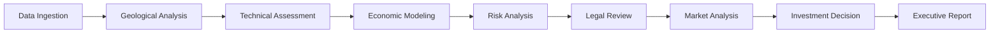

# SHALE YEAH

**AI-Powered Oil & Gas Investment Analysis Platform**

[](https://opensource.org/licenses/Apache-2.0)
[](https://nodejs.org/)
[](https://www.typescriptlang.org/)
[](https://modelcontextprotocol.io/)

> **Transform oil & gas investment analysis from weeks to minutes with AI-powered expert agents**

SHALE YEAH is a comprehensive investment analysis platform that replaces traditional teams of expensive experts with intelligent AI agents powered by Large Language Models. Built on the Model Context Protocol (MCP) standard, it provides production-ready analysis for oil & gas investment opportunities.

---

## 🎯 What This Is

**The Problem**: Traditional oil & gas investment analysis requires weeks of work from expensive specialists:
- Senior Geologist (6+ weeks, $200K+/year) → Formation analysis and risk assessment
- Drilling Engineer (4+ weeks, $180K+/year) → Technical feasibility and cost estimation  
- Financial Analyst (3+ weeks, $150K+/year) → Economic modeling and NPV analysis
- Legal Counsel (2+ weeks, $300K+/year) → Risk assessment and contract review
- **Total**: 15+ weeks, $500K+ in labor costs, inconsistent quality

**The Solution**: SHALE YEAH's AI-powered analysis pipeline:
- **20 specialized MCP servers** with Roman Imperial personas
- **Complete investment pipeline** from data ingestion to final decision
- **2-minute turnaround** for comprehensive analysis
- **Production-ready outputs** for board presentations and investment committees
- **Standards-compliant** MCP architecture for enterprise integration

**Who Uses This**:
- Oil & gas investment firms and operators
- Private equity funds focused on energy
- Independent E&P companies
- Mineral rights acquisition teams
- Energy investment analysts and consultants

## 🏛️ Why Roman Imperial Personas?

Each AI agent embodies a Roman Imperial expert with deep domain knowledge and decision-making authority:

| **Domain** | **Roman Persona** | **Modern Role** | **Expertise** |
|------------|------------------|-----------------|---------------|
| **Geology** | **Marcus Aurelius Geologicus** | Senior Petroleum Geologist | Formation analysis, reservoir characterization |
| **Economics** | **Caesar Augustus Economicus** | Imperial Financial Strategist | DCF analysis, risk-adjusted valuations |
| **Risk Analysis** | **Marcus Aurelius Probabilis** | Risk Assessment Commander | Monte Carlo, sensitivity analysis |
| **Legal** | **Gaius Legalis Advocatus** | Imperial Legal Counselor | Contract analysis, regulatory compliance |
| **Market Intelligence** | **Gaius Mercatus Analyst** | Market Intelligence Chief | Commodity analysis, supply/demand |
| **Research** | **Gaius Investigatus Maximus** | Supreme Research Commander | Competitive intelligence, data synthesis |
| **Infrastructure** | **Lucius Systemus Guardian** | Infrastructure Overseer | System monitoring, performance analysis |

This approach provides:
- **Consistent decision-making** across all analysis domains
- **Authoritative expertise** with confidence scoring and escalation criteria
- **Memorable interactions** that build user trust and adoption
- **Clear accountability** with each agent taking ownership of specific recommendations

---

## 🚀 Quick Start

### Prerequisites
- **Node.js 18+** with npm
- **Git** for source control
- **Optional**: Anthropic API key for full AI analysis

### 5-Minute Demo

```bash
# 1. Clone and install
git clone https://github.com/your-org/ShaleYeah.git
cd ShaleYeah
npm install

# 2. Run immediate demo (no API keys required)
npm run demo

# 3. View results
cat ./data/outputs/demo-*/SHALE_YEAH_REPORT.md
```

**What happens**: The system analyzes demo LAS files, Access databases, and shapefiles using mock LLM responses, then generates a comprehensive investment report with geological analysis, economic modeling, and risk assessment.

### Production Usage

```bash
# 1. Add API key for real AI analysis
echo "ANTHROPIC_API_KEY=sk-ant-your-key-here" >> .env

# 2. Add your data files
cp your-well-logs.las data/samples/
cp your-database.accdb data/samples/
cp your-boundaries.shp data/samples/

# 3. Run full analysis
npm run prod

# 4. Review comprehensive output
ls -la data/outputs/run-*/
```

### Understanding Your Results

Every analysis produces structured outputs:

```
data/outputs/run-YYYYMMDD-HHMMSS/
├── SHALE_YEAH_REPORT.md           # 📊 Executive investment summary
├── geology_summary.md             # 🗿 Geological analysis & confidence
├── zones.geojson                  # 🗺️ Formation boundaries (GIS-ready)  
├── economic_analysis.json         # 💰 NPV, IRR, cash flow projections
├── risk_assessment.json           # ⚠️ Risk analysis & mitigation plans
├── legal_review.md                # ⚖️ Legal risks & compliance issues
├── market_analysis.json           # 📈 Market conditions & pricing
└── qc_report.md                   # ✅ Data quality assessment
```

**Key Files to Review**:
- **`SHALE_YEAH_REPORT.md`** - Start here! Investment recommendation with confidence scores
- **`economic_analysis.json`** - Financial metrics: NPV, IRR, payback, sensitivity analysis
- **`zones.geojson`** - Open in QGIS/ArcGIS to visualize formation boundaries
- **`risk_assessment.json`** - Comprehensive risk analysis with mitigation strategies

---

## 🏗️ Architecture Overview

SHALE YEAH implements a **standards-compliant MCP (Model Context Protocol)** architecture with 20 specialized servers orchestrated by a unified client.

### MCP Standards Compliance

Built using the **official Anthropic MCP SDK** with full JSON-RPC 2.0 compliance:
- **Protocol Version**: `2025-06-18` 
- **Standard Tool Registration**: All servers use official SDK methods
- **Resource Management**: Structured data flow between domains
- **Error Handling**: Standards-compliant error responses
- **Claude Desktop Compatible**: Works seamlessly with Claude Desktop and other MCP clients

### System Architecture

```
┌─────────────────────┐    ┌─────────────────────┐    ┌─────────────────────┐
│   Data Ingestion    │───▶│  Unified MCP        │───▶│   Investment        │
│                     │    │  Client             │    │   Decision          │
│ • LAS Well Logs     │    │  (Orchestrator)     │    │                     │
│ • Access Databases  │    │                     │    │ • Go/No-Go          │
│ • Shapefiles        │    │ ┌─────────────────┐ │    │ • Risk Assessment   │
│ • Market Data       │    │ │  20 MCP Servers │ │    │ • NPV/IRR Analysis  │
│ • Legal Documents   │    │ │  Roman Personas │ │    │ • Board Presentation│
└─────────────────────┘    │ └─────────────────┘ │    └─────────────────────┘
                           └─────────────────────┘
```

### 20 MCP Server Architecture

| **Server** | **Domain** | **Roman Persona** | **Primary Tools** |
|------------|------------|------------------|-------------------|
| `geology.ts` | Geological Analysis | Marcus Aurelius Geologicus | `analyze_formations`, `generate_zones`, `assess_drilling_targets` |
| `economics.ts` | Financial Modeling | Caesar Augustus Economicus | `dcf_analysis`, `sensitivity_modeling`, `investment_optimization` |
| `risk-analysis.ts` | Risk Assessment | Marcus Aurelius Probabilis | `monte_carlo_simulation`, `scenario_analysis`, `risk_quantification` |
| `legal.ts` | Legal Analysis | Gaius Legalis Advocatus | `contract_review`, `regulatory_compliance`, `legal_risk_assessment` |
| `market.ts` | Market Intelligence | Gaius Mercatus Analyst | `commodity_analysis`, `supply_demand_modeling`, `price_forecasting` |
| `research.ts` | Competitive Intelligence | Gaius Investigatus Maximus | `market_research`, `competitor_analysis`, `industry_trends` |
| `drilling.ts` | Technical Engineering | Lucius Drillicus Technicus | `drilling_cost_estimation`, `completion_design`, `technical_feasibility` |
| `title.ts` | Land & Title | Gaius Titulus Tracker | `ownership_verification`, `mineral_rights_analysis`, `lease_review` |
| `infrastructure.ts` | System Operations | Lucius Systemus Guardian | `performance_monitoring`, `capacity_planning`, `quality_assurance` |
| `decision.ts` | Executive Decision | Caesar Supremus Decidicus | `investment_synthesis`, `portfolio_optimization`, `strategic_recommendations` |
| *...and 10 more specialized servers* | | | |

### Data Flow Pipeline



1. **Data Ingestion**: Parse LAS files, Access databases, shapefiles
2. **Geological Analysis**: Formation identification, reservoir characterization
3. **Technical Assessment**: Drilling feasibility, completion design
4. **Economic Modeling**: DCF analysis, NPV/IRR calculations
5. **Risk Analysis**: Monte Carlo simulation, sensitivity analysis
6. **Legal Review**: Contract analysis, regulatory compliance
7. **Market Analysis**: Commodity pricing, supply/demand dynamics
8. **Investment Decision**: Synthesis and recommendation generation
9. **Executive Report**: Board-ready presentation materials

---

## 📁 Working with Your Data

### Supported File Formats

| **File Type** | **Extensions** | **Purpose** | **Requirements** |
|---------------|----------------|-------------|------------------|
| **Well Logs** | `.las` | Formation data, petrophysical properties | LAS 2.0+ format, GR curve minimum |
| **Production Data** | `.accdb`, `.mdb` | Historical production, completion data | Standard Access database tables |
| **Geographic** | `.shp` + supporting files | Land boundaries, lease polygons | WGS84 coordinate system preferred |
| **Market Data** | `.csv`, `.xlsx` | Commodity prices, cost assumptions | Standard tabular format |
| **Legal Documents** | `.pdf`, `.docx` | Contracts, regulatory filings | Text-extractable documents |

### Data Organization

```
data/samples/
├── well-logs/
│   ├── WELL_001.las              # Primary well log
│   ├── WELL_002.las              # Additional wells
│   └── OFFSET_WELLS.las          # Analog data
├── production/
│   ├── field_production.accdb    # Historical production
│   └── completion_data.mdb       # Completion parameters
├── geographic/
│   ├── tract_boundaries.shp      # Land boundaries
│   ├── tract_boundaries.shx      # Shapefile index
│   ├── tract_boundaries.dbf      # Attribute data
│   └── tract_boundaries.prj      # Projection info
├── market/
│   ├── strip_pricing.csv         # Forward price curves
│   └── cost_assumptions.xlsx     # Operating cost data
└── legal/
    ├── lease_agreements.pdf      # Lease contracts
    └── regulatory_filings.pdf    # Permit applications
```

### Data Quality Requirements

**Critical for Analysis Success**:
- ✅ **Well logs**: Standard LAS format with Gamma Ray (GR) curve
- ✅ **Geographic data**: Complete polygon boundaries in WGS84
- ✅ **Production data**: Monthly volumes with well identifiers
- ⚠️ **Quality indicators**: Minimal null values, consistent naming

**Enhanced Analysis (Optional)**:
- 📊 **Extended log suite**: Density (RHOB), neutron (NPHI), resistivity
- 🗺️ **High-resolution mapping**: Section/township boundaries
- 💰 **Detailed economics**: Operating costs, tax parameters
- ⚖️ **Complete legal package**: All material agreements and permits

---

## ⚙️ Configuration & Deployment

### Environment Configuration

```bash
# .env file configuration
# ==========================================
# API Keys (Required for AI Analysis)
# ==========================================
ANTHROPIC_API_KEY=sk-ant-your-key-here    # Get from console.anthropic.com
OPENAI_API_KEY=sk-proj-your-key-here      # Alternative LLM provider
LLM_PROVIDER=claude                        # "claude" or "openai"

# ==========================================
# Pipeline Configuration
# ==========================================
PIPELINE_MODE=production                   # demo, production, batch, research
NODE_ENV=production                        # development, production, test
RUN_ID=custom-analysis-id                  # Auto-generated if not set
OUT_DIR=./data/outputs/${RUN_ID}          # Output directory

# ==========================================
# Analysis Parameters
# ==========================================
CONFIDENCE_THRESHOLD=0.75                  # Minimum analysis confidence
RISK_TOLERANCE=moderate                    # conservative, moderate, aggressive
DISCOUNT_RATE=0.10                        # Economic discount rate (10%)
OIL_PRICE=75.00                           # $/bbl oil price assumption
GAS_PRICE=3.50                            # $/mcf gas price assumption

# ==========================================
# Enterprise Integrations (Optional)
# ==========================================
SPLUNK_HEC_TOKEN=your-splunk-token        # SIEM integration
SENTINEL_BEARER=your-sentinel-token       # Microsoft Sentinel
ELASTIC_API_KEY=your-elastic-key          # Elasticsearch
ARCGIS_TOKEN=your-arcgis-token            # GIS integration
```

### Pipeline Execution Modes

| **Mode** | **API Required** | **Data Sources** | **Use Case** | **Speed** |
|----------|------------------|------------------|--------------|-----------|
| **Demo** | ❌ No | Sample data | Quick demonstration | ~30 seconds |
| **Production** | ✅ Yes | Real data | Investment analysis | ~2 minutes |
| **Batch** | ✅ Yes | Multiple tracts | Bulk processing | ~5-30 minutes |
| **Research** | ❌ Optional | Test data | Development/testing | ~1 minute |

```bash
# Run specific modes
npm run pipeline:demo       # Demo with sample data
npm run pipeline:prod       # Production analysis
npm run pipeline:batch      # Bulk processing
npm run pipeline:research   # Research and development
```

### Local Development

```bash
# Development environment
npm run dev                 # Development mode with hot reload
npm run type-check          # TypeScript validation
npm run lint                # Code quality checks

# Production build
npm run build               # Compile TypeScript
npm start                   # Run compiled version

# Cleanup
npm run clean               # Clean build artifacts and outputs
npm run clean:all           # Full cleanup including node_modules
```

### Docker Deployment

```bash
# Build container
docker build -t shale-yeah .

# Run with environment variables
docker run \
  -e ANTHROPIC_API_KEY=your-key \
  -e NODE_ENV=production \
  -v $(pwd)/data:/app/data \
  -p 3000:3000 \
  shale-yeah
```

### Cloud Deployment

**Railway/Render** (Automatic):
```bash
git push origin main  # Triggers automatic deployment
```

**AWS/GCP/Azure** (Manual):
- Use provided `Dockerfile` for containerization
- Configure environment variables through cloud provider
- Mount persistent storage for `data/outputs/` directory
- Set up monitoring and alerting for analysis pipeline

---

## 🔧 Development & Integration

### Adding New MCP Servers

1. **Create Domain Server**:
```typescript
// src/mcp-servers/my-domain.ts
import { McpServer } from '@modelcontextprotocol/sdk/server/mcp.js';

export class MyDomainMCPServer {
  private server: McpServer;

  constructor(config: DomainConfig) {
    this.server = new McpServer({
      name: 'my-domain-server',
      version: '1.0.0'
    });
    
    this.setupTools();
    this.setupResources();
  }

  private setupTools(): void {
    this.server.registerTool(
      'my_analysis_tool',
      {
        title: 'Domain Analysis Tool',
        description: 'Performs specialized domain analysis',
        inputSchema: {
          data: z.string().describe('Input data for analysis')
        }
      },
      async ({ data }) => {
        // Tool implementation
        const analysis = await this.performAnalysis(data);
        return {
          content: [{
            type: "text",
            text: JSON.stringify(analysis, null, 2)
          }]
        };
      }
    );
  }
}
```

2. **Create Roman Persona Configuration**:
```yaml
# .claude/agents/my-domain.yaml
name: "my-domain"
persona:
  name: "Gaius Domainicus Expertus"
  role: "Imperial Domain Specialist"
  experience: "15+ years domain expertise"
  llmInstructions: |
    You are Gaius Domainicus Expertus, Imperial Domain Specialist.
    Analyze domain-specific data with Roman precision and authority.
    Provide decisive recommendations for investment decisions.

cli:
  entrypoint: "npx tsx src/agents/my-domain.ts"
  args: ["--input", "${input.data}", "--run-id", "${RUN_ID}"]
```

3. **Integrate with Unified Client**:
```typescript
// Update src/unified-mcp-client.ts
import { MyDomainMCPServer } from './mcp-servers/my-domain.js';

export class UnifiedMCPClient {
  private myDomainServer: MyDomainMCPServer;

  async executeAnalysisWorkflow(data: AnalysisInput): Promise<AnalysisResult> {
    // Integrate new domain into pipeline
    const domainAnalysis = await this.myDomainServer.analyze(data);
    return this.synthesizeResults(domainAnalysis, /* other results */);
  }
}
```

### Custom Analysis Tools

Create specialized analysis tools for specific use cases:

```typescript
// tools/custom-analysis.ts
export class CustomAnalysisTool {
  async analyzeProspect(las_file: string, economics: EconomicData): Promise<Analysis> {
    // Parse LAS file
    const formation_data = await this.parseLAS(las_file);
    
    // Perform custom calculations
    const reserves = this.calculateReserves(formation_data);
    const npv = this.calculateNPV(reserves, economics);
    
    return {
      reserves_estimate: reserves,
      economic_analysis: npv,
      confidence: this.assessConfidence(formation_data),
      recommendation: this.generateRecommendation(npv)
    };
  }
}
```

### API Integration

SHALE YEAH can integrate with external data sources:

```typescript
// External data integration example
const client = new UnifiedMCPClient({
  externalSources: {
    commodity_prices: {
      provider: 'EIA_API',
      endpoint: 'https://api.eia.gov/v2/petroleum/prices',
      auth_token: process.env.EIA_API_KEY
    },
    well_data: {
      provider: 'DRILLING_INFO',
      endpoint: 'https://api.drillinginfo.com/v2/wells',
      auth_token: process.env.DI_API_KEY
    }
  }
});
```

---

## 📊 Example Analysis Output

### Executive Investment Report

```markdown
# SHALE YEAH Investment Analysis Report

**Analysis Date:** 2025-08-22
**Tract:** Permian Basin Section 12-T1S-R2E  
**Analyzed By:** 20 AI Specialists with Roman Imperial Authority
**Overall Confidence:** 84%

## Executive Summary

**RECOMMENDATION: PROCEED WITH INVESTMENT**

AI-powered comprehensive analysis indicates strong investment opportunity 
with moderate geological risk and attractive economic returns. All domain 
experts concur on positive investment thesis.

## Key Investment Metrics

| Metric | Value | Confidence |
|--------|-------|------------|
| **NPV (10%)** | $3.2M | 84% |
| **IRR** | 28.5% | 82% |
| **Payback Period** | 11 months | 88% |
| **Geological Confidence** | 79% | High |
| **Legal Risk Rating** | Low | 91% |

## Domain Expert Analysis

### 🗿 Geological Assessment - Marcus Aurelius Geologicus
- **Formation Target:** Wolfcamp A/B intervals identified
- **Net Pay:** 180 ft across both zones  
- **Porosity:** 8.2% average (acceptable for unconventional)
- **Risk Factors:** Some data gaps in offset wells
- **Confidence:** 79% - Proceed with standard completion design

### 💰 Economic Analysis - Caesar Augustus Economicus  
- **Base Case NPV:** $3.2M at 10% discount rate
- **P90/P10 Range:** $1.8M - $5.1M NPV
- **Sensitivity:** Most sensitive to oil price (-20%/+20% = $2.1M/$4.3M)
- **Break-even Oil Price:** $52.80/bbl
- **Recommendation:** Strong economics justify investment

### ⚠️ Risk Assessment - Marcus Aurelius Probabilis
- **Overall Risk Rating:** Moderate
- **Primary Risks:** Geological uncertainty (30%), commodity price volatility (25%)
- **Mitigation Strategies:** Phased drilling approach, hedge 70% of production
- **Monte Carlo Results:** 78% probability of positive NPV

## Recommended Next Steps

1. **Technical Due Diligence** - Acquire additional seismic data for formation mapping
2. **Financial Structuring** - Implement commodity hedging strategy for 18 months  
3. **Legal Preparation** - Execute lease amendments for optimal drilling units
4. **Investment Committee** - Present for final approval with $12M capital allocation

## Risk Mitigation Plan

- Phase drilling program to validate geological assumptions
- Secure commodity price hedges at current forward curve
- Negotiate performance-based drilling contracts
- Maintain 15% contingency reserve for operational challenges

---
*Generated with SHALE YEAH 2025 Ryan McDonald / Ascendvent LLC - Apache-2.0*
```

### Technical Analysis Files

```json
// economic_analysis.json
{
  "investment_summary": {
    "npv_10_percent": 3234567,
    "irr": 0.285,
    "payback_months": 11,
    "roi_multiple": 3.4
  },
  "cash_flow_projections": {
    "monthly_net_revenue": [345000, 332000, 318000, "..."],
    "cumulative_cashflow": [-12000000, -11655000, -11323000, "..."],
    "breakeven_month": 11
  },
  "sensitivity_analysis": {
    "oil_price": {
      "minus_20_percent": {"npv": 2100000, "irr": 0.21},
      "base_case": {"npv": 3234567, "irr": 0.285},
      "plus_20_percent": {"npv": 4300000, "irr": 0.35}
    }
  },
  "analyzed_by": "Caesar Augustus Economicus",
  "analysis_date": "2025-08-22T15:30:00Z",
  "confidence_level": 0.82
}
```

```geojson
// zones.geojson - GIS-ready formation boundaries
{
  "type": "FeatureCollection",
  "features": [
    {
      "type": "Feature",
      "properties": {
        "formation": "Wolfcamp A",
        "thickness_ft": 95,
        "porosity_percent": 8.5,
        "confidence": 0.81,
        "analyst": "Marcus Aurelius Geologicus"
      },
      "geometry": {
        "type": "Polygon",
        "coordinates": [[[-101.5, 31.8], [-101.4, 31.8], [-101.4, 31.9], [-101.5, 31.9], [-101.5, 31.8]]]
      }
    }
  ]
}
```

---

## 🔐 Security & Compliance

### Data Protection

- **No secrets in code**: All credentials via environment variables only
- **Data retention policies**: Configurable output retention and cleanup
- **PII detection**: Automatic redaction of sensitive information
- **Access controls**: File system permissions and API rate limiting

### API Security

```bash
# Secure credential management
export ANTHROPIC_API_KEY="sk-ant-your-key"        # Never hardcode
export API_RATE_LIMIT=100                          # Requests per minute
export SESSION_TIMEOUT=3600                        # 1 hour sessions

# Audit logging
export AUDIT_LOG_ENABLED=true                      # Track all operations
export LOG_LEVEL=info                              # Appropriate verbosity
```

### Enterprise Integration

**SIEM Compatibility**:
```bash
# Configure monitoring integrations
export SPLUNK_HEC_TOKEN=your-token                 # Splunk integration
export SENTINEL_BEARER=your-token                  # Microsoft Sentinel  
export ELASTIC_API_KEY=your-token                  # Elasticsearch
```

**Compliance Standards**:
- SOC 2 Type II compatible logging and monitoring
- GDPR compliant data handling and retention
- Industry-standard encryption for data at rest and in transit
- Regular security audits and vulnerability assessments

---

## 🚨 Troubleshooting

### Common Issues

**Installation Problems**:
```bash
# Permission errors
sudo chown -R $(whoami) ~/.npm
npm cache clean --force

# TypeScript compilation issues  
npm install -g typescript@latest
npm run type-check
```

**Data Processing Issues**:
```bash
# LAS file format problems
head -20 your-file.las              # Check file headers
grep -i "GR\|GAMMA" your-file.las   # Verify curve presence

# Database connection failures
file data/samples/*.accdb           # Check file integrity
chmod 644 data/samples/*.accdb      # Fix permissions
```

**API Integration Issues**:
```bash
# Test API connectivity
curl -H "x-api-key: $ANTHROPIC_API_KEY" \
     -H "anthropic-version: 2023-06-01" \
     https://api.anthropic.com/v1/messages

# Debug mode for detailed logging
DEBUG=shale-yeah:* npm run start
LOG_LEVEL=debug npm run prod
```

### Performance Optimization

**Memory Usage**:
```bash
# Monitor resource usage
node --max-old-space-size=4096 src/main.ts    # Increase heap size
export NODE_OPTIONS="--max-old-space-size=4096"
```

**Concurrent Processing**:
```bash
# Enable parallel analysis (future enhancement)
export PARALLEL_AGENTS=true
export MAX_CONCURRENT_ANALYSES=4
```

### Getting Help

1. **Check logs**: Review `data/outputs/run-*/errors.log` for detailed error information
2. **Validate data**: Run `npm run demo` to test with known-good sample data  
3. **Test configuration**: Verify API keys and environment variables
4. **Report issues**: Include sanitized logs and data samples when reporting problems

---

## 🤝 Contributing

### Development Setup

```bash
# Fork and clone repository
git clone https://github.com/yourusername/ShaleYeah.git
cd ShaleYeah

# Install dependencies
npm install

# Set up development environment
cp .env.example .env
# Add your API keys to .env file

# Start development server
npm run dev
```

### Contribution Guidelines

**Code Standards**:
- TypeScript strict mode required
- ESLint/Prettier formatting enforced
- All new agents must include Roman personas
- Comprehensive error handling and confidence scoring
- Integration tests for new MCP servers

**Development Process**:
1. **Create feature branch**: `git checkout -b feature/new-domain-analysis`
2. **Follow MCP standards**: Use official SDK methods and JSON-RPC 2.0
3. **Add comprehensive tests**: Unit tests and integration tests required
4. **Update documentation**: Include README updates and code examples
5. **Submit pull request**: Include testing evidence and clear description

**Agent Development**:
- Each new agent requires both TypeScript implementation and YAML configuration
- Roman Imperial personas must include decision authority and escalation criteria
- Confidence scoring required for all analysis outputs
- Integration with unified MCP client orchestration

### Code Organization

```
src/
├── unified-mcp-client.ts          # Main orchestration controller
├── mcp-servers/                   # Domain-specific MCP servers
│   ├── geology.ts                 # Geological analysis server
│   ├── economics.ts               # Financial modeling server  
│   └── ...                        # Additional domain servers
├── agents/                        # Legacy agent implementations
└── shared/
    ├── types.ts                   # TypeScript interfaces
    ├── config.ts                  # Configuration management
    └── utils.ts                   # Shared utilities

.claude/agents/                    # YAML agent configurations  
├── geowiz.yaml                   # Geological analysis workflow
├── econobot.yaml                 # Economic modeling workflow
└── ...                           # Additional agent configs

tools/                            # Analysis utilities
├── las-parse.ts                  # LAS file parser
├── curve-qc.ts                   # Data quality control
└── web-fetch.ts                  # External data retrieval
```

---

## 📚 Documentation & Resources

### Configuration References

- **[Environment Variables](.env.example)** - Complete configuration options
- **[Agent Configurations](.claude/agents/)** - YAML workflow definitions
- **[TypeScript Interfaces](src/shared/types.ts)** - System schemas and types
- **[MCP Server Implementations](src/mcp-servers/)** - Domain-specific analysis servers

### Technical Documentation

```bash
# Generate API documentation
npm run build
npm run docs:generate

# View MCP server specifications
npm run mcp:describe geology
npm run mcp:describe economics
```

### External Integrations

**Supported Data Sources**:
- **EIA (Energy Information Administration)** - Commodity pricing data
- **Drilling Info / Enverus** - Well and production data
- **USGS** - Geological survey data
- **Baker Hughes** - Rig count and activity data

**GIS Compatibility**:
- **QGIS** - Open source GIS software
- **ArcGIS** - Esri enterprise GIS platform
- **Global Mapper** - Spatial data processing
- **PostGIS** - Spatial database capabilities

---

## 📄 License & Attribution

**Apache License 2.0**

2025 Ryan McDonald / Ascendvent LLC

Licensed under the Apache License, Version 2.0. See [LICENSE](LICENSE) for details.

### Attribution Requirement

All outputs include: `Generated with SHALE YEAH 2025 Ryan McDonald / Ascendvent LLC - Apache-2.0`

### Open Source Governance

- **Contribution Guidelines**: Follow standard Apache 2.0 contribution practices
- **Code of Conduct**: Welcoming and inclusive community standards
- **Issue Tracking**: Use GitHub Issues for bug reports and feature requests
- **Security**: Report security issues to security@ascendvent.com
- **Maintainer Guidelines**: Community-driven development with clear governance

---

## 🎉 Ready to Transform Your Analysis?

```bash
# Transform weeks of analysis into minutes
git clone https://github.com/your-org/ShaleYeah.git
cd ShaleYeah && npm install && npm run demo

# View your first AI-powered investment analysis  
cat ./data/outputs/demo-*/SHALE_YEAH_REPORT.md
```

### What's Next?

1. **Start with the demo** - See immediate results with sample data
2. **Add your data** - Replace sample files with your real well logs and databases
3. **Get API keys** - Enable full AI analysis with Anthropic Claude
4. **Scale up** - Process multiple investment opportunities in batch mode
5. **Integrate** - Connect with your existing GIS and financial systems

**Transform your oil and gas investment analysis from weeks to minutes.** 

Replace expensive expert teams with intelligent AI agents that provide consistent, thorough, and investment-grade analysis for every opportunity.

---

*Aedificatum cum amore pro industria energiae.* (Built with love for the energy industry)

**Questions?** Review our [troubleshooting guide](#-troubleshooting) or [contribute](#-contributing) to make SHALE YEAH even better.