# SHALE YEAH

**AI-Powered Oil & Gas Investment Analysis Platform**

[](https://opensource.org/licenses/Apache-2.0)
[](https://nodejs.org/)
[](https://www.typescriptlang.org/)
[](https://modelcontextprotocol.io/)

> **Transform oil & gas investment analysis from weeks to minutes with AI-powered expert agents**

SHALE YEAH is a comprehensive investment analysis platform that replaces traditional teams of expensive specialists with intelligent AI agents powered by Large Language Models. Built on the Model Context Protocol (MCP) standard, it provides production-ready analysis for oil & gas investment opportunities.

---

## What This Is

**The Problem**: Traditional oil & gas investment analysis requires weeks of work from expensive specialists:
- Senior Geologist (6+ weeks, $200K+/year) — Formation analysis and risk assessment
- Drilling Engineer (4+ weeks, $180K+/year) — Technical feasibility and cost estimation
- Financial Analyst (3+ weeks, $150K+/year) — Economic modeling and NPV analysis
- Legal Counsel (2+ weeks, $300K+/year) — Risk assessment and contract review
- **Total**: 15+ weeks, $500K+ in labor costs, inconsistent quality

**The Solution**: SHALE YEAH's AI-powered analysis pipeline:
- **14 specialized MCP servers** with Roman Imperial personas
- **Complete investment pipeline** from data ingestion to final decision
- **Production-ready outputs** for board presentations and investment committees
- **Standards-compliant** MCP architecture for enterprise integration

**Who Uses This**:
- Oil & gas investment firms and operators
- Private equity funds focused on energy
- Independent E&P companies
- Mineral rights acquisition teams
- Energy investment analysts and consultants

---

## Roman Imperial Personas

Each AI agent embodies a Roman Imperial expert with deep domain knowledge and decision-making authority:

| **Domain** | **Roman Persona** | **Modern Role** | **Expertise** |
|------------|------------------|-----------------|---------------|
| **Geology** | **Marcus Aurelius Geologicus** | Master Geological Analyst | Formation analysis, reservoir characterization |
| **Economics** | **Caesar Augustus Economicus** | Master Financial Strategist | DCF analysis, NPV/IRR modeling |
| **Engineering** | **Lucius Technicus Engineer** | Master Reservoir Engineer | Decline curves, EUR estimation |
| **Decision** | **Augustus Decidius Maximus** | Supreme Investment Strategist | Final investment logic, portfolio optimization |
| **Research** | **Scientius Researchicus** | Master Intelligence Gatherer | Market intelligence, competitive analysis |
| **Risk Analysis** | **Gaius Probabilis Assessor** | Master Risk Strategist | Monte Carlo, uncertainty quantification |
| **Legal** | **Legatus Juridicus** | Master Legal Strategist | Contract analysis, regulatory compliance |
| **Market** | **Mercatus Analyticus** | Master Market Strategist | Commodity forecasting, supply/demand analysis |
| **Development** | **Architectus Developmentus** | Master Development Coordinator | Project planning, resource allocation |
| **Drilling** | **Perforator Maximus** | Master Drilling Strategist | Drilling programs, cost optimization |
| **Infrastructure** | **Structura Ingenious** | Master Infrastructure Architect | Facility design, capacity planning |
| **Title** | **Titulus Verificatus** | Master Title Analyst | Ownership verification, due diligence |
| **Test** | **Testius Validatus** | Master Quality Controller | Analysis validation, quality assurance |
| **Reporting** | **Scriptor Reporticus Maximus** | Master Report Generator | Executive reporting, decision synthesis |

---

## Quick Start

### Prerequisites
- **Node.js 18+** with npm
- **Git** for source control
- **Optional**: Anthropic API key for production AI analysis

### Run the Demo

```bash
# Clone and install
git clone https://github.com/rmcdonald/ShaleYeah.git
cd ShaleYeah
npm install --legacy-peer-deps

# Run the demo (uses realistic mock data — no API keys needed)
npm run demo
```

**What happens**: 14 AI expert agents analyze a Permian Basin tract through the Agent OS kernel, executing in parallel phases. Professional investment reports are generated in the output directory.

**Demo Output:**
```
🛢️  SHALE YEAH - AI-Powered Oil & Gas Investment Analysis
📋 Analysis ID: demo-20250917T132058
🗺️  Target Tract: Permian Basin Demo Tract

🤖 Phase 1 — Core Analysis (parallel)
   ✅ Geological Analysis: 90% confidence
   ✅ Financial Analysis: 82% confidence
   ✅ Engineering Analysis: 88% confidence
   ...

📊 Overall Recommendation: ✅ PROCEED (Strong Economics & Acceptable Risk)
📁 Results: ./outputs/demo/demo-20250917T132058
```

---

## Understanding Your Results

Demo analysis produces three output files in `./outputs/demo/demo-YYYYMMDDTHHMMSS/`:

| File | What It Contains | Who Should Read It |
|------|-----------------|-------------------|
| **`INVESTMENT_DECISION.md`** | Go/no-go recommendation with confidence scores | Investment committee, executives |
| **`DETAILED_ANALYSIS.md`** | Comprehensive findings from all 14 expert domains | Technical reviewers, due diligence teams |
| **`FINANCIAL_MODEL.json`** | Complete financial model with NPV, IRR, sensitivity analysis | Financial analysts, portfolio managers |

**Start with `INVESTMENT_DECISION.md`** — it's the executive summary with the final recommendation.

---

## Architecture Overview

SHALE YEAH implements an **Agent OS kernel** that orchestrates 14 specialized MCP servers:

```
┌─────────────────────┐    ┌─────────────────────────────────────┐    ┌─────────────────────┐
│   Data Ingestion    │───▶│  Agent OS Kernel                    │───▶│   Investment        │
│                     │    │  ┌───────────────────────────────┐  │    │   Decision          │
│ • LAS Well Logs     │    │  │ Registry │ Executor │ Session │  │    │                     │
│ • Access Databases  │    │  └───────────────────────────────┘  │    │ • Go/No-Go          │
│ • Shapefiles        │    │  ┌───────────────────────────────┐  │    │ • Risk Assessment   │
│ • Market Data       │    │  │ Auth │ Audit │ Resilience     │  │    │ • NPV/IRR Analysis  │
│ • Legal Documents   │    │  └───────────────────────────────┘  │    │ • Board Presentation│
└─────────────────────┘    │  ┌─────────────────┐               │    └─────────────────────┘
                           │  │  14 MCP Servers  │               │
                           │  │  Roman Personas  │               │
                           │  └─────────────────┘               │
                           └─────────────────────────────────────┘
```

### Parallel Execution Pipeline

The kernel executes servers in **parallel phases** (scatter-gather), not sequentially. Independent analyses run concurrently, with downstream phases waiting only for their declared dependencies.

```mermaid
graph TD
    A[Data Ingestion] --> P1

    subgraph P1["Phase 1 — Core Analysis (parallel)"]
        B[Geology]
        C[Economics]
        D[Engineering]
        E[Market]
        F[Research]
    end

    P1 --> P2

    subgraph P2["Phase 2 — Extended Analysis (parallel)"]
        G[Risk]
        H[Legal]
        I[Title]
        J[Drilling]
        K[Infrastructure]
        L[Development]
    end

    P2 --> P3[Phase 3 — QA Validation]
    P3 --> P4a[Reporter] --> P4b[Investment Decision]
```



**Quick Screen** (4 servers, 1 phase): Geology + Economics + Engineering + Risk in parallel — sub-second screening.

**Full Due Diligence** (14 servers, 4+ phases): All experts with dependency ordering — comprehensive investment analysis.

For detailed architecture documentation, see [docs/ARCHITECTURE.md](docs/ARCHITECTURE.md).

---

## Supported File Formats

| **File Category** | **Extensions** | **Status** | **Purpose** |
|-------------------|---------------|------------|-------------|
| **Well Logs** | `.las`, `.dlis` | Working | Formation evaluation, petrophysical data |
| **Seismic Data** | `.segy`, `.sgy` | Working | Seismic traces, interpretation |
| **Production DBs** | `.accdb`, `.mdb` | Working | Production history, well test data |
| **GIS / Spatial** | `.shp`, `.geojson`, `.kml` | Working | Boundaries, lease blocks, pipelines |
| **Financial Models** | `.xlsx`, `.csv`, `.json` | Working | Economics, forecasts, sensitivities |
| **Reports** | `.md`, `.pdf`, `.docx` | Working | Executive summaries, investor reports |

---

## Production Usage

```bash
# 1. Add API key for real AI analysis
echo "ANTHROPIC_API_KEY=sk-ant-your-key-here" >> .env

# 2. Add your data files
cp your-well-logs.las data/samples/
cp your-economic-data.xlsx data/samples/

# 3. Run full analysis
npm run prod
```

See [docs/DEMO_VS_PRODUCTION.md](docs/DEMO_VS_PRODUCTION.md) for detailed production setup and [docs/GETTING_STARTED.md](docs/GETTING_STARTED.md) for a step-by-step guide.

---

## Individual Expert Servers

Each AI expert can run independently as an MCP server — useful for connecting to Claude Desktop or other MCP clients:

```bash
npm run server:geowiz        # Geological analysis
npm run server:econobot      # Economic analysis
npm run server:decision      # Investment decisions
npm run server:research      # Market intelligence
npm run server:risk-analysis # Risk assessment
npm run server:legal         # Legal analysis
npm run server:market        # Market analysis
npm run server:development   # Development planning
npm run server:drilling      # Drilling operations
npm run server:infrastructure # Infrastructure planning
npm run server:title         # Title analysis
npm run server:test          # Quality assurance
npm run server:curve-smith   # Reservoir engineering
npm run server:reporter      # Executive reporting
```

---

## Kernel API

For programmatic integration:

```typescript
import { Kernel } from './src/kernel/index.js';

const kernel = new Kernel();
kernel.initialize(serverConfigs);
kernel.setExecutorFn(executorFn);

// Quick screen — 4 core servers in parallel
const screen = await kernel.quickScreen({ basin: "Permian" });

// Full due diligence — all 14 servers, dependency-ordered
const full = await kernel.fullAnalysis({ basin: "Permian" });

// Investment decision with confirmation gate
const invest = await kernel.shouldWeInvest({ basin: "Permian" });
const confirmed = await kernel.confirmAction(actionId);
```

See [docs/API_REFERENCE.md](docs/API_REFERENCE.md) for the complete API documentation.

---

## Security

SHALE YEAH includes role-based access control (RBAC) with a 4-tier permission hierarchy and an append-only JSONL audit trail with automatic sensitive value redaction. See [SECURITY.md](SECURITY.md) for full details.

---

## Troubleshooting

All tool errors are automatically classified by the kernel's resilience middleware:

| Error Type | Example | What To Do |
|---|---|---|
| `retryable` | Timeout, rate limit, network error | Wait and retry |
| `permanent` | Invalid input, schema validation | Fix request |
| `auth_required` | 401/403, expired token | Re-authenticate |
| `user_action` | File not found, missing data | Check your files |

**Common fixes:**
- **Demo not running?** Run `npm run build` first, then `npm run demo`
- **Type errors?** Run `npm run type-check` to see details
- **Need a clean start?** Run `npm run clean && npm install --legacy-peer-deps && npm run build`

See [docs/GETTING_STARTED.md](docs/GETTING_STARTED.md) for detailed troubleshooting.

---

## Contributing

We welcome contributions! See [CONTRIBUTING.md](CONTRIBUTING.md) for the full guide.

```bash
npm run build && npm run type-check && npm run lint && npm run test && npm run demo
```

---

## License

**Apache License 2.0** — 2025 Ryan McDonald / Ascendvent LLC

All outputs include: `Generated with SHALE YEAH 2025 Ryan McDonald / Ascendvent LLC - Apache-2.0`

See [LICENSE](LICENSE) for details.

---

## Example Analysis Output

```markdown
# SHALE YEAH Investment Analysis Report

**Analysis Date:** 2025-08-22
**Tract:** Permian Basin Section 12-T1S-R2E
**Analyzed By:** 14 AI Specialists with Roman Imperial Authority
**Overall Confidence:** 84%

## Executive Summary

**RECOMMENDATION: PROCEED WITH INVESTMENT**

AI-powered comprehensive analysis indicates strong investment opportunity
with moderate geological risk and attractive economic returns. All domain
experts concur on positive investment thesis.

## Key Investment Metrics

| Metric | Value | Confidence |
|--------|-------|------------|
| **NPV (10%)** | $3.2M | 84% |
| **IRR** | 28.5% | 82% |
| **Payback Period** | 11 months | 88% |
| **Geological Confidence** | 79% | High |
| **Legal Risk Rating** | Low | 91% |

## Domain Expert Analysis

### Marcus Aurelius Geologicus (Geological Assessment)
- **Formation Target:** Wolfcamp A/B intervals identified
- **Net Pay:** 180 ft across both zones
- **Porosity:** 8.2% average (acceptable for unconventional)
- **Confidence:** 79% — Proceed with standard completion design

### Caesar Augustus Economicus (Economic Analysis)
- **Base Case NPV:** $3.2M at 10% discount rate
- **P90/P10 Range:** $1.8M - $5.1M NPV
- **Break-even Oil Price:** $52.80/bbl
- **Recommendation:** Strong economics justify investment

### Gaius Probabilis Assessor (Risk Assessment)
- **Overall Risk Rating:** Moderate
- **Primary Risks:** Geological uncertainty (30%), commodity price volatility (25%)
- **Monte Carlo Results:** 78% probability of positive NPV

## Recommended Next Steps

1. Acquire additional seismic data for formation mapping
2. Implement commodity hedging strategy for 18 months
3. Execute lease amendments for optimal drilling units
4. Present for final approval with $12M capital allocation
```

---

*Aedificatum cum amore pro industria energiae.* (Built with love for the energy industry)
