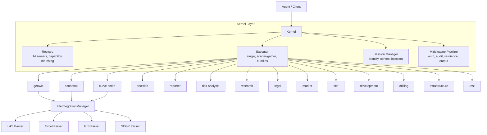

# SHALE YEAH Architecture

This document explains the technical architecture of SHALE YEAH for developers and contributors.

## High-Level Architecture

SHALE YEAH is an **Agent OS** for oil and gas investment analysis. At its core is a **kernel** that routes all execution through **14 MCP domain servers**, providing tool discovery, parallel scatter-gather execution, session management, and a middleware pipeline (auth, audit, resilience, output shaping).

Both demo and production modes run through the same kernel-backed pipeline:
- **Demo** (`npm run demo`) — Mock data, no API keys, ~6s execution via kernel
- **Production** (`npm run prod`) — Real data + Anthropic API via kernel



## Kernel Architecture

**Location**: `src/kernel/`

The kernel is the single entry point between agents and the 14 MCP domain servers. It wraps discovery, routing, execution, context, and middleware into a unified runtime based on [Arcade.dev's agentic tool patterns](https://www.arcade.dev/patterns).

### Key Components

| File | Responsibility |
|---|---|
| `index.ts` | Kernel class — entry point, middleware pipeline, high-level methods |
| `registry.ts` | Tool registry — 14 servers, capability matching, type classification |
| `executor.ts` | Execution engine — single, parallel scatter-gather, bundle execution |
| `context.ts` | Session manager — identity anchoring, context injection, result storage |
| `bundles.ts` | Pre-built task bundles (QUICK_SCREEN, FULL_DUE_DILIGENCE, GEO_DEEP_DIVE, FINANCIAL_REVIEW) |
| `types.ts` | All kernel type definitions |
| `middleware/auth.ts` | RBAC (analyst, engineer, executive, admin) |
| `middleware/audit.ts` | JSONL audit trail with sensitive value redaction |
| `middleware/resilience.ts` | Error classification + recovery guides |
| `middleware/output.ts` | Progressive detail levels (summary/standard/full) |

### Tool Classification

Every tool is classified as `query` (read-only, cacheable), `command` (side effects), or `discovery` (meta). This enables agents to safely parallelize queries, confirm commands, and explore capabilities dynamically.

### Execution Engine (Scatter-Gather)

The executor supports three execution modes:

1. **Single execution** — route a request to one server, return `ToolResponse`
2. **Parallel (scatter-gather)** — run N requests via `Promise.allSettled`, collect all results even if some fail. Respects `maxParallel` concurrency limit.
3. **Bundle execution** — resolve a dependency graph into ordered phases, execute each phase (parallel or sequential), track per-phase and overall completeness.

```
Quick Screen (1 phase, ~20ms):
  ┌─────────┐ ┌─────────┐ ┌────────────┐ ┌───────────────┐
  │ GeoWiz  │ │Econobot │ │Curve-Smith │ │Risk-Analysis  │
  └────┬────┘ └────┬────┘ └─────┬──────┘ └──────┬────────┘
       └──────────┬┘            │               │
              Promise.allSettled ────────────────┘
                    │
              GatheredResponse (completeness %)

Full Due Diligence (4+ phases):
  Phase 1:  geowiz, econobot, curve-smith, market, research  (parallel)
  Phase 2:  risk, legal, title, drilling, infra, development  (parallel, depends on P1)
  Phase 3:  test                                               (depends on P2)
  Phase 4:  reporter → decision                                (sequential, depends on P3)
```

### Pre-Built Bundles

| Bundle | Servers | Phases | Strategy | Detail Level |
|--------|---------|--------|----------|-------------|
| `quick_screen` | 4 (core) | 1 | all required | summary |
| `full_due_diligence` | 14 (all) | 4+ | majority | standard/full |
| `geological_deep_dive` | geowiz(full), curve-smith(standard), research(summary) | 1 | all | mixed |
| `financial_review` | econobot(full), risk-analysis(standard), market(summary) | 1 | all | mixed |

### Composition — Abstraction Ladder

The kernel provides tools at three abstraction levels, implementing the [Arcade.dev Abstraction Ladder](https://www.arcade.dev/patterns/abstraction-ladder) pattern:

```
High   ┌─────────────────────────────────────┐
       │  shouldWeInvest()                   │  Full pipeline + confirmation gate
       │  quickScreen() / fullAnalysis()     │  Pre-built bundles
       ├─────────────────────────────────────┤
Mid    │  geologicalDeepDive()               │  Domain-focused bundles (3 servers)
       │  financialReview()                  │  Domain-focused bundles (3 servers)
       │  executeParallel([...requests])     │  Ad-hoc scatter-gather
       ├─────────────────────────────────────┤
Low    │  execute(request)                   │  Single tool call
       │  callTool(request, sessionId)       │  Single tool + auth/audit pipeline
       └─────────────────────────────────────┘
```

### Confirmation Gate

Decision tools (`decision.make_recommendation`, `decision.analyze`) return `requires_confirmation: true` with a pending action. The agent must call `confirmAction(actionId)` or `cancelAction(actionId)` before the action executes. This implements the [Arcade.dev Confirmation Request](https://www.arcade.dev/patterns/confirmation-request) pattern for high-impact tools.

## Context and Sessions

The kernel manages user sessions with identity anchoring and context injection, implementing the Arcade patterns: **Identity Anchor**, **Context Injection**, **Context Boundary**, and **Resource Referencing**.

### Session Lifecycle

```
createSession(identity?, prefs?)  →  Session { id, identity, preferences }
        │
        ├─ storeResult("geo", response)   // Resource Referencing
        ├─ storeResult("econ", response)
        │
        ├─ getResult("geo")               // Retrieve stored analysis
        │
        ├─ getInjectedContext()            // Context Injection
        │       → { userId, role, sessionId, timestamp, timezone,
        │          defaultBasin, riskTolerance, availableResults[] }
        │
        ├─ whoAmI(sessionId)               // Identity Anchor
        │       → { identity, context }
        │
        └─ destroySession(sessionId)       // Cleanup
```

### Context Boundary (Session Isolation)

Each session is an isolated context boundary. Results stored in one session are never visible to another:

```
Session A: storeResult("geo", ...)  →  availableResults: ["geo"]
Session B: storeResult("econ", ...) →  availableResults: ["econ"]
                                        // No cross-contamination
```

### Default Identity

Demo mode uses a built-in identity:
```typescript
DEMO_IDENTITY = {
  userId: "demo", role: "analyst",
  permissions: ["read:analysis"],
  organization: "SHALE YEAH Demo"
}
```

## Middleware Pipeline

### Request Flow

```
callTool(request, sessionId)
    │
    ├─ 1. AuthMiddleware.check(tool, identity)
    │       ├─ allowed → continue
    │       └─ denied → audit.logDenial() → return error
    │
    ├─ 2. AuditMiddleware.logRequest(entry)
    │
    ├─ 3. Executor.execute(request)
    │
    └─ 4. AuditMiddleware.logResponse(entry)  — or logError(entry)
```

### Role-Based Access Control

| Role | Permissions | Can Call |
|---|---|---|
| analyst | read:analysis | All query tools (12 servers) |
| engineer | +write:reports | + reporter tools |
| executive | +execute:decisions | + decision tools |
| admin | +admin:servers, admin:users | Everything |

### Audit Trail

- Append-only JSONL at `data/audit/YYYY-MM-DD.jsonl`
- Sensitive values (keys matching `/key|token|secret|password|credential|auth|bearer/`) automatically redacted as `[REDACTED]`
- Logs requests, responses, errors, and denials with who/what/when

### Error Intelligence and Resilience

The kernel's `ResilienceMiddleware` classifies errors, generates recovery guides, and handles graceful degradation when parallel servers fail.

```
Raw Error → Pattern Matching → ErrorType Classification → RecoveryGuide
                                    │
                    ┌───────────────┼───────────────┐
                    │               │               │
               retryable      permanent      auth_required    user_action
              (retry w/       (fix request)   (re-auth)      (need input)
               backoff)
```

Priority order: auth > user_action > retryable > permanent. Unknown errors default to retryable.

When scatter-gather execution encounters partial failures, the resilience middleware assesses whether the degraded result is still useful:

```
14 servers requested → 12 succeed, 2 fail
                         │
                    completeness: 86%  (>50% threshold)
                    missingAnalyses: ["reporter", "decision"]
                    suggestions: ["Partial results sufficient...",
                                  "decision failed — try reporter.analyze"]
```

Each server has fallback suggestions based on capability overlap (e.g., geowiz to research, econobot to market).

### Configuration

Both auth and audit are controlled by environment variables:

```
KERNEL_AUTH_ENABLED=true|false   (default: false)
KERNEL_AUDIT_ENABLED=true|false  (default: true)
```

## Core Components

### MCPServer Base Class

**Location**: `src/shared/mcp-server.ts`

The foundation for all 14 domain servers. Provides:

```typescript
export abstract class MCPServer {
  public config: MCPServerConfig;
  public dataPath: string;
  public fileManager: FileIntegrationManager;

  // Standard MCP lifecycle
  abstract setupCapabilities(): void;
  abstract setupDataDirectories(): Promise<void>;

  // Tool and resource registration
  public registerTool(tool: MCPTool): void;
  public registerResource(resource: MCPResource): void;
}
```

**Key Features:**
- **MCP Protocol Compliance**: Full support for MCP 1.17.3 standard
- **Persona System**: Each server has a Roman Imperial persona with expertise
- **File Processing**: Integrated file parsing for 20+ industry formats
- **Error Handling**: Structured error responses with detailed logging
- **Resource Management**: Automatic data directory setup and file management

### Domain Expert Servers

Each server inherits from `MCPServer` and specializes in a specific domain:

#### Geological Analysis (`geowiz.ts`)
```typescript
class GeowizServer extends MCPServer {
  // Tools: analyze_formation, process_gis, assess_quality
  // Expertise: Formation analysis, well log interpretation, GIS processing
  // Persona: Marcus Aurelius Geologicus - Master Geological Analyst
}
```

#### Economic Analysis (`econobot.ts`)
```typescript
class EconobotServer extends MCPServer {
  // Tools: dcf_analysis, analyze_economics, sensitivity_analysis
  // Expertise: DCF modeling, NPV/IRR calculations, financial forecasting
  // Persona: Caesar Augustus Economicus - Master Financial Strategist
}
```

#### Investment Decision (`decision.ts`)
```typescript
class DecisionServer extends MCPServer {
  // Tools: make_investment_decision, calculate_bid_strategy, analyze_portfolio_fit
  // Expertise: Final investment logic, bid recommendations, portfolio optimization
  // Persona: Augustus Decidius Maximus - Supreme Investment Strategist
}
```

*...and 11 more specialized servers (curve-smith, reporter, risk-analysis, research, legal, market, title, development, drilling, infrastructure, test)*

### File Processing System

**Location**: `src/shared/file-integration.ts`

Handles industry-standard file formats:

```typescript
class FileIntegrationManager {
  async parseFile(filePath: string): Promise<ParseResult> {
    // Auto-detects format and routes to appropriate parser
    // Supports: LAS, Excel, CSV, Shapefiles, GeoJSON, KML, SEGY, PDF, etc.
  }
}
```

**Supported Formats:**
- **Well Logs**: LAS 2.0+, ASCII logs
- **Economic Data**: Excel (XLSX, XLSM), CSV
- **GIS/Spatial**: Shapefiles, GeoJSON, KML
- **Seismic**: SEGY/SGY files
- **Documents**: PDF, Word (architecture ready)

### Client and Demo Orchestration

**`ShaleYeahMCPClient`** (`src/mcp-client.ts`) coordinates the 14 servers. It wraps a `Kernel` instance internally — `executeAnalysis()` delegates to `kernel.fullAnalysis()`.

**`ShaleYeahMCPDemo`** (`src/demo-runner.ts`) creates a kernel session and runs the full investment analysis workflow through the kernel. All 14 servers execute in parallel phases via the kernel's scatter-gather executor, completing in ~6 seconds with mock data.

```typescript
class ShaleYeahMCPDemo {
  async runCompleteDemo(): Promise<void> {
    // 1. Create kernel session with demo identity
    // 2. Execute all 14 servers in parallel phases via kernel
    // 3. Generate professional reports
    // 4. Provide investment recommendation
  }
}
```

## MCP Protocol Implementation

### Tools (Analysis Functions)

Each server exposes tools via the MCP protocol:

```typescript
this.registerTool({
  name: 'analyze_formation',
  description: 'Analyze geological formations from well log data',
  inputSchema: z.object({
    filePath: z.string().describe('Path to LAS well log file'),
    formations: z.array(z.string()).optional(),
    analysisType: z.enum(['basic', 'standard', 'comprehensive']).default('standard')
  }),
  handler: async (args) => this.analyzeFormation(args)
});
```

### Resources (Data Access)

Servers also expose data resources:

```typescript
this.registerResource({
  name: 'formation_analysis',
  uri: 'geowiz://analyses/{id}',
  description: 'Geological formation analysis results',
  handler: async (uri) => this.getFormationAnalysis(uri)
});
```

### Server Lifecycle

```typescript
// 1. Initialize server with persona and config
const server = new GeowizServer();

// 2. Setup capabilities (tools and resources)
server.setupCapabilities();

// 3. Create data directories
await server.setupDataDirectories();

// 4. Start MCP server
await runMCPServer(server);
```

## Data Flow

### Analysis Flow (Demo and Production)

Both modes flow through the kernel. The kernel's executor runs servers in parallel phases via scatter-gather, not sequentially:

```
Client / Demo Runner
    ↓
Kernel.createSession(identity)
    ↓
Kernel.fullAnalysis(request, sessionId)
    ↓
Executor: scatter-gather in dependency-ordered phases
    Phase 1:  geowiz, econobot, curve-smith, market, research  (parallel)
    Phase 2:  risk, legal, title, drilling, infra, development  (parallel)
    Phase 3:  test                                               (parallel)
    Phase 4:  reporter → decision                                (sequential)
    ↓
Results stored in session (Resource Referencing)
    ↓
Final Recommendation + Reports
```

In production mode, file processing occurs before execution:

```
Input Files → FileIntegrationManager → Detect Format → LAS/Excel/GIS/SEGY Parser
    ↓
Parsed data injected into analysis request
    ↓
(Same kernel execution flow as above)
```

### Data Storage

```
data/
├── outputs/              # Analysis results
│   └── demo-{timestamp}/ # Demo run outputs
│       ├── INVESTMENT_DECISION.md
│       ├── DETAILED_ANALYSIS.md
│       └── FINANCIAL_MODEL.json
├── audit/                # Audit trail (JSONL)
│   └── YYYY-MM-DD.jsonl
└── {server-name}/        # Server-specific data
    ├── analyses/         # Analysis results
    ├── reports/          # Generated reports
    └── temp/            # Temporary files
```

## Design Patterns

### 1. Template Method Pattern

Base `MCPServer` class defines the template:

```typescript
abstract class MCPServer {
  // Template method
  async initialize(): Promise<void> {
    await this.setupDataDirectories();  // Concrete implementation
    await this.setupCapabilities();     // Concrete implementation
    await this.server.connect();        // Framework method
  }
}
```

### 2. Strategy Pattern

File parsing uses strategy pattern:

```typescript
class FileIntegrationManager {
  private parsers = {
    '.las': new LASParser(),
    '.xlsx': new ExcelParser(),
    '.shp': new GISParser(),
    '.segy': new SEGYParser()
  };
}
```

### 3. Factory Pattern

Server creation uses factory pattern:

```typescript
function createServer(type: string): MCPServer {
  switch (type) {
    case 'geowiz': return new GeowizServer();
    case 'econobot': return new EconobotServer();
    // ...
  }
}
```

## Configuration

### Server Configuration

```typescript
interface MCPServerConfig {
  name: string;           // Server identifier
  version: string;        // Server version
  description: string;    // Human-readable description
  persona: {              // Roman Imperial persona
    name: string;         // e.g., "Marcus Aurelius Geologicus"
    role: string;         // e.g., "Master Geological Analyst"
    expertise: string[];  // Areas of specialization
  };
  dataPath?: string;      // Optional custom data directory
}
```

### Tool Configuration

```typescript
interface MCPTool {
  name: string;                    // Tool identifier
  description: string;             // Human-readable description
  inputSchema: z.ZodSchema<any>;   // Zod schema for validation
  handler: (args: any) => Promise<any>; // Implementation function
}
```

## Error Handling

### Structured Error Responses

```typescript
protected formatError(operation: string, error: any): any {
  return {
    success: false,
    error: {
      operation,
      message: String(error),
      server: this.config.name,
      persona: this.config.persona.name,
      timestamp: new Date().toISOString()
    }
  };
}
```

### File Processing Errors

```typescript
interface ParseResult {
  success: boolean;
  data?: any;
  errors?: string[];
  warnings?: string[];
  metadata?: {
    format: string;
    size: number;
    processingTime: number;
  };
}
```

## Performance Considerations

### 1. Async Processing
- All analysis operations are fully asynchronous
- Supports concurrent server execution
- Memory-efficient file streaming for large files

### 2. Caching Strategy
- Results cached in server-specific data directories
- Intelligent cache invalidation based on input changes
- Optional in-memory caching for frequently accessed data

### 3. Resource Management
- Automatic cleanup of temporary files
- Graceful server shutdown handling
- Memory usage monitoring and optimization

## Testing Strategy

Tests use a simple assert pattern (not jest/vitest), run via `npx tsx tests/<name>.test.ts`. There are 8 kernel test suites (627 tests) plus demo integration and file processing tests.

### Kernel Tests

```typescript
// tests/kernel-registry.test.ts
import { Kernel } from "../src/kernel/index.js";
import { ShaleYeahMCPClient } from "../src/mcp-client.js";

let passed = 0;
let failed = 0;

function assert(condition: boolean, message: string): void {
  if (condition) {
    console.log(`  ✅ ${message}`);
    passed++;
  } else {
    console.error(`  ❌ ${message}`);
    failed++;
  }
}

const client = new ShaleYeahMCPClient();
const kernel = new Kernel();
kernel.initialize(client.serverConfigs);

assert(kernel.initialized, "Kernel is initialized");
assert(kernel.registry.serverCount === 14, "Registry has 14 servers");
assert(kernel.registry.toolCount === 14, "Registry has 14 tools");
```

### Test Suites

| Suite | File | Tests |
|---|---|---|
| Registry | `tests/kernel-registry.test.ts` | 60 |
| Output | `tests/kernel-output.test.ts` | 56 |
| Executor | `tests/kernel-executor.test.ts` | 83 |
| Context | `tests/kernel-context.test.ts` | 87 |
| Resilience | `tests/kernel-resilience.test.ts` | 108 |
| Auth | `tests/kernel-auth.test.ts` | 63 |
| Audit | `tests/kernel-audit.test.ts` | 58 |
| Bundles | `tests/kernel-bundles.test.ts` | 112 |

### Running Tests

```bash
npm run test                          # All suites
npx tsx tests/kernel-registry.test.ts # Individual suite
npm run demo                          # Demo integration test
```

## Security Considerations

### 1. Input Validation
- All inputs validated with Zod schemas
- File type verification before processing
- Path traversal protection

### 2. Data Privacy
- No sensitive data logged
- Temporary files cleaned up automatically
- Audit trail redacts sensitive values automatically

### 3. Access Control
- Role-based access control via AuthMiddleware
- Server-level permission management
- Append-only audit logging for all operations

## Running the System

### Development
```bash
npm run server:geowiz    # Individual server testing
npm run demo             # Full 14-server demonstration through kernel
```

### Production
```bash
npm run prod                          # Production analysis via kernel
npm run prod -- --files="*.las,*.xlsx" # Production with file inputs
```

---

*Generated with SHALE YEAH 2025 Ryan McDonald / Ascendvent LLC - Apache-2.0*
