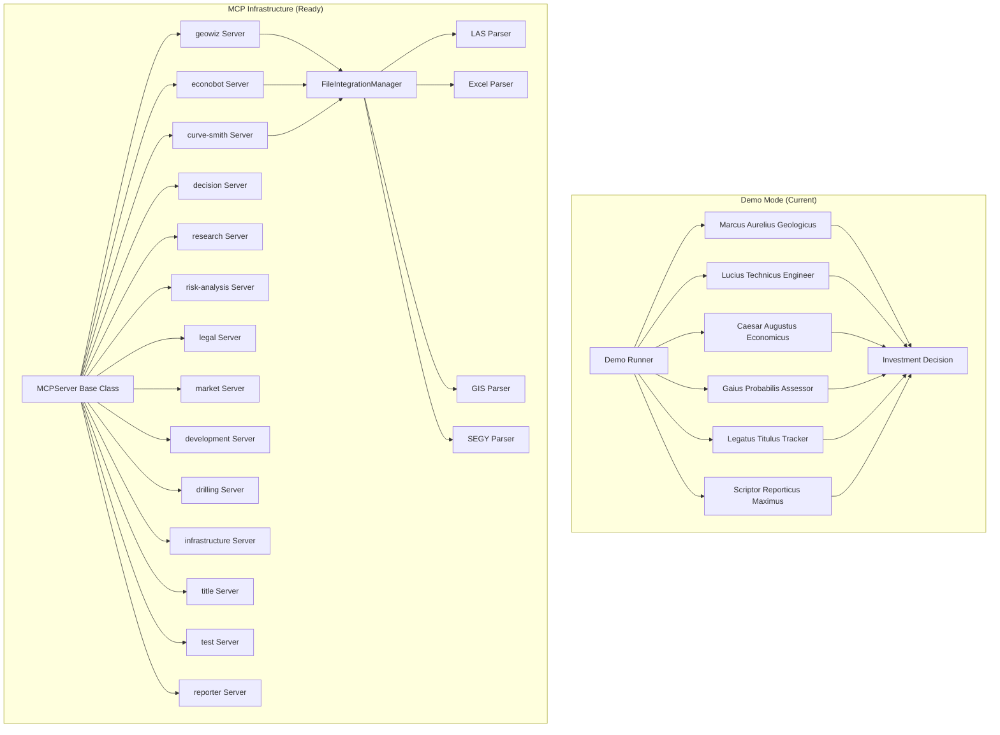

# SHALE YEAH Architecture

This document explains the technical architecture of SHALE YEAH for developers and contributors.

## High-Level Architecture

SHALE YEAH implements a **two-tier architecture** with demo mode currently operational and MCP server infrastructure ready for production integration:

### Current Demo Architecture
- **Demo Runner** (`src/demo-runner.ts`) - Orchestrates 6 AI agents with realistic mock data
- **Professional Analysis Workflow** - Complete investment analysis in ~6 seconds
- **No API Dependencies** - Perfect for presentations and evaluation

### MCP Server Infrastructure (Ready for Production)
- **14 Active MCP Servers** - Standards-compliant specialized analysis servers
- **File Processing Foundation** - Comprehensive industry format support
- **Enterprise Architecture** - Built on official Anthropic MCP SDK



## Core Components

### 1. MCPServer Base Class

**Location**: `src/shared/mcp-server.ts`

The foundation for all AI agents. Provides:

```typescript
export abstract class MCPServer {
  public config: MCPServerConfig;
  public dataPath: string;
  public fileManager: FileIntegrationManager;

  // Standard MCP lifecycle
  abstract setupCapabilities(): void;
  abstract setupDataDirectories(): Promise<void>;

  // Tool and resource registration
  public registerTool(tool: MCPTool): void;
  public registerResource(resource: MCPResource): void;
}
```

**Key Features:**
- **MCP Protocol Compliance**: Full support for MCP 1.17.3 standard
- **Persona System**: Each server has a Roman Imperial persona with expertise
- **File Processing**: Integrated file parsing for 20+ industry formats
- **Error Handling**: Structured error responses with detailed logging
- **Resource Management**: Automatic data directory setup and file management

### 2. Domain Expert Servers

Each server inherits from `MCPServer` and specializes in a specific domain:

#### Geological Analysis (`geowiz.ts`)
```typescript
class GeowizServer extends MCPServer {
  // Tools: analyze_formation, process_gis, assess_quality
  // Expertise: Formation analysis, well log interpretation, GIS processing
  // Persona: Marcus Aurelius Geologicus - Master Geological Analyst
}
```

#### Economic Analysis (`econobot.ts`)
```typescript
class EconobotServer extends MCPServer {
  // Tools: dcf_analysis, analyze_economics, sensitivity_analysis
  // Expertise: DCF modeling, NPV/IRR calculations, financial forecasting
  // Persona: Caesar Augustus Economicus - Master Financial Strategist
}
```

#### Investment Decision (`decision.ts`)
```typescript
class DecisionServer extends MCPServer {
  // Tools: make_investment_decision, calculate_bid_strategy, analyze_portfolio_fit
  // Expertise: Final investment logic, bid recommendations, portfolio optimization
  // Persona: Augustus Decidius Maximus - Supreme Investment Strategist
}
```

*...and 11 more specialized servers*

### 3. File Processing System

**Location**: `src/shared/file-integration.ts`

Handles industry-standard file formats:

```typescript
class FileIntegrationManager {
  async parseFile(filePath: string): Promise<ParseResult> {
    // Auto-detects format and routes to appropriate parser
    // Supports: LAS, Excel, CSV, Shapefiles, GeoJSON, KML, SEGY, PDF, etc.
  }
}
```

**Supported Formats:**
- **Well Logs**: LAS 2.0+, ASCII logs
- **Economic Data**: Excel (XLSX, XLSM), CSV
- **GIS/Spatial**: Shapefiles, GeoJSON, KML
- **Seismic**: SEGY/SGY files
- **Documents**: PDF, Word (architecture ready)

### 4. Demo Orchestration

**Location**: `src/demo-runner.ts`

Simulates a complete investment analysis workflow:

```typescript
class ShaleYeahDemo {
  async runCompleteDemo(): Promise<void> {
    // 1. Setup analysis environment
    // 2. Execute 6 core agents in sequence
    // 3. Generate professional reports
    // 4. Provide investment recommendation
  }
}
```

## MCP Protocol Implementation

### Tools (Analysis Functions)

Each server exposes tools via the MCP protocol:

```typescript
this.registerTool({
  name: 'analyze_formation',
  description: 'Analyze geological formations from well log data',
  inputSchema: z.object({
    filePath: z.string().describe('Path to LAS well log file'),
    formations: z.array(z.string()).optional(),
    analysisType: z.enum(['basic', 'standard', 'comprehensive']).default('standard')
  }),
  handler: async (args) => this.analyzeFormation(args)
});
```

### Resources (Data Access)

Servers also expose data resources:

```typescript
this.registerResource({
  name: 'formation_analysis',
  uri: 'geowiz://analyses/{id}',
  description: 'Geological formation analysis results',
  handler: async (uri) => this.getFormationAnalysis(uri)
});
```

### Server Lifecycle

```typescript
// 1. Initialize server with persona and config
const server = new GeowizServer();

// 2. Setup capabilities (tools and resources)
server.setupCapabilities();

// 3. Create data directories
await server.setupDataDirectories();

// 4. Start MCP server
await runMCPServer(server);
```

## Data Flow

### 1. Demo Analysis Flow

```
Demo Runner
    ↓
[Setup Output Directory]
    ↓
[Execute Agents Sequentially]
    ↓ (for each agent)
[Generate Mock Analysis] → [Save Results] → [Log Progress]
    ↓
[Generate Reports]
    ↓
[Final Recommendation]
```

### 2. Production Analysis Flow

```
Client Request (MCP)
    ↓
[Parse Input Files] → [FileIntegrationManager]
    ↓                        ↓
[Route to Agent] ← [Detect Format] → [LAS/Excel/GIS/SEGY Parser]
    ↓
[Execute Analysis] → [Save Results]
    ↓
[Return Structured Response]
```

### 3. Data Storage

```
data/
├── outputs/              # Analysis results
│   └── demo-{timestamp}/ # Demo run outputs
│       ├── INVESTMENT_DECISION.md
│       ├── DETAILED_ANALYSIS.md
│       └── FINANCIAL_MODEL.json
└── {server-name}/        # Server-specific data
    ├── analyses/         # Analysis results
    ├── reports/          # Generated reports
    └── temp/            # Temporary files
```

## Design Patterns

### 1. Template Method Pattern

Base `MCPServer` class defines the template:

```typescript
abstract class MCPServer {
  // Template method
  async initialize(): Promise<void> {
    await this.setupDataDirectories();  // Concrete implementation
    await this.setupCapabilities();     // Concrete implementation
    await this.server.connect();        // Framework method
  }
}
```

### 2. Strategy Pattern

File parsing uses strategy pattern:

```typescript
class FileIntegrationManager {
  private parsers = {
    '.las': new LASParser(),
    '.xlsx': new ExcelParser(),
    '.shp': new GISParser(),
    '.segy': new SEGYParser()
  };
}
```

### 3. Factory Pattern

Server creation uses factory pattern:

```typescript
function createServer(type: string): MCPServer {
  switch (type) {
    case 'geowiz': return new GeowizServer();
    case 'econobot': return new EconobotServer();
    // ...
  }
}
```

## Configuration

### Server Configuration

```typescript
interface MCPServerConfig {
  name: string;           // Server identifier
  version: string;        // Server version
  description: string;    // Human-readable description
  persona: {              // Roman Imperial persona
    name: string;         // e.g., "Marcus Aurelius Geologicus"
    role: string;         // e.g., "Master Geological Analyst"
    expertise: string[];  // Areas of specialization
  };
  dataPath?: string;      // Optional custom data directory
}
```

### Tool Configuration

```typescript
interface MCPTool {
  name: string;                    // Tool identifier
  description: string;             // Human-readable description
  inputSchema: z.ZodSchema<any>;   // Zod schema for validation
  handler: (args: any) => Promise<any>; // Implementation function
}
```

## Error Handling

### Structured Error Responses

```typescript
protected formatError(operation: string, error: any): any {
  return {
    success: false,
    error: {
      operation,
      message: String(error),
      server: this.config.name,
      persona: this.config.persona.name,
      timestamp: new Date().toISOString()
    }
  };
}
```

### File Processing Errors

```typescript
interface ParseResult {
  success: boolean;
  data?: any;
  errors?: string[];
  warnings?: string[];
  metadata?: {
    format: string;
    size: number;
    processingTime: number;
  };
}
```

## Performance Considerations

### 1. Async Processing
- All analysis operations are fully asynchronous
- Supports concurrent server execution
- Memory-efficient file streaming for large files

### 2. Caching Strategy
- Results cached in server-specific data directories
- Intelligent cache invalidation based on input changes
- Optional in-memory caching for frequently accessed data

### 3. Resource Management
- Automatic cleanup of temporary files
- Graceful server shutdown handling
- Memory usage monitoring and optimization

## Testing Strategy

### 1. Unit Tests
```typescript
// Test individual server methods
describe('GeowizServer', () => {
  it('should analyze formation data correctly', async () => {
    const server = new GeowizServer();
    const result = await server.analyzeFormation(mockData);
    expect(result.confidence).toBeGreaterThan(0.7);
  });
});
```

### 2. Integration Tests
```typescript
// Test MCP protocol compliance
describe('MCP Integration', () => {
  it('should register tools correctly', async () => {
    const server = new GeowizServer();
    await server.initialize();
    expect(server.getToolCount()).toBe(4);
  });
});
```

### 3. Demo Tests
```typescript
// Test end-to-end demo functionality
describe('Demo Runner', () => {
  it('should complete full analysis', async () => {
    const demo = new ShaleYeahDemo(config);
    await demo.runCompleteDemo();
    expect(outputFiles).toContain('INVESTMENT_DECISION.md');
  });
});
```

## Security Considerations

### 1. Input Validation
- All inputs validated with Zod schemas
- File type verification before processing
- Path traversal protection

### 2. Data Privacy
- No sensitive data logged
- Temporary files cleaned up automatically
- Optional data encryption at rest

### 3. Access Control
- MCP protocol provides built-in access control
- Server-level permission management
- Audit logging for all operations

## Agent OS Kernel Layer

The kernel is the runtime layer between agents and the 14 MCP domain servers. It provides tool discovery, routing, and (progressively) execution, context, middleware, and composition.

```
┌─────────────────────────────────────────────────┐
│                  AGENT (LLM)                     │
│         Calls tools, receives results            │
└───────────────────┬─────────────────────────────┘
                    │ MCP Protocol
┌───────────────────▼─────────────────────────────┐
│                  KERNEL                          │
│                                                  │
│  ┌──────────────┐  ┌──────────────────────────┐ │
│  │   Registry   │  │   Discovery Tools        │ │
│  │              │  │                          │ │
│  │ 14 servers   │  │ list_servers             │ │
│  │ 14 tools     │  │ describe_tools           │ │
│  │ capabilities │  │ find_capability          │ │
│  └──────────────┘  └──────────────────────────┘ │
└───────────────────┬─────────────────────────────┘
                    │
        ┌───────────┼───────────┐
        ▼           ▼           ▼
   ┌─────────┐ ┌─────────┐ ┌─────────┐
   │ GeoWiz  │ │Econobot │ │  ...12  │
   │ (query) │ │ (query) │ │  more   │
   └─────────┘ └─────────┘ └─────────┘
```

### Key Components

- **Registry** (`src/kernel/registry.ts`) — indexes all servers and tools, provides capability matching and server routing
- **Kernel** (`src/kernel/index.ts`) — unified entry point, exposes discovery and execution methods
- **Executor** (`src/kernel/executor.ts`) — execution engine for single, parallel (scatter-gather), and bundled tool invocations
- **OutputShaper** (`src/kernel/middleware/output.ts`) — progressive detail levels (summary/standard/full)
- **Types** (`src/kernel/types.ts`) — Agent OS type system (tool classification, response envelope, error types, permissions)

### Tool Classification

Every tool is classified as `query` (read-only, cacheable), `command` (side effects), or `discovery` (meta). This enables agents to safely parallelize queries, confirm commands, and explore capabilities dynamically.

### Execution Engine (Scatter-Gather)

The executor supports three execution modes:

1. **Single execution** — route a request to one server, return `ToolResponse`
2. **Parallel (scatter-gather)** — run N requests via `Promise.allSettled`, collect all results even if some fail. Respects `maxParallel` concurrency limit.
3. **Bundle execution** — resolve a dependency graph into ordered phases, execute each phase (parallel or sequential), track per-phase and overall completeness.

```
Quick Screen (1 phase, ~20ms):
  ┌─────────┐ ┌─────────┐ ┌────────────┐ ┌───────────────┐
  │ GeoWiz  │ │Econobot │ │Curve-Smith │ │Risk-Analysis  │
  └────┬────┘ └────┬────┘ └─────┬──────┘ └──────┬────────┘
       └──────────┬┘            │               │
              Promise.allSettled ────────────────┘
                    │
              GatheredResponse (completeness %)

Full Due Diligence (4+ phases):
  Phase 1:  geowiz, econobot, curve-smith, market, research  (parallel)
  Phase 2:  risk, legal, title, drilling, infra, development  (parallel, depends on P1)
  Phase 3:  test                                               (depends on P2)
  Phase 4:  reporter → decision                                (sequential, depends on P3)
```

### Pre-Built Bundles

| Bundle | Servers | Phases | Strategy | Detail Level |
|--------|---------|--------|----------|-------------|
| `quick_screen` | 4 (core) | 1 | all required | summary |
| `full_due_diligence` | 14 (all) | 4+ | majority | standard/full |

## Context & Sessions

The kernel manages user sessions with identity anchoring and context injection, implementing the Arcade patterns: **Identity Anchor**, **Context Injection**, **Context Boundary**, and **Resource Referencing**.

### Session Lifecycle

```
createSession(identity?, prefs?)  →  Session { id, identity, preferences }
        │
        ├─ storeResult("geo", response)   // Resource Referencing
        ├─ storeResult("econ", response)
        │
        ├─ getResult("geo")               // Retrieve stored analysis
        │
        ├─ getInjectedContext()            // Context Injection
        │       → { userId, role, sessionId, timestamp, timezone,
        │          defaultBasin, riskTolerance, availableResults[] }
        │
        ├─ whoAmI(sessionId)               // Identity Anchor
        │       → { identity, context }
        │
        └─ destroySession(sessionId)       // Cleanup
```

### Context Boundary (Session Isolation)

Each session is an isolated context boundary. Results stored in one session are **never visible** to another:

```
Session A: storeResult("geo", ...)  →  availableResults: ["geo"]
Session B: storeResult("econ", ...) →  availableResults: ["econ"]
                                        // No cross-contamination
```

### Default Identity

Demo mode uses a built-in identity:
```typescript
DEMO_IDENTITY = {
  userId: "demo", role: "analyst",
  permissions: ["read:analysis"],
  organization: "SHALE YEAH Demo"
}
```

## Error Intelligence & Resilience

The kernel's `ResilienceMiddleware` classifies errors, generates recovery guides, and handles graceful degradation when parallel servers fail.

### Error Classification Pipeline

```
Raw Error → Pattern Matching → ErrorType Classification → RecoveryGuide
                                    │
                    ┌───────────────┼───────────────┐
                    │               │               │
               retryable      permanent      auth_required    user_action
              (retry w/       (fix request)   (re-auth)      (need input)
               backoff)
```

Priority order: auth > user_action > retryable > permanent. Unknown errors default to retryable.

### Graceful Degradation

When scatter-gather execution encounters partial failures, the resilience middleware assesses whether the degraded result is still useful:

```
14 servers requested → 12 succeed, 2 fail
                         │
                    completeness: 86%  (>50% threshold)
                    missingAnalyses: ["reporter", "decision"]
                    suggestions: ["Partial results sufficient...",
                                  "decision failed — try reporter.analyze"]
```

### Alternative Tool Mapping

Each server has fallback suggestions based on capability overlap (e.g., geowiz → research, econobot → market).

## Composition — Abstraction Ladder

The kernel provides tools at three abstraction levels, implementing the [Arcade.dev Abstraction Ladder](https://www.arcade.dev/patterns/abstraction-ladder) pattern:

```
High   ┌─────────────────────────────────────┐
       │  shouldWeInvest()                   │  Full pipeline + confirmation gate
       │  quickScreen() / fullAnalysis()     │  Pre-built bundles
       ├─────────────────────────────────────┤
Mid    │  geologicalDeepDive()               │  Domain-focused bundles (3 servers)
       │  financialReview()                  │  Domain-focused bundles (3 servers)
       │  executeParallel([...requests])     │  Ad-hoc scatter-gather
       ├─────────────────────────────────────┤
Low    │  execute(request)                   │  Single tool call
       │  callTool(request, sessionId)       │  Single tool + auth/audit pipeline
       └─────────────────────────────────────┘
```

### Pre-Built Bundles (from `bundles.ts`)

| Bundle | Servers | Detail Levels | Strategy |
|---|---|---|---|
| `geological_deep_dive` | geowiz(full), curve-smith(standard), research(summary) | Mixed | all |
| `financial_review` | econobot(full), risk-analysis(standard), market(summary) | Mixed | all |

### Confirmation Gate

Decision tools (`decision.make_recommendation`, `decision.analyze`) return `requires_confirmation: true` with a pending action. The agent must call `confirmAction(actionId)` or `cancelAction(actionId)` before the action executes. This implements the [Arcade.dev Confirmation Request](https://www.arcade.dev/patterns/confirmation-request) pattern for high-impact tools.

## Security Layer

The kernel provides role-based access control and append-only audit logging, implementing the Arcade patterns: **Permission Gate**, **Secret Injection**, and **Audit Trail**.

### Middleware Pipeline

```
callTool(request, sessionId)
    │
    ├─ 1. AuthMiddleware.check(tool, identity)
    │       ├─ allowed → continue
    │       └─ denied → audit.logDenial() → return error
    │
    ├─ 2. AuditMiddleware.logRequest(entry)
    │
    ├─ 3. Executor.execute(request)
    │
    └─ 4. AuditMiddleware.logResponse(entry)  — or logError(entry)
```

### Role Hierarchy

| Role | Permissions | Can Call |
|---|---|---|
| analyst | read:analysis | All query tools (12 servers) |
| engineer | +write:reports | + reporter tools |
| executive | +execute:decisions | + decision tools |
| admin | +admin:servers, admin:users | Everything |

### Audit Trail

- Append-only JSONL at `data/audit/YYYY-MM-DD.jsonl`
- Sensitive values (keys matching `/key|token|secret|password|credential|auth|bearer/`) automatically redacted as `[REDACTED]`
- Logs requests, responses, errors, and denials with who/what/when

### Configuration

Both features controlled by env vars (auth off by default, audit on by default):

```
KERNEL_AUTH_ENABLED=true|false   (default: false)
KERNEL_AUDIT_ENABLED=true|false  (default: true)
```

## Composition — Abstraction Ladder

The kernel provides three tiers of tool abstraction, letting agents choose the right level for their task:

```
HIGH-LEVEL (Composite)     shouldWeInvest() → full pipeline + confirmation gate
                           geologicalDeepDive() → geowiz + curve-smith + research
                           financialReview() → econobot + risk-analysis + market
                           quickScreen() → 4 core servers in parallel
                           fullAnalysis() → 14 servers, dependency-ordered

MID-LEVEL (Orchestration)  executeParallel() → scatter-gather any N tools
                           executeBundle() → phased bundle with dependencies

LOW-LEVEL (Direct)         execute() → single tool call
                           callTool() → single tool with auth + audit
```

### Pre-Built Bundles

| Bundle | Servers | Strategy | Detail Levels |
|---|---|---|---|
| `quick_screen` | geowiz, econobot, curve-smith, risk-analysis | all (parallel) | summary |
| `full_due_diligence` | All 14 servers | majority (5 phases) | mixed |
| `geological_deep_dive` | geowiz(full), curve-smith(standard), research(summary) | all (parallel) | mixed |
| `financial_review` | econobot(full), risk-analysis(standard), market(summary) | all (parallel) | mixed |

### Confirmation Gate

Decision tools (`decision.make_recommendation`, `decision.analyze`) are gated behind a confirmation step. When called via `shouldWeInvest()`, the decision result returns `requires_confirmation: true` with a `pending_action` containing an `actionId`. The agent must call `confirmAction(actionId)` to finalize, or `cancelAction(actionId)` to discard. Implements the Arcade **Confirmation Request** pattern.

## Deployment Architecture

### Development
```bash
npm run server:geowiz    # Individual server testing
npm run demo            # Full demonstration
```

### Production
```bash
npm run prod            # Production orchestration
npm run pipeline:batch  # Batch processing
```

### Enterprise
- Docker containerization support
- Kubernetes deployment ready
- Load balancing across server instances
- Horizontal scaling capabilities

---

This architecture provides a robust, scalable foundation for AI-powered oil & gas investment analysis while maintaining clean separation of concerns and adherence to industry standards.