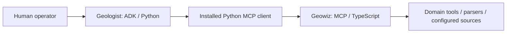

# SHALE YEAH architecture

SHALE YEAH augments an oil-and-gas evaluation team with 14 specialist employees.
Each agent has a job and human owner; it prepares evidence and work products for
review. A tool server supplies bounded domain tools and data hooks. Either unit
can be used independently through its supported interface.

[ADR 0001](adr/0001-durable-employee-contracts.md) defines target boundaries and
migration rules. [topology.md](topology.md) describes the target topology;
[mvp-release-plan.md](mvp-release-plan.md) gives issue order and acceptance gates.
This page describes current implementation and gaps.

## Current building block

The Geologist is an ADK (Agent Development Kit) Python package. Its configured
MCP (Model Context Protocol) wrapper calls independently runnable Geowiz over
HTTP. Geowiz processes domain inputs; the agent selects tools and prepares work.

```mermaid
flowchart LR
    Human[Human operator] --> Agent[Geologist: ADK / Python]
    Agent --> Client[Installed Python MCP client]
    Client --> Server[Geowiz: MCP / TypeScript]
    Server --> Logic[Domain tools / parsers / configured sources]
```

Geologist does not import Geowiz TypeScript source. Its thin role adapter calls
the versioned [Python MCP client](../sdk/python/README.md) at a validated endpoint.
#679 supplies installed-wheel isolation, dedicated credential references,
safe typed failures and bounded setup retries without post-dispatch replay.
#668 supplies tested
independent HTTP protocol/transport lifecycles. #677 supplies declared-schema,
structured-result and genuine-failure boundary checks in the SDK/Geologist;
the shared client preserves those result checks. #678 requires
configured identity/scopes/audit at HTTP entry, including direct external clients
and session ownership. See [HTTP access migration](../sdk/docs/http-access.md).
Session IDs are not authority; actual role result schemas/domain qualification
remain owned by #671/#674 and their role peers.

[ADR 0004](../contracts/docs/0004-composition-conformance.md), delivered by #572,
specifies our/third-party employee and MCP combinations, standalone use and optional
coordination. The selected reference profile is MCP 2025-11-25, with stdio and
Streamable HTTP qualification still required in #674. Geologist's lock resolves
ADK 2.4.0 and Python MCP 1.28.1; the TypeScript workspace resolves MCP SDK 1.29.0.
A2A remains unconfigured and unqualified. Executed external employee record cases
prove structure/binding; future adapter scenarios define discovery, error, scope,
review, cancellation and credential acceptance checks.

The agent requests ADK confirmation for `save_geowiz_finding`. That flag does
not prove authenticated revision-bound professional review or restart recovery.
Its manifest declares in-memory sessions. Durable context and review/revision/
resume are #672/#673; full-path provider replacement is #669. Server synthesis
still uses the SDK's Anthropic-specific client.

## Packages and dependency boundaries

| Area | Current responsibility | Target boundary |
| --- | --- | --- |
| `contracts/` | Canonical JSON Schema 0.1.0, generated TypeScript types and Python/TypeScript validators for employee records | Extractable business contracts independent of agent, tool, model and storage adapters |
| `agents/<role>/` | Specialist tools/reasoning, ADK assets or remaining TypeScript implementation | Independent employee with versioned job/task/product/context/review/eval contracts |
| `servers/<name>/` | 14 TypeScript MCP servers with domain handlers and data hooks | Independent permitted-client interface, its own adapters and access enforcement |
| `sdk/` | TypeScript contracts, models/parsers, server helpers, model client and legacy runtime | Small contract artifacts/bindings separated from installed utilities/adapters |
| `sdk/python/` | Independently buildable `shaleyeah-mcp-client`; Geologist first consumer | Installed protocol adapter with no ADK/domain/root source imports |
| `orchestrator/` | Version-constant stub with a workspace SDK dependency | Optional Chief of Staff unit; #675 charter selects bounded ADK/Python pilot implemented in #676 |

Ten agents have ADK manifests: Geologist, Risk Analyst, Legal Analyst, Market
Analyst, Title Analyst, Drilling Engineer, Development Planner, Research Analyst,
Infrastructure Planner and Investment Chair. Economist, Reservoir Engineer,
Reporter and Quality Assurance retain TypeScript implementations.
See the [complete role/server map](mvp-release-plan.md#complete-employee-coverage).

Those TypeScript agents use `LocalAgentRuntime` and copied task loops.
`sdk/src/service.ts` supplies an endpoint facade, not an implemented universal
HTTP employee service. `sdk/src/agent-loop.ts` exports a shared loop with tests
but no internal production caller. #576 verifies caller/public API implications;
migrations and #692 remove displaced runtime after replacement acceptance.
The [legacy migration ledger](legacy-migration-ledger.md) records the verified
four-employee callers, public exports, ten Python wrappers, numerical/fallback
repairs and cleanup gates. Its inventory does not change runtime behavior.
Preserve useful trust behavior and regression cases at the replacement boundary.

Every unit needs install/run/check docs and declared dependencies. #674 and role
PRs verify extraction; moving a folder alone does not prove independent operation.
The [deployment support guide](deployment-support.md) records current no-key
reference checks, actual ports/config/data paths, durable-state/review gaps and
optional-host qualification. Geowiz maintains transport sessions and writes
findings; process separation does not make it stateless or prove replica safety.

## Context, evaluations and trust

[`contracts/`](../contracts/README.md) defines employee charters, task assignments,
work products with evidence/assumptions, bounded context manifests, review requests
and review decisions. Both language bindings validate the same fixtures; exact
version checks reject unsupported records. Expected scope/revision comparisons
and a separately supplied policy check support callers without granting authority.
Roman display names are separate from employee, role and capability IDs.

These records are ready for adoption; current employees do not yet emit them.
The package verifies structure and declared references, not reviewer identity,
real source content/rights or execution permission.
[ADR 0003](../contracts/docs/0003-authority-and-review.md), delivered by #573,
specifies trusted identity and exact-revision review. #678 supplies HTTP entry;
#672/#673 implement durable context/review. Eval profiles/results are #666/#667.

Legacy `ContextStore` is a process-local map, not durable isolated storage. ADK
sessions are distinct from retained employee context and reviewed shared
knowledge. [ADR 0002](../contracts/docs/0002-context-lifecycle.md), delivered by
#571, defines private ownership, reviewed handoffs, bounded retrieval, compaction,
invalidation and export/deletion. #672 implements durable storage and retrieval;
the policy/reference fixtures do not enforce it today. Warehouses, vectors and
hosted memory are optional adapters selected through measured qualification.

Existing shape tests/eval assets are foundational. Configurable job scorecards,
portable results and promotion gates are #666/#667/#577/#691. Each role needs
professional cases and human acceptance; importing an agent is not job-quality
evidence.

ADR 0003 requires the executing backend to enforce identity, scopes, exact
input/product/action review, source rights and redacted durable audit. Its
reference cases validate current contract comparisons and specify future
execution failures; they do not install that enforcement. #678 supplies ingress,
while #673/#574 and connector/provider/context owners implement the remaining
operation-specific policy. Namespace strings, prompts,
caller approval booleans and transport session IDs cannot grant authority.
Legacy runtime checks do not establish protection on every current ADK-to-MCP
path: its scopes are optional caller data and approval trusts a boolean. The
shared MCP HTTP boundary now requires explicit verified identity/scopes/audit;
source rights, domain-review grants and actual issuer/TLS deployment still need
their qualification owners. Geologist uses the installed credential-aware client;
the other nine Python roles adopt it through their migration issues.

## Optional coordination

`orchestrator/src/index.ts` has no Temporal workflow or fleet-wide deal pipeline.
Employees run without it. Chief of Staff initially coordinates Geologist and
Research Analyst within declared authority. The [#675 charter](chief-of-staff-role.md)
keeps Investment Chair separate for advisory investment synthesis and the human
owner accountable. #676 implements that pilot; no coordinator runtime exists yet.

Framework/model/protocol upgrades are reviewed adapter changes. Business contracts
stay language-neutral and versioned; accepted releases pin tested dependencies
and model/profile versions. ADR 0001 defines compatibility, deprecation and
upgrade checks. Automatic latest-model promotion and mandatory provider/cloud
dependencies are outside the target architecture.
