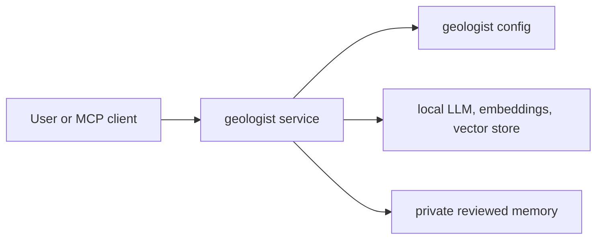
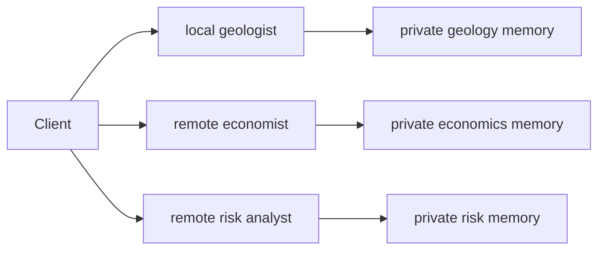
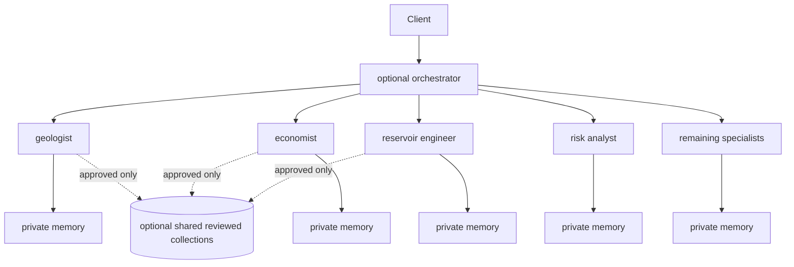

# Distributed Agent Architecture

Issue [#377](https://github.com/ryemyster/ShaleYeah/issues/377) defines the contributor-facing architecture guide for the distributed SHALE YEAH refactor. Treat this document as the baseline for issues [#358](https://github.com/ryemyster/ShaleYeah/issues/358), [#363](https://github.com/ryemyster/ShaleYeah/issues/363), and the agent migration issues [#364-#376](https://github.com/ryemyster/ShaleYeah/issues/364).

## Architecture Decision

SHALE YEAH is moving from a kernel-centered runtime toward an open-source distributed agent system. The monorepo remains the contributor workspace, but each specialist must be independently deployable as its own process, container, or remote service.

Users must be able to run:

- One standalone agent
- A selected subset of agents
- The complete 14-agent fleet
- An optional orchestrator after standalone agents are stable

No standalone agent may require the central kernel, shared hosted infrastructure, or the orchestrator to start, expose health, publish its tools, or complete its core role.

## Agent Layer vs Tool Layer

Each specialist has two distinct responsibilities:

| Layer | Owns | Must not own |
| --- | --- | --- |
| Agent | Role, persona, instructions, context policy, memory policy, provider selection, approval policy, run metadata | Hardcoded provider clients, hidden shared state, orchestration-only behavior |
| Tools | Focused MCP-compatible operations, schemas, validation, deterministic domain logic, side-effect declarations | Long-lived reasoning state, private memory promotion, unrelated domain workflows |

The agent decides what context to use and how to reason about its domain. Tools do narrow work with explicit inputs and outputs.

## Standalone Agent Contract

Every standalone agent must expose the same minimum contract.

| Contract | Required behavior |
| --- | --- |
| `AgentManifest` | Stable id, role, version, description, capabilities, required providers, tool metadata, required scopes, health metadata, compatibility version |
| `AgentRuntime` | Initialize, validate config, expose manifest, discover tools progressively, execute tools, resolve context, retrieve reviewed memory, emit run metadata, shut down cleanly |
| Health | A cheap endpoint or command that returns readiness, config validity, provider availability, and storage status without running analysis |
| Discovery | Summary first, tool list second, individual tool schema third. Clients should not need every schema up front |
| Execution | MCP-compatible tool calls with validated input and output schemas |
| Configuration | Per-agent config with environment overrides and secret redaction |
| Storage | Private run context and private reviewed-memory namespace by default |
| Compatibility | Backwards-compatible `npm run server:<name>` while the old MCP server entrypoints remain supported |

## Provider Ownership

Provider choice belongs to the standalone agent, not a central kernel.

| Provider type | Requirement |
| --- | --- |
| LLM | BYO adapter, including hosted and local/offline models |
| Embeddings | BYO adapter, including disabled/no-op and local embeddings |
| Vector store | BYO adapter, including local file-backed memory and hosted pgvector-style stores |
| Data connectors | BYO adapter, optional per agent, with explicit auth scopes |

Agents may share default adapter implementations, but no agent may instantiate a hardcoded hosted provider directly in domain logic.

## Memory Model

Memory is reviewed, scoped, and explicit.

| Memory type | Scope | Promotion rule |
| --- | --- | --- |
| Run context | One agent run or session | Stored automatically with retention and redaction |
| Candidate memory | One agent's proposed lesson | Must be reviewed before trusted reuse |
| Private reviewed memory | One agent namespace | Explicit human approval |
| Shared reviewed collection | Cross-agent, opt-in | Explicit approval and provenance |

Unreviewed run output is not trusted memory. Shared memory is not a dumping ground; it is an approved knowledge collection with provenance.

## Arcade-Aligned Principles

SHALE YEAH does not require Arcade-hosted infrastructure. It adopts portable architecture principles from Arcade's MCP and tool guidance:

- [Tools](https://docs.arcade.dev/en/resources/tools): focused tool boundaries with explicit schemas and metadata
- [Tool calling](https://docs.arcade.dev/en/guides/tool-calling): tools are independently usable by agents and clients
- [Authorization](https://docs.arcade.dev/en/get-started/about-arcade): sensitive actions surface explicit authorization state
- [Tools with auth](https://docs.arcade.dev/en/home/build-tools/create-a-tool-with-auth): scopes and secrets are handled outside the LLM prompt

Every standalone agent must implement these concrete requirements:

- Focused MCP-compatible tools with explicit input and output schemas
- Progressive discovery: agent summary, tool list, then per-tool schema
- Dynamic loading of configured tools and adapters
- Minimum required scopes for authenticated tools
- Execution-context secret injection only
- No tokens in LLM prompts, client-visible payloads, logs, run context, or memory
- Explicit authorization or human-approval challenge for sensitive actions
- Observable run metadata for debugging and review

## Deployment Shapes

### Local-Only

Use this when a user wants one specialist on a laptop with local or hosted providers.

### Mixed Local and Remote

Use this when teams want to host expensive or regulated agents separately while keeping others local.

### Full Suite With Optional Orchestrator

The orchestrator discovers and coordinates configured endpoints. It must not become the place where agent business logic lives.

## Delivery Order

| Order | Work | Issues |
| --- | --- | --- |
| 1 | Distributed agent foundation: contracts, manifests, providers, gateway, context, persistence, docs | [#357](https://github.com/ryemyster/ShaleYeah/issues/357), [#358](https://github.com/ryemyster/ShaleYeah/issues/358), [#115](https://github.com/ryemyster/ShaleYeah/issues/115), [#116](https://github.com/ryemyster/ShaleYeah/issues/116), [#119](https://github.com/ryemyster/ShaleYeah/issues/119), [#123](https://github.com/ryemyster/ShaleYeah/issues/123), [#134](https://github.com/ryemyster/ShaleYeah/issues/134), [#136](https://github.com/ryemyster/ShaleYeah/issues/136), [#141](https://github.com/ryemyster/ShaleYeah/issues/141), [#142](https://github.com/ryemyster/ShaleYeah/issues/142), [#206](https://github.com/ryemyster/ShaleYeah/issues/206), [#207](https://github.com/ryemyster/ShaleYeah/issues/207), [#271](https://github.com/ryemyster/ShaleYeah/issues/271), [#306](https://github.com/ryemyster/ShaleYeah/issues/306) |
| 2 | Geologist reference agent | [#309](https://github.com/ryemyster/ShaleYeah/issues/309), [#363](https://github.com/ryemyster/ShaleYeah/issues/363) |
| 3 | Remaining standalone agent fleet | [#364-#376](https://github.com/ryemyster/ShaleYeah/issues/364) |
| 4 | Optional intelligence adapters and reviewed shared-memory flows | [#143](https://github.com/ryemyster/ShaleYeah/issues/143), [#144](https://github.com/ryemyster/ShaleYeah/issues/144), [#284](https://github.com/ryemyster/ShaleYeah/issues/284) |
| 5 | Optional distributed orchestration | [#362](https://github.com/ryemyster/ShaleYeah/issues/362) |

## Implementation Checklist

Use this checklist for every standalone agent migration.

- [ ] Agent has an `AgentManifest` with stable id, role, version, capabilities, provider needs, scopes, and health metadata.
- [ ] Agent has a standalone runtime entrypoint that boots without the orchestrator.
- [ ] Agent can run as one process, one container, or one remote service.
- [ ] Agent exposes health without performing analysis.
- [ ] Agent supports progressive discovery.
- [ ] Agent exposes focused MCP-compatible tools with explicit schemas.
- [ ] Agent loads only configured providers, tools, and adapters.
- [ ] Agent owns validated config with environment overrides and secret redaction.
- [ ] Agent accepts BYO LLM provider.
- [ ] Agent accepts BYO embedding provider or disabled embeddings.
- [ ] Agent accepts BYO vector store or disabled memory.
- [ ] Agent accepts optional BYO data connectors.
- [ ] Agent has private run context and private reviewed-memory namespace.
- [ ] Agent can opt into shared reviewed collections without making them required.
- [ ] Agent declares minimum scopes for authenticated tools.
- [ ] Agent injects secrets only through execution context.
- [ ] Agent never exposes tokens to prompts, responses, logs, run context, or memory.
- [ ] Agent returns authorization or human-approval challenges for sensitive actions.
- [ ] Agent emits observable run metadata.
- [ ] Agent preserves its backwards-compatible `npm run server:<name>` path while migration is underway.
- [ ] Agent has standalone tests and a README or docs section.

## Security Checklist

Security is local to the agent boundary first. Optional orchestration can add policy, but it cannot bypass an agent's own policy.

- [ ] Secrets are configured through environment references or secret resolvers, not checked-in files.
- [ ] Secrets are injected into tools at execution time only.
- [ ] Logs redact values matching token, secret, key, credential, password, auth, and bearer patterns.
- [ ] Tool manifests declare whether a tool is read-only, side-effecting, or approval-gated.
- [ ] Authenticated tools declare minimum scopes.
- [ ] Missing consent returns a structured authorization challenge.
- [ ] Human approval is required before destructive or investment-impacting actions.
- [ ] Memory promotion requires explicit approval.
- [ ] Candidate memories include provenance and source run ids.
- [ ] Shared collections require explicit opt-in.
- [ ] Run metadata is observable but does not include private memory content by default.

## Compliance Matrix

Legend:

- `Planned`: not implemented yet; issue defines expected migration work.
- `Reference`: the agent that proves the pattern before the fleet migration.
- `N/A`: not applicable to that agent's role.

| Legacy server | Standalone agent | Issue | Runtime | Manifest | Health | Discovery | BYO providers | Private memory | Auth scopes | Approval challenge | Observability | Notes |
| --- | --- | --- | --- | --- | --- | --- | --- | --- | --- | --- | --- | --- |
| `geowiz` | Geologist | [#363](https://github.com/ryemyster/ShaleYeah/issues/363) | Reference | Planned | Planned | Planned | Planned | Planned | Planned | Planned | Planned | First implementation after extraction in [#309](https://github.com/ryemyster/ShaleYeah/issues/309) |
| `econobot` | Economist | [#364](https://github.com/ryemyster/ShaleYeah/issues/364) | Planned | Planned | Planned | Planned | Planned | Planned | Planned | Planned | Planned | Follow geologist reference |
| `curve-smith` | Reservoir engineer | [#365](https://github.com/ryemyster/ShaleYeah/issues/365) | Planned | Planned | Planned | Planned | Planned | Planned | Planned | Planned | Planned | Follow geologist reference |
| `risk-analysis` | Risk analyst | [#366](https://github.com/ryemyster/ShaleYeah/issues/366) | Planned | Planned | Planned | Planned | Planned | Planned | Planned | Planned | Planned | Follow geologist reference |
| `decision` | Investment chair | [#367](https://github.com/ryemyster/ShaleYeah/issues/367) | Planned | Planned | Planned | Planned | Planned | Planned | Planned | Planned | Planned | Approval challenge is mandatory for investment decisions |
| `reporter` | Reporting agent | [#368](https://github.com/ryemyster/ShaleYeah/issues/368) | Planned | Planned | Planned | Planned | Planned | Planned | Planned | Planned | Planned | Report generation remains side-effect aware |
| `research` | Research analyst | [#369](https://github.com/ryemyster/ShaleYeah/issues/369) | Planned | Planned | Planned | Planned | Planned | Planned | Planned | Planned | Planned | Connector scopes matter for external research |
| `legal` | Legal analyst | [#370](https://github.com/ryemyster/ShaleYeah/issues/370) | Planned | Planned | Planned | Planned | Planned | Planned | Planned | Planned | Planned | Legal outputs should preserve provenance |
| `market` | Market analyst | [#371](https://github.com/ryemyster/ShaleYeah/issues/371) | Planned | Planned | Planned | Planned | Planned | Planned | Planned | Planned | Planned | EIA and commodity data connectors must be optional |
| `title` | Title analyst | [#372](https://github.com/ryemyster/ShaleYeah/issues/372) | Planned | Planned | Planned | Planned | Planned | Planned | Planned | Planned | Planned | Title data connectors are sensitive; scope tightly |
| `development` | Development planner | [#373](https://github.com/ryemyster/ShaleYeah/issues/373) | Planned | Planned | Planned | Planned | Planned | Planned | Planned | Planned | Planned | Follow geologist reference |
| `drilling` | Drilling engineer | [#374](https://github.com/ryemyster/ShaleYeah/issues/374) | Planned | Planned | Planned | Planned | Planned | Planned | Planned | Planned | Planned | Follow geologist reference |
| `infrastructure` | Infrastructure planner | [#375](https://github.com/ryemyster/ShaleYeah/issues/375) | Planned | Planned | Planned | Planned | Planned | Planned | Planned | Planned | Planned | Follow geologist reference |
| `test` | Quality-assurance agent | [#376](https://github.com/ryemyster/ShaleYeah/issues/376) | Planned | Planned | Planned | Planned | Planned | Planned | Planned | Planned | Planned | Validates analysis quality, not CI execution |

## Contributor Instructions

1. Read this document before starting any standalone-agent issue.
2. Start with the contract in [#358](https://github.com/ryemyster/ShaleYeah/issues/358), not orchestration.
3. Use `geowiz` extraction [#309](https://github.com/ryemyster/ShaleYeah/issues/309) and standalone geologist [#363](https://github.com/ryemyster/ShaleYeah/issues/363) as the reference.
4. Keep edits scoped to one agent where possible.
5. Do not add a central orchestrator dependency to make an agent boot.
6. Review the implementation against the checklist and matrix before opening a PR.

## Out of Scope for Agent Migrations

- Full-suite workflow orchestration before standalone agents are stable
- Shared hosted storage as a requirement
- Runtime hot-loading beyond configured startup discovery
- Rewriting every domain tool in one PR
- Moving agent business logic into an orchestrator

