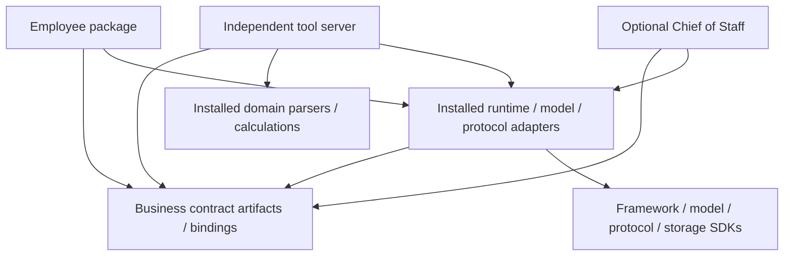

# ADR 0001: durable employee contracts and replaceable adapters

Status: accepted on merge of issue #567's architecture PR into develop.

Owner: [#567](https://github.com/ryemyster/ShaleYeah/issues/567), including the
operating-mode scope transferred from closed #569.

Evidence reviewed: 2026-10-07, starting at develop
`511572bba83662606f85d89596e1d33d7b628a74`.

An architecture decision record (ADR) states a choice, its boundaries and how
future work verifies it. This record decides architecture. The linked issues
implement schemas, storage, adapters, review and evaluations.

## Context and decision

SHALE YEAH augments oil-and-gas professionals. Each agent represents an employee
with a particular job and a human owner. Value comes from useful evidenced work
and reduced manual effort, verified by professional review. Roman personas are
display names alongside stable role and capability identifiers.

Keep one monorepo with independently installable/extractable agents and MCP
(Model Context Protocol) tool servers, small shared business contracts and an
optional Chief of Staff. ADK (Agent Development Kit) with Python is the primary
agent authoring surface; TypeScript remains appropriate for tool servers.
Neither technology defines the business contract.

Put durable business meaning in versioned language-neutral contracts. Put
framework, model, protocol, retrieval, storage and hosting mechanics in
replaceable adapters. An adapter translates a business interface to a particular
technology. Replacing it must preserve contracts and pass the same job, trust
and regression checks.

This boundary cannot guarantee unchanged professional quality through every
future technology change. It limits what a change can affect and makes required
evidence explicit. Business contracts evolve through reviewed versions when the
job or policy changes.

## Current evidence and gaps

These files were verified locally against the starting checkout. Target
capabilities remain in their owning implementation issues.

| Evidence | Current behavior | Follow-on owner |
| --- | --- | --- |
| [Geologist](../../agents/geologist/app/agent.py), [MCP wrapper](../../agents/geologist/app/geowiz_mcp.py) | ADK/Python calls configured Geowiz through HTTP; no Geowiz TypeScript source import | #679, #674 |
| [Manifest](../../agents/geologist/agents-cli-manifest.yaml) | In-memory sessions and no deployment target | #672, #673, #674 |
| [Geologist](../../agents/geologist/app/agent.py) | Finding-save tool requests ADK confirmation; default model uses a moving `latest` alias | #573, #673, #669, #577 |
| [SDK contracts](../../sdk/src/contracts.ts) | TypeScript/Zod runtime configuration includes provider/transport settings; not the future language-neutral employee contract set | #568, #572 |
| [Context store](../../sdk/src/context-store.ts) | Process-local map loses state on restart; a namespace alone is not access enforcement | #571, #672, #573 |
| [LLM client](../../sdk/src/llm-client.ts) | Server synthesis uses an Anthropic-specific client; changing the agent model alone does not prove BYO-provider support | #669 |
| [MCP server](../../sdk/src/mcp-server.ts) | Transport/session lifecycle belongs to the current SDK implementation | #668, #678, #677 |
| [Orchestrator](../../orchestrator/src/index.ts) | Version-constant stub with no workflow | #675, #676 |

Ten agents have ADK manifests. Economist, Reservoir Engineer, Reporter and QA
retain TypeScript implementations. Their migrations and shared-runtime removal
stay in #541/#542/#680/#681/#576/#692. Existing shape tests and confirmation flags
do not establish durable authenticated professional review.

## Durable contracts

#568 publishes exact schemas and bindings. These architectural requirements
define their business meaning:

| Contract | Durable meaning | Excluded technology detail |
| --- | --- | --- |
| Employee charter | Stable role/capabilities, responsibilities, evidence, human ownership and authority limits | Framework agent classes, provider objects and cloud resources |
| Task | Task/revision IDs, customer/asset/employee scope, requested outcome, constraints, capabilities and state references | ADK Session objects, MCP connection IDs, workflow-engine handles |
| Evidence and work product | Sources/versions, usage restrictions, units, assumptions, uncertainty, artifact/revision references and review status | Raw provider responses or vendor database/vector IDs as the public format |
| Context manifest | Authorized scope, selected evidence/revisions, freshness, provenance, retention, budget and reviewed shared-knowledge references | Embedding arrays, vendor indexes and warehouse query objects |
| Review decision | Authenticated reviewer authority, exact task/product revision, approve/reject/revise outcome and audit reference | Chat prose or an unchecked boolean treated as permission |
| Evaluation profile and result | Job cases, rubric/metric IDs, thresholds, profile/judge versions, evaluated revision and failures | Framework dataset classes and provider judge clients |

Use ordinary JSON values and published JSON Schema artifacts for the public
machine-readable boundary. YAML configuration maps to the same validated values.
Select Draft 2020-12 initially, with explicit dialect/schema IDs; #568 tests
validation behavior and any later dialect migration.
[JSON Schema Draft 2020-12 specification](https://json-schema.org/draft/2020-12)

Python and TypeScript bindings may be generated or maintained with parity
fixtures. Neither Zod nor Pydantic owns a competing public definition. Contract
artifacts contain no executable imports of ADK, model, transport or storage SDKs.
Adapters translate such objects at their boundary. Namespaced extensions must be
declared and validated; generic object fields cannot smuggle framework state,
credentials or approval authority into records.

Secrets stay outside contracts, prompts, logs, exports and employee memory. A
secret reference identifies a separately authorized lookup; it neither carries
the secret nor grants access. Trusted policy checks occur where a protected
action executes, including direct tool-server access.

## Package dependency direction

Arrows mean permitted package dependencies, not mandatory shared services.

| Unit | Allowed dependencies/calls | Boundary that blocks coupling |
| --- | --- | --- |
| Contract artifacts/bindings | Primitive schemas, validation and compatibility fixtures | No agent, coordinator, server or vendor-runtime imports |
| Employee | Contracts and installed adapters; compatible tool services through declared interfaces | No sibling employee/server source imports, mandatory coordinator or root-workspace runtime state |
| MCP server | Contracts, domain utilities and its own source/model/storage adapters | No agent runtime dependency; independently usable by generic permitted clients |
| Chief of Staff | Contracts, discovery/task clients and permitted employee work products | No employee implementation imports, private-context access by default or inherited tool credentials |
| Shared adapter helper | Contracts/bindings and its declared technology SDK | Installable, versioned and replaceable; no source symlinks or hidden monorepo dependencies |
| Context/audit/config service | Declared storage/export adapters behind scoped contracts | Shared hosting optional; equivalent ownership/trust enforcement in every deployment |

The existing `sdk/` combines contracts, server helpers, parsers and legacy runtime.
It is a migration starting point, not a universal employee runtime requirement.
Contract packaging is #568; the installed Python MCP helper is #679; caller-backed
cleanup is #576/#692. Provider/storage clients do not belong in a contract package.

Extraction retains declared dependencies, install/run/check commands,
configuration, contract/profile versions and accepted context/review behavior.
It works without root pnpm state, sibling source paths or a running coordinator.
Reusable domain utilities may be installed packages. #674 proves reference
extraction; role PRs prove their own limits.

## Operating-mode selection

This matrix transfers all #569 scope. Every role records one primary mode and why
in its issue, spec, docs, evaluations and PR. Capability routing is an optional
layer on the primary mode. A standalone employee may have explicit internal state
transitions without becoming a fleet hierarchy.

| Mode | Choose when | Required controls | Default, exception and non-goal |
| --- | --- | --- | --- |
| Stand-alone Agent with Progressive Disclosure (Skills) | One role can do its job with bounded tools and load task-specific procedures when needed | Versioned procedure selection, bounded context, role scorecard and human review | Specialist default; no unlimited context or executable skills authorized by retrieved text |
| Hierarchical (Orchestrator-Worker) | Work needs distinct employee responsibilities and delegated work products | Child task identity, authority/budget limits, handoffs, cancellation/failure and isolation checks | Optional Chief of Staff pilot; no automatic all-fleet fan-out or private-memory access |
| Graph-Based Workflow (ADK 2.0) | Conditional transitions, validation, durable review/revision and resume need an explicit state machine | Persisted revisions, authenticated guards, retry/idempotency and recovery tests | Explicit business transitions; graph-library types stay adapter-local, not mandatory domain records |
| Ambient (Event-Driven) | An authenticated event/upload/schedule/queue record starts bounded work | Event identity/provenance, idempotency key, deduplication, scoped task, retry/dead-letter policy and observable review state | Opt in per workflow; an event is not approval and redelivery cannot repeat protected effects |
| Capability-First | A deterministic parser/calculation/lookup can satisfy a declared capability before model reasoning | Capability metadata, validation, provenance, fallback/errors and role regressions | Layer over the primary mode; no extra employee or global arbitrator required |

Specialists default to standalone plus skills. Chief of Staff uses hierarchy
only for bounded #676 delegation. #673 selects a tested implementation of explicit
Geologist review transitions; an ADK confirmation flag is not the entire review
contract. Ambient operation is not implicitly enabled for every role.

ADK supports graph nodes/routes combining code and model reasoning. That is an
available mechanism; this project's decision keeps persisted business state and
authority outside graph-library types.
[ADK graph workflow documentation](https://adk.dev/graphs/)

## Per-employee context and human review

Separate active task state, retained working context, source/domain evidence and
reviewed shared knowledge. ADK distinguishes sessions/state from cross-session
memory and offers different backing services; its in-memory options lose data on
restart. These services may implement adapters while the context manifest and
review history remain independent contracts.
[ADK session, state and memory documentation](https://adk.dev/sessions/)

Scope context by customer, asset, task and employee, with authenticated access
checks and retention/provenance policy. Namespace strings and prompts are
insufficient isolation. Assemble a bounded set using authorized evidence, source
rights, freshness and task relevance. Files and small structured stores can meet
small-dataset needs; vector search and warehouses are optional.
[ADR 0002](../../contracts/docs/0002-context-lifecycle.md), delivered by #571,
sets the lifecycle, selection and reviewed-sharing policy; #672 implements the
reference.

Raw model output remains unreviewed. Shared-knowledge promotion requires
authorized review, provenance and retention metadata. Superseded revisions,
changed sources and revoked access invalidate affected context/approvals rather
than silently reusing stale findings. #571/#573 specify the detailed lifecycle.

The human owner inspects inputs/evidence, corrects assumptions, requests changes,
rejects or approves within authority, and resumes the correct revision after
restart. Trusted code validates reviewer authority and consumes revision-bound
decisions. Prompts, retrieved text, self-reported scopes and coordinator prose
cannot grant permission. Protected-action policy is enforced at execution.
[ADR 0003](../../contracts/docs/0003-authority-and-review.md), delivered by #573,
specifies that boundary, including exact operation/input binding, replay and audit
failure recovery; #678/#673 implement it with connector/context/events owners.

ADK tool confirmation can pause for a response, but current documentation marks
it experimental and lists unsupported persistent session services. Test those
limits before selecting the #673 adapter; do not weaken the domain review
contract to fit a framework limitation.
[ADK confirmation capabilities and limitations](https://adk.dev/tools-custom/confirmation/)

## Optional Chief of Staff and Investment Chair

Chief of Staff receives permitted tasks/work products, delegates within granted
authority and prepares decisions. Every employee retains its own context and
human review. Failed, incomplete or unreviewed child results cannot authorize
consequential action. Operators may call employees directly or use a compatible
external coordinator.

The [Chief of Staff charter](../chief-of-staff-role.md), delivered by #675,
keeps Investment Chair as a separate advisory investment-synthesis employee.
Chief of Staff owns bounded planning/delegation/status; the authenticated human
organization owner remains accountable. Neither employee grants itself capital,
legal, professional or publication authority, waives required specialist review,
or changes evaluator/shared-context policy silently.

Use `orchestrator/` for the optional #676 coordinator, with ADK/Python as the
preferred authoring adapter and installed contract/task/provider/storage
adapters. Replace its obsolete TypeScript stub in that implementation PR. The
pilot covers one asset's Geologist/Research Analyst diligence and corrected-input
review/resume, with an external compatible fixture substitute. Whole-deal
comparison, Temporal, full-fleet fan-out and binding decisions remain outside
the pilot. Runtime qualification and actual human acceptance are still pending.

## Versions, compatibility and promotion

Version public domain contracts separately from adapters, employee packages,
protocol revisions and configuration/profile/judge data. Use semantic versions
for the declared API: breaking changes increment major; compatible additions
increment minor; compatible fixes increment patch. Initial `0.x` versions are
experimental and still declare compatibility rather than implying it from a
dependency range. [Semantic Versioning specification](https://semver.org/)

The project adds these compatibility rules:

1. Publish schema IDs/versions and supported read/write versions. Validate version
   and required capabilities before work; fail explicitly on incompatibility.
2. Compatible additions preserve meaning, units, required fields, approval
   behavior and prior readers. Unknown optional data is ignored only where the
   schema permits it. Input tightening, changed defaults/enums or authority can
   be breaking even when the JSON shape is similar.
3. Deprecation records an owner, successor, migration and earliest removal
   release. Support both forms through at least one announced migration release,
   or use an explicitly reviewed breaking release. Test both claimed compatibility
   directions; no indefinite hidden adapter coexistence.
4. Persist original record versions. Explicit migration creates a new revision
   with provenance; no silent rewrites of reviewed history or approval reuse after
   consequential changes.
5. Lock resolved adapters and pin deployment artifacts. Accepted configuration
   records provider/model ID, adapter/protocol versions, prompts/skills, context
   policy, eval/metric/judge versions and source revisions. Manifest ranges do
   not replace reproducible lockfiles and tested release manifests.
6. No automatic promotion of `latest` models, new frameworks or provider routing.
   Prefer fixed model versions where available. If a provider offers no fixed
   version, declare the limit, record served versions when available and rerun
   regressions before accepting a candidate. Existing moving aliases remain gaps
   owned by #669/#577 and role adoption, not approved release behavior.
7. Run contract fixtures, role cases, restart/context/isolation, review/authority,
   source failure and observable/redacted-result checks. Compare the previous
   accepted candidate, record changes and preserve compatible rollback. Ordinary
   rubric/threshold tuning uses validated configuration; executable metric
   additions need trusted code review.

Protocol versions belong to adapters. MCP revision 2026-07-28 uses per-request
metadata; 2025-11-25 and earlier use initialization. Our current client initializes.
Transport-session IDs never define employee identity, persistent context or
review decisions. [ADR 0004](../../contracts/docs/0004-composition-conformance.md),
delivered by #572, selects the pinned MCP 2025-11-25 reference profile; #674 must
prove its compositions. #668 repairs lifecycle
for supported session-based adapters. Modern stateless support is a separately
verified change rather than an automatic upgrade of that repair.
[MCP's official cross-revision migration guide](https://ts.sdk.modelcontextprotocol.io/v2/migration/support-2026-07-28),
[MCP 2025-11-25 lifecycle](https://modelcontextprotocol.io/specification/2025-11-25/basic/lifecycle)

BYO-model/key, BYO-agent/runtime, BYO-data and BYO-coordinator have separate
conformance profiles. A model switch proves neither runtime replacement nor
compatibility with all external employees. ADR 0004 defines mandatory/conditional
composition, discovery/state/artifact/cancellation requirements and deferred A2A;
#669 tests full-path providers. Paid live smoke tests are opt-in,
with live support claims tied to recorded evidence. Local/container portability
does not certify every hosted platform.

## First reference build order and acceptance walkthroughs

The [MVP ledger](../mvp-release-plan.md) determines strictly sequential PR order.
Role/source research #665 feeds contracts #568 and context/trust/composition
decisions #571/#573/#572. Record cleanup/support/contributor and role/coordinator
charters, then repair transport/results/HTTP authority/client packaging
#668/#677/#678/#679. Add full-path providers/files #669/#670, configured evaluations
#666/#667 and events #574. Complete Geologist inputs/context/review
#671/#672/#673, CI gate #577 and extraction #674 before fleet adoption or #676.

An evidence checklist was defined before this decision. These walkthroughs check
the architecture; runtime proof remains in the owning issues.

| Scenario | Architectural result | Required implementation evidence |
| --- | --- | --- |
| Standalone Geologist with permitted compatible tools | Own task/context/review; installed protocol adapter; coordinator absent | #572/#674 isolation and role journey |
| Generic permitted client uses Geowiz; reference pair together | Server has no employee/framework import and enforces its own access | #678/#674 tool-only and paired fixtures |
| Small dataset without warehouse/vector service | File adapter and scoped persistent state meet contracts; retrieval stays simple | #670/#672 restart, provenance and budget checks |
| Provider/framework replacement | Translate in adapter; preserve records and rerun job/trust/context checks | #669/#572/#674 conformance and #577/#691 promotion |
| ADK Session or MCP transport object proposed as a shared field | Reject or translate to declared primitives; no object leakage | #568 invalid-boundary and language-parity fixtures |
| Approved revision changes or event arrives twice | Approval cannot authorize changed work; duplicate event cannot repeat protected effects | #573/#673 revision checks; event idempotency tests when selected |
| Every employee is forced to share a runtime/warehouse/coordinator/context service | Reject mandatory coupling; optional composition needs declared interfaces/isolation | #572/#674 extraction and compatibility checks |

## Consequences, rejected alternatives and open decisions

This choice supports independent employees and small datasets with common
evidence/review formats. It costs adapter translation, parity/compatibility
fixtures and explicit upgrade ownership. Those costs are preferable to coupling
every role to one framework or hiding changes from acceptance.

Rejected: universal custom reasoning loops, mandatory warehouses/vector stores,
framework objects as domain schemas, Chief of Staff as the only entry point,
automatic all-role fan-out and default latest-model promotion. A complete rewrite
is not the migration strategy; verified domain logic survives behind boundaries.

| Unconfirmed implementation decision | Owner |
| --- | --- |
| Exact professional workflows, source availability/rights and thresholds | #665, #538, role adoption |
| Exact fields, initial versions, bindings/package names and migrations | #568 |
| Context store/retrieval, retention and promotion implementation | #571, #672 |
| Identity/credential resolution, reviewer authority and durable review adapter | #573, #678, #673 |
| Actual qualification of ADR 0004's selected profiles/compositions and optional alternate runtimes | #674, #676 and transport/client prerequisites; #572 specification delivered |
| Provider pair/model versions and production/judge config | #669, #666, #667 |
| Chief of Staff charter, Investment Chair split and package location | #675, #676 |
| Hosted-platform certification and deployment choices | #578, #674 |

These decisions do not block this ADR; each blocks its own consumer until
resolved. #665 refines role requirements in its PR after this decision. Changing
accepted boundaries requires a reviewed superseding ADR with migration and
acceptance impact.
