# Shale Yeah Topology

Date: 2026-07-11

This document captures the current understanding of the system topology and the boundaries we are designing against.

## What This Project Is

Shale Yeah is a monorepo that contains many independently buildable project units:

- 14 specialist agents
- 14 matching MCP servers or service backends where applicable
- an optional orchestrator
- shared contract packages and runtime helpers

The monorepo is a workspace, not the architecture itself. Each unit must remain independently useful, independently runnable, and independently extractable into its own repository without breaking the rest of the system.

## Core Principles

1. Each agent is a standalone project unit.
2. Each MCP server is a standalone project unit.
3. The orchestrator is optional, not mandatory.
4. ADK is the primary agent development surface.
5. Runtime deployment is portable: local, container, VM, Fly.io, Cloud Run, GKE, Agent Runtime, or similar.
6. Shared code exists as contracts, not hidden coupling.
7. Refactors should delete displaced code rather than leave old and new paths intertwined.
8. Specs come before implementation.
9. HITL, evals, memory, security, and observability are first-class architecture concerns.

## Topology

```mermaid
flowchart TB
  User[Operator / Team / Organization]

  subgraph Repo[Monorepo Workspace]
    Docs[Docs / README / Issue Specs]
    Shared[Shared Contracts\nschemas, auth rules, observability formats,\nagent metadata, runtime helpers]
    ADK[ADK Authoring Layer]
  end

  subgraph Units[Independent Project Units]
    A1[Geologist Agent]
    M1[Geowiz MCP]
    A2[Economist Agent]
    M2[Econobot MCP]
    A3[Reservoir Engineer Agent]
    M3[Curve-smith MCP]
    A4[Risk Analyst Agent]
    M4[Risk-analysis MCP]
    A5[Legal Analyst Agent]
    M5[Legal MCP]
    A6[Market Analyst Agent]
    M6[Market MCP]
    A7[Title Analyst Agent]
    M7[Title MCP]
    A8[Development Planner Agent]
    M8[Development MCP]
    A9[Drilling Engineer Agent]
    M9[Drilling MCP]
    A10[Research Analyst Agent]
    M10[Research MCP]
    A11[Reporter Agent]
    M11[Reporter MCP]
    A12[Quality Assurance Agent]
    M12[QA MCP]
    A13[Infrastructure Planner Agent]
    M13[Infrastructure MCP]
    A14[Investment Chair Agent]
    M14[Decision MCP]
  end

  subgraph Control[Optional Control Plane]
    Orchestrator[Optional Orchestrator]
    Registry[Discovery / Registry]
    Router[Task Routing / Handoff]
    Learner[Learning Loop / Memory Promotion]
    Evals[Runtime Evals / Guardrails]
  end

  subgraph Trust[Trust Layer]
    Auth[Auth / Consent / Scopes]
    Audit[Audit Log / Export]
    Redact[Secret Redaction]
  end

  subgraph Platform[Platform Services]
    Memory[Vector Store / Embeddings]
    Obs[Structured Logs / Traces / SIEM Export]
    Config[Per-unit Config Profiles / BYO Providers]
  end

  User --> A1
  User --> A2
  User --> Orchestrator

  ADK --> A1
  ADK --> A2
  ADK --> A3

  A1 <--> M1
  A2 <--> M2
  A3 <--> M3
  A4 <--> M4
  A5 <--> M5
  A6 <--> M6
  A7 <--> M7
  A8 <--> M8
  A9 <--> M9
  A10 <--> M10
  A11 <--> M11
  A12 <--> M12
  A13 <--> M13
  A14 <--> M14

  Orchestrator --> Registry
  Orchestrator --> Router
  Orchestrator --> Learner
  Orchestrator --> Evals

  A1 --> Auth
  A2 --> Auth
  A3 --> Auth
  A4 --> Auth
  A5 --> Auth
  A6 --> Auth
  A7 --> Auth
  A8 --> Auth
  A9 --> Auth
  A10 --> Auth
  A11 --> Auth
  A12 --> Auth
  A13 --> Auth
  A14 --> Auth

  A1 --> Audit
  A2 --> Audit
  A3 --> Audit
  A4 --> Audit
  A5 --> Audit
  A6 --> Audit
  A7 --> Audit
  A8 --> Audit
  A9 --> Audit
  A10 --> Audit
  A11 --> Audit
  A12 --> Audit
  A13 --> Audit
  A14 --> Audit

  A1 --> Redact
  A2 --> Redact
  A3 --> Redact
  A4 --> Redact
  A5 --> Redact
  A6 --> Redact
  A7 --> Redact
  A8 --> Redact
  A9 --> Redact
  A10 --> Redact
  A11 --> Redact
  A12 --> Redact
  A13 --> Redact
  A14 --> Redact

  A1 --> Memory
  A2 --> Memory
  A3 --> Memory
  A4 --> Memory
  A5 --> Memory
  A6 --> Memory
  A7 --> Memory
  A8 --> Memory
  A9 --> Memory
  A10 --> Memory
  A11 --> Memory
  A12 --> Memory
  A13 --> Memory
  A14 --> Memory

  A1 --> Obs
  A2 --> Obs
  A3 --> Obs
  A4 --> Obs
  A5 --> Obs
  A6 --> Obs
  A7 --> Obs
  A8 --> Obs
  A9 --> Obs
  A10 --> Obs
  A11 --> Obs
  A12 --> Obs
  A13 --> Obs
  A14 --> Obs

  Config --> A1
  Config --> A2
  Config --> A3
  Config --> A4
  Config --> A5
  Config --> A6
  Config --> A7
  Config --> A8
  Config --> A9
  Config --> A10
  Config --> A11
  Config --> A12
  Config --> A13
  Config --> A14

  Evals --> A1
  Evals --> A2
  Evals --> A3
  Evals --> A4
  Evals --> A5
  Evals --> A6
  Evals --> A7
  Evals --> A8
  Evals --> A9
  Evals --> A10
  Evals --> A11
  Evals --> A12
  Evals --> A13
  Evals --> A14
```

## Operating Modes

The project intentionally supports more than one agent pattern.

- Stand-alone plus skills: the default for most specialist roles.
- Hierarchical: only when a role genuinely needs child agents.
- Graph-based: for conditional business logic, stateful workflows, and HITL gates.
- Ambient: for event-driven background work.
- Capability-first: a routing policy for offloading deterministic work.

The architecture decision is per role, not globally one-size-fits-all.

## What Must Stay Independent

Every unit should have its own:

- README
- build and test lifecycle
- run command
- deployment path
- spec/contract
- acceptance criteria
- docs for its own topology and usage

If any unit cannot be extracted into a separate repo without breaking the rest of the system, we have hidden coupling and the boundary is wrong.

## Shared Contracts

Shared code is allowed when it behaves like a contract:

- schemas and types
- MCP tool metadata
- auth and consent policy
- logging and audit format
- memory and learning contracts
- deployment and config conventions

Shared code is not allowed to become a hidden runtime dependency pile that couples all units together.

## Build Order

The current build philosophy is:

1. Define the spec for the unit.
2. Decide the operating mode.
3. Decide the MCP boundary.
4. Decide the HITL, memory, eval, and security boundaries.
5. Implement by deleting displaced code.
6. Verify the unit in isolation.
7. Only then consider orchestration or cross-unit integration.

## Current Interpretation

The working interpretation of the project is:

- one monorepo
- many independent projects
- portable runtime
- optional orchestration
- ADK for authoring agents
- MCP servers as independent tool backends
- a trust layer for security, observability, and governance
- learning through reviewed memory, not silent mutation

That is the topology this backlog should now support.
