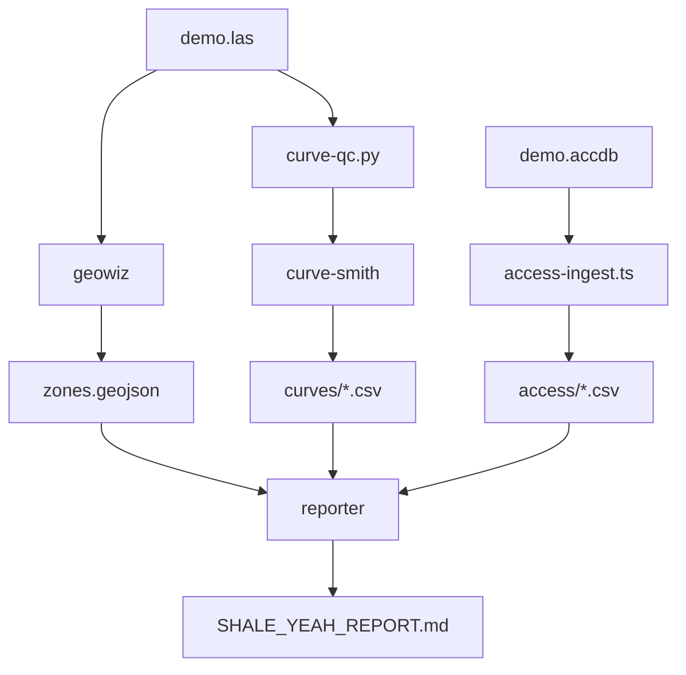

# SHALE YEAH Orchestration & End-to-End Story

## Mission Alignment

**Core Disruption**: Replace enterprise oil & gas workflows with 1-person army toolkit
**Proof Point**: Demo pipeline that produces actionable geological insights in minutes, not days

## End-to-End Story

### Input: Raw Industry Data
- `demo.las` - Well log with GR, RHOB, NPHI curves (6800-7200ft)
- `demo.accdb` - Legacy Access database with wells, formations, production data
- Optional: Shapefiles, CSV data, existing geological context

### Output: Executive-Ready Intelligence
- `SHALE_YEAH_REPORT.md` - Decision-ready geological and economic insights
- `zones.geojson` - Spatial geological data for GIS integration
- `curves/*.csv` - QC'd well log data for modeling
- `qc_report.md` - Statistical validation with confidence metrics

### Value Proposition
**Before SHALE YEAH**: 3-5 days with geologist + data analyst + GIS specialist
**After SHALE YEAH**: 15 minutes with `npm run demo`

## Orchestration Architecture

### Phase 1: Data Ingestion (Parallel)
```
├── geowiz → Parse LAS files, identify formations
├── access-ingest.ts → Convert Access DB to CSV
└── Environment setup → RUN_ID, output directories
```

### Phase 2: Analysis & QC (Sequential)
```
curve-qc.py → Statistical analysis of GR curve
    ↓
curve-smith → Fit missing data, generate curves/*.csv
    ↓
geowiz → Complete geological interpretation → zones.geojson
```

### Phase 3: Synthesis (Final)
```
reporter → Combine all outputs → SHALE_YEAH_REPORT.md
```

### Phase 4: Optional Integrations (Async)
```
Splunk HEC ← Telemetry events
GIS Systems ← zones.geojson export  
SIEM/SOAR ← Audit and monitoring data
```

## Agent Interaction Model

### Data Flow Dependencies


### Quality Gates & Checkpoints
1. **LAS Validation**: Curves present, depth units declared
2. **Statistical QC**: RMSE/NRMSE within acceptable ranges
3. **Geological Consistency**: Zone boundaries make geological sense
4. **Attribution Compliance**: All outputs include SHALE YEAH footer
5. **Completeness Check**: All expected outputs generated

### Error Handling Strategy
- **Individual Agent Failures**: Continue pipeline, note in final report
- **Critical Data Missing**: Graceful degradation with partial results
- **Quality Gate Failures**: Generate report with warnings and recommendations
- **Infrastructure Issues**: Retry logic with exponential backoff

## Pipeline Execution Modes

### 1. Demo Mode (Default)
```bash
npm run demo
# Uses data/samples/* for consistent, reproducible results
# Validates complete pipeline functionality
```

### 2. Batch Mode
```bash
export INPUT_DIR=/path/to/well/data
export RUN_ID=batch-$(date +%Y%m%d-%H%M%S)  
npm run pipeline
# Processes real data from specified directory
```

### 3. Research Mode
```bash
export RESEARCH_TARGET="ArcGIS REST API"
npm run research
# Executes research-hub → agent-forge workflow
```

## Success Metrics & Evaluation

### Functional Success
- [ ] Pipeline completes end-to-end without manual intervention
- [ ] All quality gates pass with demo data
- [ ] Generated reports are actionable and accurate
- [ ] Processing time < 5 minutes for demo dataset

### Business Impact Success  
- [ ] Geological insights match expert interpretation (>80% confidence)
- [ ] Statistical QC identifies real data quality issues
- [ ] Executive report enables immediate decision-making
- [ ] Integration hooks work with enterprise systems

### Technical Success
- [ ] Zero secrets in code or outputs
- [ ] All tools work cross-platform (Linux, macOS, Windows)
- [ ] CI/CD pipeline validates every commit
- [ ] Error handling prevents pipeline crashes

## Orchestration Implementation

### Current: Simple Shell Pipeline
```bash
#!/bin/bash
# scripts/demo.sh - Current implementation
export RUN_ID=$(date +%Y%m%d-%H%M%S)
mkdir -p data/outputs/$RUN_ID

# Run pipeline stages
npx claude-flow@alpha run pipelines/shale.yaml --vars RUN_ID=$RUN_ID
```

### Future: Agent Orchestration Platform
- **Task Queue**: Redis/PostgreSQL for agent job management
- **Event Bus**: Pub/sub for agent coordination and telemetry  
- **State Management**: Persistent storage for pipeline state
- **Monitoring**: Real-time dashboard for pipeline execution
- **Scaling**: Kubernetes deployment for enterprise environments

## Integration Patterns

### Enterprise Integration Points
1. **Data Sources**: Connect to existing well databases, geological repositories
2. **Workflow Systems**: Integrate with Zapier, Microsoft Power Automate
3. **Visualization**: Export to Tableau, Power BI, ArcGIS dashboards
4. **Notifications**: Slack/Teams alerts for pipeline completion
5. **Storage**: Automated backup to AWS S3, Azure Blob, Google Cloud

### API Design Principles
- **RESTful**: Standard HTTP verbs and status codes
- **Idempotent**: Same input always produces same output
- **Documented**: OpenAPI/Swagger specifications
- **Versioned**: Semantic versioning for backward compatibility
- **Secure**: API key authentication, rate limiting

## Next Phase Execution Plan

### Immediate (This Wave)
1. **Fix Pipeline Orchestration**: Make `npm run demo` work end-to-end
2. **Implement Core Agent Logic**: Real geological analysis, not stubs
3. **Validate Quality Gates**: Ensure all outputs meet specifications

### Short Term (Next Wave)  
1. **Performance Optimization**: Sub-5-minute demo execution
2. **Error Resilience**: Comprehensive error handling and recovery
3. **Integration Validation**: Test Splunk HEC and one GIS integration

### Medium Term (Future Waves)
1. **Agent Marketplace**: Community-contributed agents and integrations
2. **Cloud Deployment**: Kubernetes helm charts, Docker containers
3. **Enterprise Features**: User management, audit logging, compliance reporting

---

*SHALE YEAH Orchestration Design - One Person Army Architecture*

Generated with SHALE YEAH (c) Ryan McDonald / Ascendvent LLC - Apache-2.0